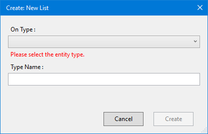
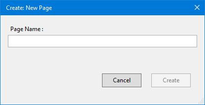
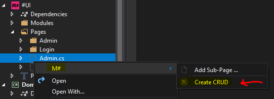
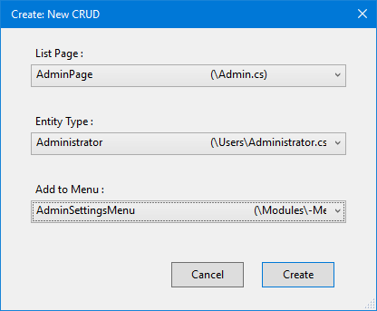
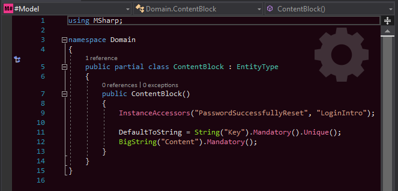
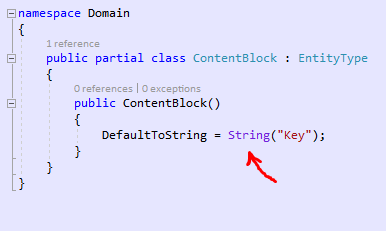

## M# Visual Studio Extensions
(todo: intro)

(todo: for each single feature in this extension, add a section here with screenshots, etc. Also provide a CLI alternative tip for doing the same thing in CMD)

# VS Ext: MSharp.AddNew
MSharp.AddNew VSIX provides a set of functionality and project templates wizards to make projects from scratch and create M# project items easily. So you can create 3 different M# project types (**M# ASP.NET Core - MVC**, **M# ASP.NET Core - Microservice** and **M# Class Library**) by using this extension.


##  ASP.NET Core - MVC Project
---
By using **_M# MVC Project Template Wizard_** you can create a standard M# project from scratch. Each M# ASP.NET MVC Application at least should consists of 4 different projects. 

* #Model *(Standard .Net Core 2.1)*
* #UI *(Standard .Net Core 2.1)*
* Domain *(Standard .Net Core 2.1)*
* Website *(Standard ASP.Net Core App 2.1)*
* _[Docker-compose]_ *(Docker Contianer)*

Developers should specify the _Name_, _Location_ and _Solution name_ of new project and hit **OK** button, then a project wizard with a popup winodow gets custom __M#__ project options from user In the **M# MVC Project Wizard** window.


In **M# MVC Project Wizard** window developers should specify a **M# Project Name** and choose a **Database Type** providers such as _Sql Server_, _MySQL_, _PostgreSQL_, _Sqlite_ as Database Management System for new M# Application. Also developers should specify related **Connections String** according to selected **Database Type** as well.


Then M# project wizard tries to download new fresh copy of __M# MVC Project__ template from web server.


After the template downloaded successfully, **Initialize.bat** of downloaded package automatically runs to initialize M# solution by updating projects referenses and all required website packages.


##  ASP.NET Core - MVC Microservice Project
---
By using **_M# ASP.NET Core MVC Microservice Project_** you can create a standard M# Microservice project from scratch. Each M# ASP.NET Microservice Application at least should consists of 4 different projects. 

* #Model *(Standard .Net Core 2.1)*
* #UI *(Standard .Net Core 2.1)*
* Domain *(Standard .Net Core 2.1)*
* Website *(Standard ASP.Net Core App 2.1)*

Developers should specify the _Name_, _Location_ and _Solution name_ of new project and hit **OK** button, then a project wizard with a popup winodow gets custom __M# Microservice__ project options from user In the **M# Microservice Project Wizard** window.


In **M# Microservice Project Wizard** window developers should specify a **M# Microservice Project Name** and choose a **Database Type** providers such as _Sql Server_, _MySQL_, _PostgreSQL_, _Sqlite_ as Database Management System for new M# Microservice Application. Also developers should specify related **Connections String** according to selected **Database Type** as well.


Then M# project wizard tries to download new fresh copy of __M# MVC Microservice Project__ template from web server.


##  Class Library Template
---
We have produced a __Custom Project Sub Type__ with name "M# Class Library Template", developers can use this project type as a standard class library in their .NET framework projects.


##  New Entity Project Item 


# Solution Explorer Context Menu Commands
## Build All


## Run Fast


# Generate Project Items
Depending on the type of project chosen, developers can create/add custom project requirements by using M# context menu under solution explorer node.

## Create New Entity
In each M# project the first thing a developer needs to do is to build a concrete business domain model, which consists of entities often referred to as business objects, in this case developer can select a node (Project root node/Folder) from solution explorer tree in the __#Model__ project then right click on it and choose **"Add Entity ..."** from path "Add > M# > Add Entity ..." menu item of it's context menu.


M# shows a tool window to get an _Entity/**Type Name**_ with an optional __Base Type__ to generate a plain __M# Entity__ class or a generic __M# Entity SubType__ class under selected node.


So that if developer only specified a __Type Name__ then M# creates a plain Enity type class and if he select a __Base Type__ from dropdown combo then M# will generates a Entity __SubType<*Base Type*>__ class depending on selected item.

> Note : Only compiled Entity Types are availabe in drop down combos to select as Base Type in all Create pages.

> [ CLI Command](CLI.md#user-content-msharpexe-addtype-nametypename-basebasetypename-foldercontainerfolder) : 
>
> msharp.exe /add:type /name:"Person" [/base:"Administrator"] [/folder:"ContainerFolder"]
>- _Person is sample entity name_
>- _Administrator is sample entity base type_ (optional)
>- _ContainerFolder is sample folder_ (optional)

## Create CRUD


> [ CLI Command](CLI.md) : 
>
> msharp.exe /add:Crud /page:"Admin.cs" /type:"ContentBlock" [/menu:"MainMenu"]
>- _Admin.cs is sample page name_
>- _ContentBlock is sample entity base type_
>- _MainMenu is sample menu module name_ (optional)

## Create Partial Class


## Create Form 


> [ CLI Command](CLI.md#user-content-msharpexe-addform-onentitytypename-namemyformname-foldercontainerfolder) : 
>
> msharp.exe /add:form /on:"EntityTypeName" /name:"MyFormName" [/folder:"ContainerFolder"]
>- _EntityTypeName is sample entity name_
>- _MyFormName is sample form module name_
>- _ContainerFolder is sample folder_ (optional)
## Create List 



> [ CLI Command](CLI.md#user-content-msharpexe-addlist-onentitytypename-namemyformname-foldercontainerfolder) : 
>
> msharp.exe /add:list /on:"EntityTypeName" /name:"MyListName" [/folder:"ContainerFolder"]
>- _EntityTypeName is sample entity name_
>- _MyListName is sample list  module name_
>- _ContainerFolder is sample folder_ (optional)

## Create View 


> [ CLI Command](CLI.md#user-content-msharpexe-addview-onentitytypename-namemyformname-foldercontainerfolder) : 
>
> msharp.exe /add:view /on:"EntityTypeName" /name:"MyViewName" [/folder:"ContainerFolder"]
>- _EntityTypeName is sample entity name_
>- _MyViewName is sample view module name_
>- _ContainerFolder is sample folder_ (optional)

## Create Menu 


> [ CLI Command](CLI.md) : 
>
> msharp.exe /add:menu /name:"MyMenuName" [/folder:"ContainerFolder"]
>- _MyMenuName is sample menu module name_
>- _ContainerFolder is sample folder_ (optional)

## Create Generic Module


> [ CLI Command](CLI.md) : 
>
> /add:Custom /name:MyCustomModule /folder:"C:\..\MSharp.Mvc\M#\UI\Modules"
>- _MyCustomModule is sample generic module name_
>- _C:\..\MSharp.Mvc\M#\UI\Modules is sample folder path that module should create there_ (optional)

## Create Root Page



> [ CLI Command](CLI.md) : 
>
> msharp.exe /add:page /name:"PageName" [/parent:"FullPathToParentFolderOrFile"]
>- _PageName is sample page or sub-page module name_
>- _FullPathToParentFolderOrFile is sample folder or Page Module file name_

## Create Sub-Page


> [ CLI Command](CLI.md) : 
>
> msharp.exe /add:Page /name:MySubAdmin /parent:"C:\...\MSharp.Mvc73\MSharp.Mvc\M#\UI\Pages\Admin.cs"
>- _MySubAdmin is sample Sub Page name_
>- _C:\..\MSharp.Mvc73\MSharp.Mvc\M#\UI\Pages\Admin.cs is sample Parent Page full path_

## Create CRUD by Page




> [ CLI Command](CLI.md) : 
>
> msharp.exe /add:Crud /page:"Admin.cs" /type:"Administrator" [/menu:"AdminSettingsMenu"]
>- _Admin.cs is sample page name_
>- _Administrator is sample entity base type_
>- _AdminSettingsMenu is sample menu module name_ (optional)

## Create API Proxy


> [ CLI Command](CLI.md) : 
>
> msharp.exe /add:type /name:"Person" [/base:"Administrator"] [/folder:"ContainerFolder"]
>- _Person is sample entity name_
>- _Administrator is sample entity base type_
>- _ContainerFolder is sample folder_

# VS Ext: MSharp.Colorize
 By using __MSharp.Colorize__ extension all M# Projects (MVC, MVC Microservice and Class Library) has specific UI layout in solution explorer tool window. So that Model and UI projects in "M# ASP.NET - MVC" and "M# ASP.NET - MVC Microservice" and project root icon in "M# Class Library" are shown as a simple custom M# purple icon like this : 
 


Also according to C# class file contents and it's base class in #Model and #UI projects, their icon will be changed in this types:
-  : Plain __C#__ files
-  : M# __Entity__ Type and Entity __SubType<*base*>__ 
-  : M# __Form Module__
-  : M# __List Module__
-  : M# __Menu Type__ and __Menu Module__
-  : M# __View Module__
-  : M# __Root Page__ and __SubPage__
-  : M# __Generic Module__
  
  >These icons are shown in Top Right corner of each M# class modules in code editor window too, for example in M# Entity file it will be look like this : 

  

### M# Code Highlighting

MSharp.Colorize VSIX provides attribute classes to apply coloring rules on M# methods, so developer can better work with M# codes.

#### MethodColorAttribute, MethodStyleAttribute classes

MSharp.Colorize VSIX provides set of Classifiers to show M# code hilighted. And M# framework team used this attribute classes to decorate their methods with some styling features like color.

Using "MSharp.Colorize VSIX code highlighter" is very simple. To colouring a method you simply should create a class with name "MethodColorAttribute" derived from Attribute class and a constructor with at least one string parameter in your project, like this :
```C#
    public class MethodColorAttribute : Attribute
    {
        public MethodColorAttribute(string colorHexString/*like: "#8fdd24" */) 
        {
            
        }
    }
```
In this case you can decorate all your methods with this new created attribute like :
```C#
        [MethodColor("#8fdd24")]
        public StringProperty String(string displayName, int maxCapacity = 200){
          // Code
        }
```
So whenever developers use your decorated mothod then they will see method name coloured like this :

  

Depending on the current color theme of Visual Studio and the background color of the code editor window, the specified color can vary. That way your decorated method will displayed in specified color if background color is dark (just like previous screenshot).Otherwise, the decorated method will be displayed in reverse color.

  

MethodColorAttribute class constructor can be implement with second string parameter too. In that case first parameter is specified method color in dark theme and second, specified method color in light theme.

>You can test live Colouring functionalies by implementing a **MethodColorAttribute** class in your project and decorate a method with this attribute, then the decorated mrthod reflects method color changes real time. 

## In Dark Theme
  

## In Light Theme
  


> Note : The background color of M# code editor windows are customized to dark brown in __Dark Theme__ and light blue in __Light Theme__.

## Vs Ext: Geeks.StylishCode
...

## VS Ext: MSharp.CodePreview 
...


## VS Ext: MSharp.F7 
...

## VS Ext: MSharp.Goto 
...

## VS Ext: MSharp.Intellisense 
...

## VS Ext: MSharp.Snippet 
...

## VS Ext: MSharp.Warninigs 
...

## VS Ext: MSharp.CodePreview 
...
