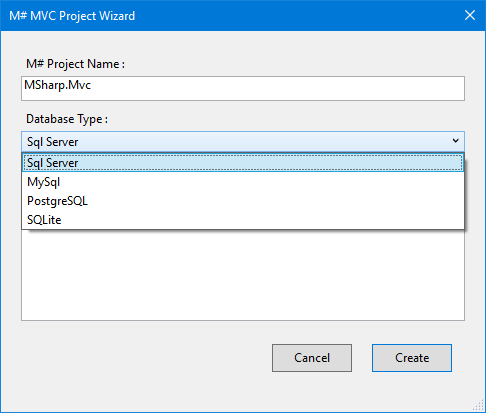
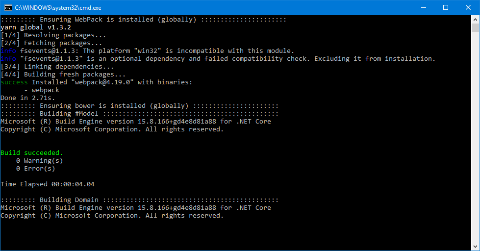
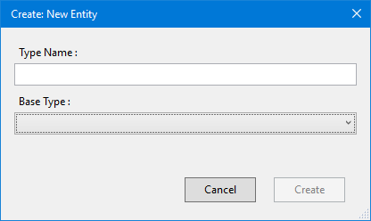
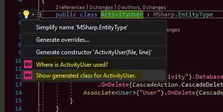
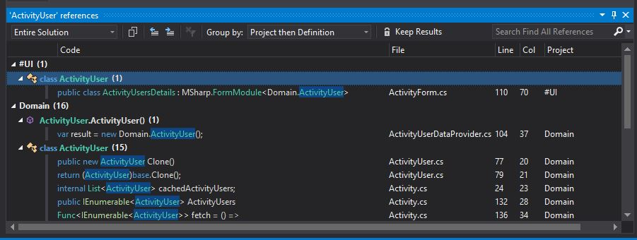
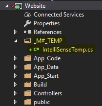
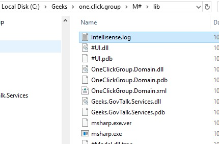
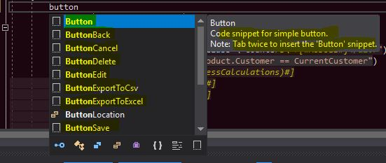

# M# Visual Studio Extensions

(todo: intro)

(todo: for each single feature in this extension, add a section here with screenshots, etc. Also provide a CLI alternative tip for doing the same thing in CMD)

## VS Ext: MSharp.AddNew

MSharp.AddNew VSIX provides a set of functionality and project templates wizards to make projects from scratch and create M# project items easily. So you can create 3 different M# project types (**M# ASP.NET Core - MVC**, **M# ASP.NET Core - Microservice** and **M# Class Library**) by using this extension.


##  ASP.NET Core - MVC Project

---
By using **_M# MVC Project Template Wizard_** you can create a standard M# project from scratch. Each M# ASP.NET MVC Application at least should consists of 4 different projects.

* #Model *(Standard .Net Core 2.1)*
* #UI *(Standard .Net Core 2.1)*
* Domain *(Standard .Net Core 2.1)*
* Website *(Standard ASP.Net Core App 2.1)*
* _[Docker-compose]_ *(Docker Container)*

Developers should specify the _Name_, _Location_ and _Solution name_ of new project and hit **OK** button, then a project wizard with a popup window gets custom __M#__ project options from user In the **M# MVC Project Wizard** window.


In **M# MVC Project Wizard** window developers should specify a **M# Project Name** and choose a **Database Type** providers such as _Sql Server_, _MySQL_, _PostgreSQL_, _Sqlite_ as Database Management System for new M# Application. Also developers should specify related **Connections String** according to selected **Database Type** as well.



Then M# project wizard tries to download new fresh copy of __M# MVC Project__ template from web server.


After the template downloaded successfully, **Initialize.bat** of downloaded package automatically runs to initialize M# solution by updating projects references and all required website packages.



##  ASP.NET Core - MVC Microservice Project

---
By using **_M# ASP.NET Core MVC Microservice Project_** you can create a standard M# Microservice project from scratch. Each M# ASP.NET Microservice Application at least should consists of 4 different projects.

* #Model *(Standard .Net Core 2.1)*
* #UI *(Standard .Net Core 2.1)*
* Domain *(Standard .Net Core 2.1)*
* Website *(Standard ASP.Net Core App 2.1)*

Developers should specify the _Name_, _Location_ and _Solution name_ of new project and hit **OK** button, then a project wizard with a popup window gets custom __M# Microservice__ project options from user In the **M# Microservice Project Wizard** window.


In **M# Microservice Project Wizard** window developers should specify a **M# Microservice Project Name** and choose a **Database Type** providers such as _Sql Server_, _MySQL_, _PostgreSQL_, _Sqlite_ as Database Management System for new M# Microservice Application. Also developers should specify related **Connections String** according to selected **Database Type** as well.


Then M# project wizard tries to download new fresh copy of __M# MVC Microservice Project__ template from web server.


##  Class Library Template

---
We have produced a __Custom Project Sub Type__ with name "M# Class Library Template", developers can use this project type as a standard class library in their .NET framework projects.


##  New Entity Project Item


## Solution Explorer Context Menu Commands

### Build All


### Run Fast


## Generate Project Items

Depending on the type of project chosen, developers can create/add custom project requirements by using M# context menu under solution explorer node.

## Create New Entity

In each M# project the first thing a developer needs to do is to build a concrete business domain model, which consists of entities often referred to as business objects, in this case developer can select a node (Project root node/Folder) from solution explorer tree in the __#Model__ project then right click on it and choose **"Add Entity ..."** from path "Add > M# > Add Entity ..." menu item of it's context menu.


M# shows a tool window to get an _Entity/**Type Name**_ with an optional __Base Type__ to generate a plain __M# Entity__ class or a generic __M# Entity SubType__ class under selected node.



So that if developer only specified a __Type Name__ then M# creates a plain Entity type class and if he select a __Base Type__ from dropdown combo then M# will generates a Entity __SubType<*Base Type*>__ class depending on selected item.

> Note : Only compiled Entity Types are available in drop down combos to select as Base Type in all Create pages.
> [ CLI Command](CLI.md#user-content-MSharpexe-addtype-nametypename-basebasetypename-foldercontainerfolder) :
>
> MSharp.exe /add:type /name:"Person" [/base:"Administrator"] [/folder:"ContainerFolder"]
>* _Person is sample entity name_
>* _Administrator is sample entity base type_ (optional)
>* _ContainerFolder is sample folder_ (optional)

## Create CRUD


> [ CLI Command](CLI.md) :
>
> MSharp.exe /add:Crud /page:"Admin.cs" /type:"ContentBlock" [/menu:"MainMenu"]
>* _Admin.cs is sample page name_
>* _ContentBlock is sample entity base type_
>* _MainMenu is sample menu module name_ (optional)

## Create Partial Class


## Create Form


> [ CLI Command](CLI.md#user-content-MSharpexe-addform-onentitytypename-namemyformname-foldercontainerfolder) :
>
> MSharp.exe /add:form /on:"EntityTypeName" /name:"MyFormName" [/folder:"ContainerFolder"]
>* _EntityTypeName is sample entity name_
>* _MyFormName is sample form module name_
>* _ContainerFolder is sample folder_ (optional)

## Create List


> [ CLI Command](CLI.md#user-content-MSharpexe-addlist-onentitytypename-namemyformname-foldercontainerfolder) :
>
> MSharp.exe /add:list /on:"EntityTypeName" /name:"MyListName" [/folder:"ContainerFolder"]
>* _EntityTypeName is sample entity name_
>* _MyListName is sample list  module name_
>* _ContainerFolder is sample folder_ (optional)

## Create View


> [ CLI Command](CLI.md#user-content-MSharpexe-addview-onentitytypename-namemyformname-foldercontainerfolder) :
>
> MSharp.exe /add:view /on:"EntityTypeName" /name:"MyViewName" [/folder:"ContainerFolder"]
>* _EntityTypeName is sample entity name_
>* _MyViewName is sample view module name_
>* _ContainerFolder is sample folder_ (optional)

## Create Menu


> [ CLI Command](CLI.md) :
>
> MSharp.exe /add:menu /name:"MyMenuName" [/folder:"ContainerFolder"]
>* _MyMenuName is sample menu module name_
>* _ContainerFolder is sample folder_ (optional)

## Create Generic Module


> [ CLI Command](CLI.md) :
>
> /add:Custom /name:MyCustomModule /folder:"C:\..\MSharp.Mvc\M#\UI\Modules"
>* _MyCustomModule is sample generic module name_
>* _C:\..\MSharp.Mvc\M#\UI\Modules is sample folder path that module should create there_ (optional)

## Create Root Page


> [ CLI Command](CLI.md) :
>
> MSharp.exe /add:page /name:"PageName" [/parent:"FullPathToParentFolderOrFile"]
>* _PageName is sample page or sub-page module name_
>* _FullPathToParentFolderOrFile is sample folder or Page Module file name_

## Create Sub-Page


> [ CLI Command](CLI.md) :
>
> MSharp.exe /add:Page /name:MySubAdmin /parent:"C:\...\MSharp.Mvc73\MSharp.Mvc\M#\UI\Pages\Admin.cs"
>* _MySubAdmin is sample Sub Page name_
>* _C:\..\MSharp.Mvc73\MSharp.Mvc\M#\UI\Pages\Admin.cs is sample Parent Page full path_

## Create CRUD by Page


> [ CLI Command](CLI.md) :
>
> MSharp.exe /add:Crud /page:"Admin.cs" /type:"Administrator" [/menu:"AdminSettingsMenu"]
>* _Admin.cs is sample page name_
>* _Admin.cs is sample page name_
>* _Administrator is sample entity base type_
>* _AdminSettingsMenu is sample menu module name_ (optional)

## Create API Proxy


> [CLI Command](CLI.md):
>
> MSharp.exe /add:type /name:"Person" [/base:"Administrator"] [/folder:"ContainerFolder"]
>* _Person is sample entity name_
>* _Administrator is sample entity base type_
>* _ContainerFolder is sample folder_

## VS Ext: MSharp.Colorize

 By using __MSharp.Colorize__ extension all M# Projects (MVC, MVC Microservice and Class Library) has specific UI layout in solution explorer tool window. So that Model and UI projects in "M# ASP.NET - MVC" and "M# ASP.NET - MVC Microservice" and project root icon in "M# Class Library" are shown as a simple custom M# purple icon like this :


Also according to C# class file contents and it's base class in #Model and #UI projects, their icon will be changed in this types:

*  : Plain __C#__ files
  
*  : M# __Entity__ Type and Entity __SubType<*base*>__
  
*  : M# __Form Module__
  
*  : M# __List Module__
  
*  : M# __Menu Type__ and __Menu Module__
  
*  : M# __View Module__
  
*  : M# __Root Page__ and __SubPage__
  
*  : M# __Generic Module__
  
  >These icons are shown in Top Right corner of each M# class modules in code editor window too, for example in M# Entity file it will be look like this :

  

## M# Code Highlighting

MSharp.Colorize VSIX provides attribute classes to apply coloring rules on M# methods, so developer can better work with M# codes.

### MethodColorAttribute, MethodStyleAttribute classes

MSharp.Colorize VSIX provides set of Classifiers to show M# code highlighted. And M# framework team used this attribute classes to decorate their methods with some styling features like color.

Using "MSharp.Colorize VSIX code highlighter" is very simple. To colouring a method you simply should create a class with name "MethodColorAttribute" derived from Attribute class and a constructor with at least one string parameter in your project, like this :

```C#
    public class MethodColorAttribute : Attribute
    {
        public MethodColorAttribute(string colorHexString/*like: "#8fdd24" */)
        {

        }
    }
```

In this case you can decorate all your methods with this new created attribute like :

```C#
        [MethodColor("#8fdd24")]
        public StringProperty String(string displayName, int maxCapacity = 200){
          // Code
        }
```

So whenever developers use your decorated method then they will see method name coloured like this :

  

Depending on the current color theme of Visual Studio and the background color of the code editor window, the specified color can vary. That way your decorated method will displayed in specified color if background color is dark (just like previous screenshot).Otherwise, the decorated method will be displayed in reverse color.

  

MethodColorAttribute class constructor can be implement with second string parameter too. In that case first parameter is specified method color in dark theme and second, specified method color in light theme.

>You can test live Colouring functionalities by implementing a **MethodColorAttribute** class in your project and decorate a method with this attribute, then the decorated method reflects method color changes real time.

## In Dark Theme

  

## In Light Theme

  

> Note : The background color of M# code editor windows are customized to dark brown in __Dark Theme__ and light blue in __Light Theme__.

## Vs Ext: Geeks.StylishCode

...

## VS Ext: MSharp.CodePreview

...

## VS Ext: MSharp.F7

...

## VS Ext: MSharp.Goto

In many cases developers need to switch to the definition and in other hand references across the solution specially when using with M# Entities in Model and generated codes, so they can go to declared class and all references as well.
By using the MSharp GoTo VSIX you can switch better and faster to the declaration of generated classes or properties.
So when in C# generated class in the Gen-Entities folder in Domain project you request a suggestion in the editor by pressing [CTRL+.] over class identifier name (Class Name) or property identifier name (Property Name) then a light-bulb pops up with a custom suggestion with name "Goto Definition.", then if you select this suggestion iem you will navigate to the declaration class to the Model project.

  
  
In other hand you can navigate to this generated class by invoking a suggestion request (Ctrl+.) over class name identifier then you can see 2 custom suggestions in light-bulb items "Where is {ClassName} used?" and "Show generated class for {ClassName}.".

  

So if you select "Where is {ClassName} used?" item , then you can navigate to all references by selection an item in the opened references toolbox panel.

  

Also you can navigate to the generated class in the Domain project by selecting the "Show generated class fo {ClassName}." item as well.

## VS Ext: MSharp.Intellisense

Developers can put their C# code in many parts of M# code structures, it means when M# engine starts generate the code, then that static code part should be placed inside generated code when we use C# syntax methods (decorated by one of this attributes : ExpectsCSharpStatementAttribute, ExpectsCSharpExpressionAttribute, ExpectsCSharpBlockAttribute ) , for example in a header module inside UI project we can write :

```C#
            OnViewModelClassCode("Return applicable menu").Code(@"public MvcHtmlString GetApplicableMenu(User user, HtmlHelper Html){
            if (user is VendorManager)
                return Html.Action<Controllers.VendorMenuController>();

            if (user is ApplicationUser)
                return Html.Action<Controllers.AdminMenuController>();

            if (user is AgencyUser)
                return Html.Action<Controllers.AgencyMenuController>();

            if (user is Contractor)
                return Html.Action<Controllers.ContractorMenuController>();

            return null;
            }");
```

  

Writing and maintaining c# codes in string literals are not easy, So by using the Intellisense VSIX we can work with those types of code in fast and easy way.

  

When the cursor is under calling method or its string literal parameter then you can open a code peeker just below the current line by right click command on the method name or its string parameter and then select "Show Intellisense For String Parameter Alt+ I" item from the context menu.

  

or pressing [ALT + I] shortcut key or by invoking the light-bulb command when it suggested or hitting the [CTRL + .] key combination on proper line and select "Show Intellisense for string parameter" command.

  

The Intellisense VSIX uses MSharp.exe to generate a temporary intellisense C# file, so peeker loads that temporary file as well and developers can manipulate their codes in right C# code context.

> [ CLI Command](CLI.md) :
>MSharp.exe /intellisense {Switch} /file:{FullFileName} /setting:{Setting} /line:{line number} /text:{C# code}
>
> Sample CLI command :
> MSharp.exe /intellisense /ExpectsCSharpStatement /file:"C:\Geeks\SampleApp\M#\UI\Modules-Custom\Header.cs" /setting:Code /line:39 /text:"var i = Math.Cos(90)"
>*_Switch_ : all attributes that in ExpectsCSharp category like /ExpectsCSharpStatement
>*_FullFileName_ : C# file with full path containing Method calling like C:\Geeks\SampleApp\M#\UI\Modules-Custom\Header.cs
>*_Setting_ : Method name that we would like to have C# context of its code.
>*_Line Number_ : Line number of the method(_Setting_) in _FullFileName_.
>*_Text_ : C# code or constant that is currently in parameter of the method(_Setting_).

### Technical Tip 1

Some times it maybe take long time to show peeker with the C# context, it's completely depends on project size and system performance, because temporary C# (with name **IntellisenseTemp.cs**) file should be populate and create in the _M#_TEMP folder under the WebSite project



Then Intellisense VSIX shows the code file in the peeker, so during generating file you can see a progress bar in top of displayed empty peeker.


### Technical Tip 2

 (**Troubleshooting**) if you cant see the peeker panel after a while, or you get "No Result, We did not find any result." message, then maybe MSharp.exe has been returned an error and intellisense temporary file is not generated correctly in  _M#_TEMP, So you can check these:

* Make sure the solution is fully compiled without error.
* Make sure #UI.dll, #Model.dll, MSharp.exe and MSharp.DLS.exe are exit in the "[Solution Path]\M#\Lib\".
* Run MSharp.exe from command line with some sample parameters to ensure everything works well.


### Technical Note

C# code file that opened by Intellisense Peeker Panel, is used only for specific manner, So developers can not make changes (and they do not need to do this) in top and bottom code area that wraps the original code/text, so those parts of code are read-only.

### **Debugging** Tip

You simply can set "DEBUG:" prefix in start of code in string literal, Then an error log file will be created in Lib folder in this location : "[Solution Path]\M#\Lib\Intellisense.log".



You can close peeker panel with or without saving code, so if you push ESC button or hit the X corner button then peeker tries to close, but if you have made changes then a messages box appears and ask you about saving changes by reflecting them to the main code or not, otherwise peeker panel will close simply.


Also you can close intellisense peeker by pressing the CTRL + S key, then all changes are saved and will be reflect to the main code.

## VS Ext: MSharp.Snippet

Development with M# always is fun also this work is more simple and fun if you use our custom Visual Studio extensions too.

Snippet is a programming term for a small region of re-usable source code. Ordinarily, these are formally defined operative units to incorporate into larger programming modules.

MSharp Snippet is custom Visual Studio extension that contained with many useful small parts of code and are useful when you want to write some UI codes. Snippets are defined in MSharp.Snippet extension, and each one are declared in simple XML file and after Visual Studio loads this package you can call their shortcut name to put template in side your code, for example this is a button create snippet :

```XML
<?xml version="1.0" encoding="utf-8"?>
<CodeSnippet Format="1.0.0" xmlns="http://schemas.microsoft.com/VisualStudio/2005/CodeSnippet">
  <Header>
    <Title>Button</Title>
    <Author>Geeks Ltd</Author>
    <Shortcut>Button</Shortcut>
    <Description>Code snippet for simple button.</Description>
    <SnippetTypes>
      <SnippetType>Expansion</SnippetType>
    </SnippetTypes>
  </Header>
  <Snippet>
    <Declarations>
      <Literal>
        <ID>name</ID>
        <ToolTip>Button name</ToolTip>
        <Default>ButtonName</Default>
      </Literal>
      <Literal>
        <ID>action</ID>
        <ToolTip>The action</ToolTip>
        <Default>...</Default>
      </Literal>
    </Declarations>
    <Code Language="csharp">
      <![CDATA[Button("$name$")
                .Action(x => $action$);$end$]]>
    </Code>
  </Snippet>
</CodeSnippet>
```

Each Snippet contains in 2 parts, Header and Snippet, and you can use them by writing their shortcut name and press TAB key.
In this example shortcut name is "Button" and template code is :



```C#
    Button("$name$")
      .Action(x => $action$);
```


For more simplicity and usefulness there are some place holder in some snippets that you help you write your code more robust and fast so just need to fill in the blanks. In our example $name$ and $action$ are code placeholders and $end$ is defined the end cursor location after snippet completion. Also you can see every Snippet have metadata in it's definition point. This metadata can be used in Visual Studio Snippet Manager Window.


In general it is better you know Snippets, their shortcut names and functionalities.
Here is the list of all Snippets that supported in the latest extension version :

>* Shortcut name : *Button*
>* M# Code:
>* **Button("$name$").Action(x => $action$);**
>* Description: Code snippet for simple button.

>* Shortcut name : *ButtonAddNew*
>* M# Code:
>* **Button("$name$").Icon($icon$)
            .Action(x => x.Go<$page$>()
            $sendReturnUrl$);**
>* Description: Code snippet for a add new button.

>* Shortcut name : *ButtonBack*
>* M# Code:
>* **Button("$name$")
            .Action(x => $back$);**
>* Description: Code snippet for a back button.

>* Shortcut name : *ButtonCancel*
>* M# Code:
>* **Button("$name$").CausesValidation(value: false)
            .Action(x => $close$);**
>* Description: Code snippet for a cancel button.

>* Shortcut name : *ButtonDelete*
>* M# Code:
>* **ButtonColumn("$name$").Icon($icon$)
            .Action(x => 
            {
               $delete$
               $reload$
            });**
>* Description: Code snippet for a delete button.

>* Shortcut name : *ButtonEdit*
>* M# Code:
>* **ButtonColumn("$name$").Icon($icon$)
            .Action(x => x.Go<$page$>()
            $sendReturnUrl$$send$);**
>* Description: Code snippet for a edit button.

>* Shortcut name : *ButtonExportToCsv*
>* M# Code:
>* **CButton("$name$").Icon($icon$)
            .Action(x => $action$);**
>* Description: Code snippet for an export-to-csv button.

>* Shortcut name : *ButtonExportToExcel*
>* M# Code:
>* **Button("$name$").Icon($icon$)
            .Action(x => $action$);**
>* Description: Code snippet for an export-to-excel button.

>* Shortcut name : *ButtonSave*
>* M# Code:
>* **Button("$name$").IsDefault().Icon($icon$)
            .Action(x =>
            {
                $saveAction$
                $showMessage$
                $close$
            });**
>* Description: Code snippet for a save button.

>* Shortcut name : *ButtonSearch*
>* M# Code:
>* **Button("$name$").Icon($icon$)
            .Action(x => $action$);**
>* Description: Code snippet for a search button.

>* Shortcut name : *ButtonSort*
>* M# Code:
>* **Button("$name$")
            .Action(x => $action$);**
>* Description: Code snippet for a sort button.

## VS Ext: MSharp.Warnings

...
