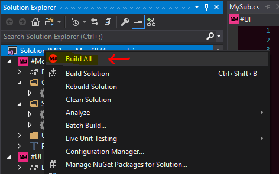
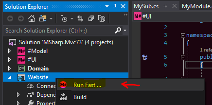
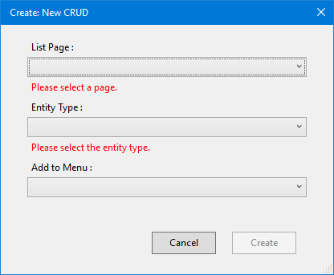
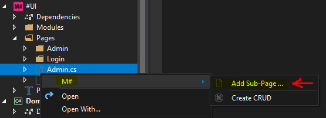
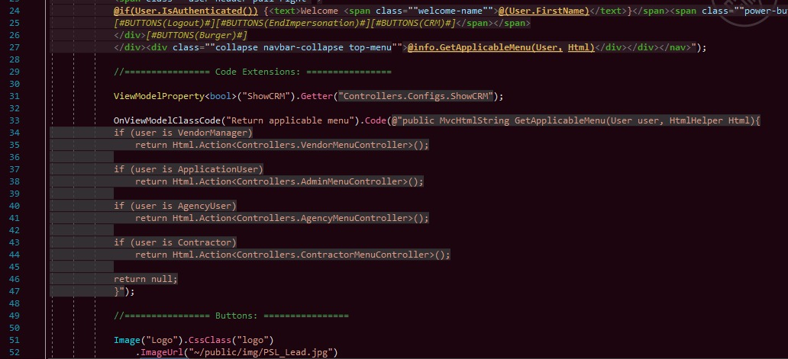
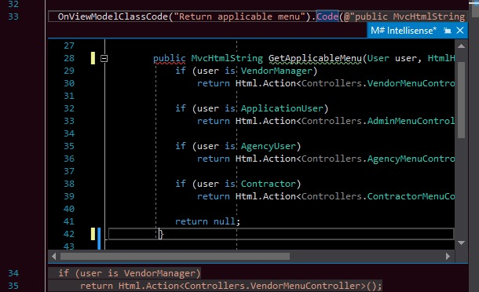

# M# Visual Studio Extensions

(todo: intro)

(todo: for each single feature in this extension, add a section here with screenshots, etc. Also provide a CLI alternative tip for doing the same thing in CMD)

## VS Ext: MSharp.AddNew

MSharp.AddNew VSIX provides a set of functionality and project templates wizards to make projects from scratch and create M# project items easily. So you can create 3 different M# project types (**M# ASP.NET Core - MVC**, **M# ASP.NET Core - Microservice** and **M# Class Library**) by using this extension.


##  ASP.NET Core - MVC Project

---

By using **_M# MVC Project Template Wizard_** you can create a standard M# project from scratch. Each M# ASP.NET MVC Application at least should consists of 4 different projects.

- #Model _(Standard .Net Core 2.1)_
- #UI _(Standard .Net Core 2.1)_
- Domain _(Standard .Net Core 2.1)_
- Website _(Standard ASP.Net Core App 2.1)_
- _[Docker-compose]_ _(Docker Container)_

Developers should specify the _Name_, _Location_ and _Solution name_ of new project and hit **OK** button, then a project wizard with a popup window gets custom **M#** project options from user In the **M# MVC Project Wizard** window.


In **M# MVC Project Wizard** window developers should specify a **M# Project Name** and choose a **Database Type** providers such as _Sql Server_, _MySQL_, _PostgreSQL_, _Sqlite_ as Database Management System for new M# Application. Also developers should specify related **Connections String** according to selected **Database Type** as well.


Then M# project wizard tries to download new fresh copy of **M# MVC Project** template from web server.


After the template downloaded successfully, **Initialize.bat** of downloaded package automatically runs to initialize M# solution by updating projects references and all required website packages.


##  ASP.NET Core - MVC Microservice Project

---

By using **_M# ASP.NET Core MVC Microservice Project_** you can create a standard M# Microservice project from scratch. Each M# ASP.NET Microservice Application at least should consists of 4 different projects.

- #Model _(Standard .Net Core 2.1)_
- #UI _(Standard .Net Core 2.1)_
- Domain _(Standard .Net Core 2.1)_
- Website _(Standard ASP.Net Core App 2.1)_

Developers should specify the _Name_, _Location_ and _Solution name_ of new project and hit **OK** button, then a project wizard with a popup window gets custom **M# Microservice** project options from user In the **M# Microservice Project Wizard** window.


In **M# Microservice Project Wizard** window developers should specify a **M# Microservice Project Name** and choose a **Database Type** providers such as _Sql Server_, _MySQL_, _PostgreSQL_, _Sqlite_ as Database Management System for new M# Microservice Application. Also developers should specify related **Connections String** according to selected **Database Type** as well.


Then M# project wizard tries to download new fresh copy of **M# MVC Microservice Project** template from web server.


##  Class Library Template

---

We have produced a **Custom Project Sub Type** with name "M# Class Library Template", developers can use this project type as a standard class library in their .NET framework projects.


##  New Entity Project Item


You can create a new Entity class from simple class template by selecting the M# Entity item from *Add new Item* panel.

> Either you can create new Entity or SubType< Entity > classes by selecting the context menu item in solution explorer over the M# Model project or project folder. (you can read more about this item later in this document)


## Solution Explorer Context Menu Commands

### Build All

-=***=- There is an useful M# build task that you can use it by selecting first context menu item of the solution node in the __Solution Explorer__ window.



### Run Fast

-=***=- Compile, Build and run every projects are Time-consuming task, so there is an item in __Website__ node context menu with name __Run Fast__ you can run your website project without need of solution builds. 



## Generate Project Items

Depending on the type of project you are working on, you can create/add custom project requirements by using M# context menu under solution explorer node.

## Create New Entity

In each M# project the first thing a developer needs to do is to build a concrete business domain model, which consists of entities often referred to as business objects, in this case developer can select a node (Project root node/Folder) from solution explorer tree in the **#Model** project then right click on it and choose **"Add Entity ..."** from path "Add > M# > Add Entity ..." menu item of it's context menu.


M# shows a tool window to get an _Entity/**Type Name**_ with an optional **Base Type** to generate a plain **M# Entity** class or a generic **M# Entity SubType** class under selected node.


So that if developer only specified a **Type Name** then M# creates a plain Entity type class and if he select a **Base Type** from dropdown combo then M# will generates a Entity **SubType<_Base Type_>** class depending on selected item.

> Note : Only compiled Entity Types are available in drop down combos to select as Base Type in all Create pages.
> [ CLI Command](CLI.md#user-content-MSharpexe-addtype-nametypename-basebasetypename-foldercontainerfolder) :
>
> MSharp.exe /add:type /name:"Person" [/base:"Administrator"][/folder:"containerfolder"]
>
> - _Person is sample entity name_
> - _Administrator is sample entity base type_ (optional)
> - _ContainerFolder is sample folder_ (optional)

## Create CRUD




> [ CLI Command](CLI.md) :
>
> MSharp.exe /add:Crud /page:"Admin.cs" /type:"ContentBlock" [/menu:"MainMenu"]
>
> - _Admin.cs is sample page name_
> - _ContentBlock is sample entity base type_
> - _MainMenu is sample menu module name_ (optional)

## Create Partial Class

In many cases maybe you want to have a partial classes in the Domain project to separate your concern into two partial files so you can select the *Create Partial Class ...* item in the context menu of entity classes  in the Solution explorer window. Then a new partial file will be create in the Domain\Logic folder.


## Create Form


> [ CLI Command](CLI.md#user-content-MSharpexe-addform-onentitytypename-namemyformname-foldercontainerfolder) :
>
> MSharp.exe /add:form /on:"EntityTypeName" /name:"MyFormName" [/folder:"ContainerFolder"]
>
> - _EntityTypeName is sample entity name_
> - _MyFormName is sample form module name_
> - _ContainerFolder is sample folder_ (optional)

## Create List


> [ CLI Command](CLI.md#user-content-MSharpexe-addlist-onentitytypename-namemyformname-foldercontainerfolder) :
>
> MSharp.exe /add:list /on:"EntityTypeName" /name:"MyListName" [/folder:"ContainerFolder"]
>
> - _EntityTypeName is sample entity name_
> - _MyListName is sample list module name_
> - _ContainerFolder is sample folder_ (optional)

## Create View


> [ CLI Command](CLI.md#user-content-MSharpexe-addview-onentitytypename-namemyformname-foldercontainerfolder) :
>
> MSharp.exe /add:view /on:"EntityTypeName" /name:"MyViewName" [/folder:"ContainerFolder"]
>
> - _EntityTypeName is sample entity name_
> - _MyViewName is sample view module name_
> - _ContainerFolder is sample folder_ (optional)

## Create Menu


> [ CLI Command](CLI.md) :
>
> MSharp.exe /add:menu /name:"MyMenuName" [/folder:"ContainerFolder"]
>
> - _MyMenuName is sample menu module name_
> - _ContainerFolder is sample folder_ (optional)

## Create Generic Module


> [ CLI Command](CLI.md) :
>
> /add:Custom /name:MyCustomModule /folder:"C:\..\MSharp.Mvc\M#\UI\Modules"
>
> - _MyCustomModule is sample generic module name_
> - _C:\..\MSharp.Mvc\M#\UI\Modules is sample folder path that module should create there_ (optional)

## Create Root Page


> [ CLI Command](CLI.md) :
>
> MSharp.exe /add:page /name:"PageName" [/parent:"FullPathToParentFolderOrFile"]
>
> - _PageName is sample page or sub-page module name_
> - _FullPathToParentFolderOrFile is sample folder or Page Module file name_

## Create Sub-Page




> [ CLI Command](CLI.md) :
>
> MSharp.exe /add:Page /name:MySubAdmin /parent:"C:\...\MSharp.Mvc73\MSharp.Mvc\M#\UI\Pages\Admin.cs"
>
> - _MySubAdmin is sample Sub Page name_
> - _C:\..\MSharp.Mvc73\MSharp.Mvc\M#\UI\Pages\Admin.cs is sample Parent Page full path_

## Create CRUD by Page


> [ CLI Command](CLI.md) :
>
> MSharp.exe /add:Crud /page:"Admin.cs" /type:"Administrator" [/menu:"AdminSettingsMenu"]
>
> - _Admin.cs is sample page name_
> - _Admin.cs is sample page name_
> - _Administrator is sample entity base type_
> - _AdminSettingsMenu is sample menu module name_ (optional)

## Create API Proxy


> [CLI Command](CLI.md):
>
> MSharp.exe /add:type /name:"Person" [/base:"Administrator"][/folder:"containerfolder"]
>
> - _Person is sample entity name_
> - _Administrator is sample entity base type_
> - _ContainerFolder is sample folder_

## VS Ext: MSharp.Colorize

 By using **MSharp.Colorize** extension all M# Projects (MVC, MVC Microservice and Class Library) has specific UI layout in solution explorer tool window. So that Model and UI projects in "M# ASP.NET - MVC" and "M# ASP.NET - MVC Microservice" and project root icon in "M# Class Library" are shown as a simple custom M# purple icon like this :


Also according to C# class file contents and it's base class in #Model and #UI projects, their icon will be changed in this types:

-  : Plain **C#** files

-  : M# **Entity** Type and Entity **SubType< _base_ >**

-  : M# **Form Module**

-  : M# **List Module**

-  : M# **Menu Type** and **Menu Module**

-  : M# **View Module**

-  : M# **Root Page** and **SubPage**

-  : M# **Generic Module**

  > These icons are shown in Top Right corner of each M# class modules in code editor window too, for example in M# Entity file it will be look like this :

  

## M# Code Highlighting

MSharp.Colorize VSIX provides attribute classes to apply coloring rules on M# methods, so developer can better work with M# codes.

### MethodColorAttribute, MethodStyleAttribute classes

MSharp.Colorize VSIX provides set of Classifiers to show M# code highlighted. And M# framework team used this attribute classes to decorate their methods with some styling features like color.

Using "MSharp.Colorize VSIX code highlighter" is very simple. To colouring a method you simply should create a class with name "MethodColorAttribute" derived from Attribute class and a constructor with at least one string parameter in your project, like this :

```C#
    public class MethodColorAttribute : Attribute
    {
        public MethodColorAttribute(string colorHexString/*like: "#8fdd24" */)
        {

        }
    }
```

In this case you can decorate all your methods with this new created attribute like :

```C#
        [MethodColor("#8fdd24")]
        public StringProperty String(string displayName, int maxCapacity = 200){
          // Code
        }
```

So whenever developers use your decorated method then they will see method name coloured like this :


Depending on the current color theme of Visual Studio and the background color of the code editor window, the specified color can vary. That way your decorated method will displayed in specified color if background color is dark (just like previous screenshot).Otherwise, the decorated method will be displayed in reverse color.


MethodColorAttribute class constructor can be implement with second string parameter too. In that case first parameter is specified method color in dark theme and second, specified method color in light theme.

> You can test live Colouring functionalities by implementing a **MethodColorAttribute** class in your project and decorate a method with this attribute, then the decorated method reflects method color changes real time.

## In Dark Theme


## In Light Theme


> Note : The background color of M# code editor windows are customized to dark brown in **Dark Theme** and light blue in **Light Theme**.

## Vs Ext: Geeks.StylishCode

__Geeks Stylish Code__ has been developed specially to decorate C# source codes with colors and text styles just like CSS rules.
You can make all class members coloured by decorating them with special Stylish code attributes : _MethodColorAttribute_ and _MemberStyleAttribute_

## VS Ext: MSharp.CodePreview

CodePreview VSIX is one of useful extensions that developed to help M# programmers to rapidly observe generated code by M# engine in real-time (after each project build) within a tool-window that displays in the right side of code editor window.
You can open the Code Preview too-window by selecting the first menu item of the currently opened code editor window with name **"Show Generated Code"**.


There will be 3 tabs in the _Preview Generated Code_ window with different titles, So that if you invoke this command in the M# UI modules then the Preview Generated Code window will bew appear with these 3 tabs :
_Preview_, _Controller_, _Cshtml_.


In other hand if you invoke this command in the M# Entity classes then you can see the Preview Generated Code window with these 3 tabs :
_Sql_, _DAL_, _Structure_.


## VS Ext: MSharp.Goto

In many cases developers need to switch to the definition and in other hand references across the solution specially when using with M# Entities in Model and generated codes, so they can go to declared class and all references as well.
By using the MSharp GoTo VSIX you can switch better and faster to the declaration of generated classes or properties.
So when in C# generated class in the Gen-Entities folder in Domain project you request a suggestion in the editor by pressing [CTRL+.] over class identifier name (Class Name) or property identifier name (Property Name) then a light-bulb pops up with a custom suggestion with name "Goto Definition.", then if you select this suggestion iem you will navigate to the declaration class to the Model project.


In other hand you can navigate to this generated class by invoking a suggestion request (Ctrl+.) over class name identifier then you can see 2 custom suggestions in light-bulb items "Where is {ClassName} used?" and "Show generated class for {ClassName}.".


So if you select "Where is {ClassName} used?" item , then you can navigate to all references by selection an item in the opened references toolbox panel.


Also you can navigate to the generated class in the Domain project by selecting the "Show generated class fo {ClassName}." item as well.

Often when you're working with code, for every concept there are multiple code files, which are effectively sister files all related to that concept.

With this extension, when you open a M# class file and it has a sister or sisters then in right corner of code editor window all sister files will be displayed as navigation buttons so by pressing each one you can jump switch to the sister file of the currently opened file in Visual Studio. When there are multiple sister files in the same category then all other sisters will be shown as drop-down list you can navigate to.


These buttons are shown in different colors, so you can navigate better across sister files. There are 3 types of buttons available to navigate to sister files (and 1 another button if you installed CodePreview VSIX) categorized by these 4 colors :

>  Pink  : Currently opened document button will be displayed as Purple with the title of current file type.
> 
>  Purple : Other sister files will be shown as purple button with the title of sister type.
> 
>  Cyan : Cyan buttons are not really sister files but this buttons are relative files that are related to currently open file, So that you can navigate to these relative files.
> 
>>  Orange : If you have installed the **CodePreview VSIX** then if you open an M# UI classes then an additional button in Orange color with M# icon will appear to the end of navigation buttons list. So when you push this button, you can see the HTML preview of your currently UI class.

## VS Ext: MSharp.Intellisense

Writing C# in in M# modules can be a pain, for example writing the below bit of code in a string can be annoying! Having no intellisense and visual studio features when writing this.



This is where the Intellisense VSIX comes in! We can work with code in fast and easy way.



When the cursor is under calling method or its string literal parameter then you can open a code peeker just below the current line by the right click command on the method name or its string parameter and then select "Show Intellisense For String Parameter Alt+ I" item from the context menu.


or pressing [ALT + I] shortcut key or by invoking the light-bulb command when it suggested or hitting the [CTRL + .] key combination on proper line and select "Show Intellisense for string parameter" command.


The Intellisense VSIX uses MSharp.exe to generate a temporary intellisense C# file, so peeker loads that temporary file as well and developers can manipulate their code in right C# code context. When hitting [CTRL + S] it will close the peaker menu and add the code as a string.

### Technical Tip 1

Sometimes it may take long time to show peeker with the C# context, it's completely depends on project size and system performance, because temporary C# (with name **IntellisenseTemp.cs**) file will be populated and created in the \_M#\_TEMP folder under the WebSite project


Then Intellisense VSIX shows the code file in the peeker, so during generating file you can see a progress bar in top of displayed empty peeker.


### Technical Tip 2

(**Troubleshooting**) If you cant see the peeker panel after a while, or you get "No Result, We did not find any result." message, then maybe MSharp.exe has been returned an error and intellisense temporary file is not generated correctly in \_M#\_TEMP, So you can check these:

- Make sure the solution is fully compiled without any error.
- Make sure #UI.dll, #Model.dll, MSharp.exe and MSharp.DLS.exe exist in the "[Solution Path]\M#\Lib\".
- Run MSharp.exe from command line with some sample parameters to ensure everything works well.

> [ CLI Command](CLI.md) :
> MSharp.exe /intellisense {Switch} /file:{FullFileName} /setting:{Setting} /line:{line number} /text:{C# code}
>
> Sample CLI command :
> MSharp.exe /intellisense /ExpectsCSharpStatement /file:"C:\Geeks\SampleApp\M#\UI\Modules-Custom\Header.cs" /setting:Code /line:39 /text:"var i = Math.Cos(90)"
> _*Switch* : all attributes that in ExpectsCSharp category like /ExpectsCSharpStatement
> \_\_FullFileName_ : C# file with full path containing Method calling like C:\Geeks\SampleApp\M#\UI\Modules-Custom\Header.cs
> _*Setting* : Method name that we would like to have C# context of its code.
> \_\_Line Number_ : Line number of the method(_Setting_) in _FullFileName_. \*_Text_ : C# code or constant that is currently in parameter of the method(_Setting_).


### Technical Note

C# code file that opened by Intellisense Peeker Panel, is used only for specific manner, So developers can not make changes (and they do not need to do this) in top and bottom code area that wraps the original code/text, so those parts of code are read-only.

### **Debugging** Tip

You simply can set "DEBUG:" prefix in start of code in string literal, Then an error log file will be created in Lib folder in this location : "[Solution Path]\M#\Lib\Intellisense.log".


You can close peeker panel with or without saving code, so if you push ESC button or hit the X corner button then peeker tries to close, but if you have made changes then a messages box appears and ask you about saving changes by reflecting them to the main code or not, otherwise peeker panel will close simply.


Also you can close intellisense peeker by pressing the CTRL + S key, then all changes are saved and will be reflect to the main code.

## VS Ext: MSharp.Snippet

Development with M# always is fun also this work is more simple and fun if you use our custom Visual Studio extensions too.

Snippet is a programming term for a small region of re-usable source code. Ordinarily, these are formally defined operative units to incorporate into larger programming modules.

MSharp Snippet is custom Visual Studio extension that contained with many useful small parts of code and are useful when you want to write some UI codes. Snippets are defined in MSharp.Snippet extension, and each one are declared in simple XML file and after Visual Studio loads this package you can call their shortcut name to put template in side your code, for example this is a button create snippet :

```XML
<?xml version="1.0" encoding="utf-8"?>
<CodeSnippet Format="1.0.0" xmlns="http://schemas.microsoft.com/VisualStudio/2005/CodeSnippet">
  <Header>
    <Title>Button</Title>
    <Author>Geeks Ltd</Author>
    <Shortcut>Button</Shortcut>
    <Description>Code snippet for simple button.</Description>
    <SnippetTypes>
      <SnippetType>Expansion</SnippetType>
    </SnippetTypes>
  </Header>
  <Snippet>
    <Declarations>
      <Literal>
        <ID>name</ID>
        <ToolTip>Button name</ToolTip>
        <Default>ButtonName</Default>
      </Literal>
      <Literal>
        <ID>action</ID>
        <ToolTip>The action</ToolTip>
        <Default>...</Default>
      </Literal>
    </Declarations>
    <Code Language="csharp">
      <![CDATA[Button("$name$")
                .Action(x => $action$);$end$]]>
    </Code>
  </Snippet>
</CodeSnippet>
```

Each Snippet contains in 2 parts, Header and Snippet, and you can use them by writing their shortcut name and press TAB key.
In this example shortcut name is "Button" and template code is :


```C#
    Button("$name$")
      .Action(x => $action$);
```


For more simplicity and usefulness there are some place holder in some snippets that you help you write your code more robust and fast so just need to fill in the blanks. In our example $name$ and $action$ are code placeholders and $end$ is defined the end cursor location after snippet completion. Also you can see every Snippet have metadata in it's definition point. This metadata can be used in Visual Studio Snippet Manager Window.

In general it is better you know Snippets, their shortcut names and functionalities.
Here is the list of all Snippets that supported in the latest extension version :

> - Shortcut name : _Button_
> - M# Code:
> - **Button("$name$").Action(x => $action$);**
> - Description: Code snippet for simple button.

> - Shortcut name : _ButtonAddNew_
> - M# Code:
> - \*\*Button("$name$").Icon($icon$)

            .Action(x => x.Go<$page$>()
            $sendReturnUrl$);**

> - Description: Code snippet for a add new button.

> - Shortcut name : _ButtonBack_
> - M# Code:
> - \*\*Button("$name$")

            .Action(x => $back$);**

> - Description: Code snippet for a back button.

> - Shortcut name : _ButtonCancel_
> - M# Code:
> - \*\*Button("$name$").CausesValidation(value: false)

            .Action(x => $close$);**

> - Description: Code snippet for a cancel button.

> - Shortcut name : _ButtonDelete_
> - M# Code:
> - \*\*ButtonColumn("$name$").Icon($icon$)

            .Action(x =>
            {
               $delete$
               $reload$
            });**

> - Description: Code snippet for a delete button.

> - Shortcut name : _ButtonEdit_
> - M# Code:
> - \*\*ButtonColumn("$name$").Icon($icon$)

            .Action(x => x.Go<$page$>()
            $sendReturnUrl$$send$);**

> - Description: Code snippet for a edit button.

> - Shortcut name : _ButtonExportToCsv_
> - M# Code:
> - \*\*CButton("$name$").Icon($icon$)

            .Action(x => $action$);**

> - Description: Code snippet for an export-to-csv button.

> - Shortcut name : _ButtonExportToExcel_
> - M# Code:
> - \*\*Button("$name$").Icon($icon$)

            .Action(x => $action$);**

> - Description: Code snippet for an export-to-excel button.

> - Shortcut name : _ButtonSave_
> - M# Code:
> - \*\*Button("$name$").IsDefault().Icon($icon$)

            .Action(x =>
            {
                $saveAction$
                $showMessage$
                $close$
            });**

> - Description: Code snippet for a save button.

> - Shortcut name : _ButtonSearch_
> - M# Code:
> - \*\*Button("$name$").Icon($icon$)

            .Action(x => $action$);**

> - Description: Code snippet for a search button.

> - Shortcut name : _ButtonSort_
> - M# Code:
> - \*\*Button("$name$")

            .Action(x => $action$);**

> - Description: Code snippet for a sort button.

## VS Ext: MSharp.Warnings

When you are developing M# project then maybe you write some code that they produce warnings when complied with MSharp.dsl.
According to the Olive compatibility change log In a normal M# projects (Model and UI sub-project) you should at least have a after build target task to participate M# build task to your projects, So your _Model.csproject_ and _UI.csproject_ files should contain theses section in the project structure node like :

```XML
<Target Name="Generate code" AfterTargets="AfterBuild">
    <Exec Condition="'$(MSHARP_BUILD)' != 'FULL'" WorkingDirectory="$(TargetDir)" 
	  Command="dotnet msharp.dsl.dll /build /model /warn" />
</Target>
```
for _M# Model project_ And :

```XML
<Target Name="Generate code" AfterTargets="AfterBuild">
    <Exec Condition="'$(MSHARP_BUILD)' != 'FULL'" WorkingDirectory="$(TargetDir)" 
	  Command="dotnet msharp.dsl.dll /build /ui /warn" />
</Target>
```
for _M# UI project_. In fact you can run the M# build command from the command line as a CLI command in this style :

```
...\M#\lib> dotnet msharp.dsl.dll /build [/model|/ui] [/warn]
or
...\M#\lib> msharp.dsl.exe /build [/model|/ui] [/warn]
```

So when you run build your M# projects with **/WARN** switch then if any projects has one or more warnings an XML file in the OBJ folder of each project should be placed :

```
...\M#\Model\Obj\MSharp.Warnings.xml
and/or
...\M#\UI\Obj\MSharp.Warnings.xml
```
These are simple XML files that contains valuable information about M# coding styles. as you maybe know M# warnings are notices about best practices or some M# development designing patterns to help M# developers write better code for develop and maintenance that shows in the Visual Studio Standard Error Window. 

For example this is a simple **UI** warning file :
```XML
<Warnings>
  <Warning Type="ViewElement" Property="LabelText" Source="UI\Modules\..abc.cs:line 115">As this module is using a custom Markup, this column will be ignored, so remove it to prevent confusion.</Warning>
  <Warning Type="ApplicationPage" Property="Name" Source="UI\Pages\...xyz.cs:line 13">This page seems to be orphand. There is no standard Navigate Activity pointing to it.</Warning>
    <Warning Type="ModuleCodeExtension" Property="Code" Source="UI\Modules\..ijk.cs:line 44">Custom code is too long. Do you really need it? Can you reuse some M# alternatives?
If not, you should still break it into smaller methods with well defined, self-explanatory names.</Warning>
  <Warning Type="GenericFormElement" Property="ControlMarkup" Source="UI\Modules\...qwe.cs:line 30">There is too much custom code here. Refactor it, break it down, move logic to Model project, etc.</Warning>
</Warnings>
```

And this is a simple **Model** warning file :

```XML
<Warnings>
  <Warning Type="Association" Property="DatabaseIndex" Source="Model\...abc.cs:line 9">This association is referenced in its inverse association. So it's likely to get frequent queries on this column. Consider putting an index on it.</Warning>
  <Warning Type="BooleanProperty" Property="Title" Source="Model\...ijk.cs:line 71">Property title should be « Proper case ».</Warning>
</Warnings>
```


So When you double Click on a warning row in the Errors List Tool-window then you will navigate to the exact line of code that produced a warning.


As you can see in the code editor window, an exclamation triangle icon will be displayed in front of each line that has a warning. Also, a purple squiggle line will be drawn under each warning lines, so you can see brief information about warning as a meta tooltip window as well.

>Technical Note: Exclamation icon and squiggle line are displayed in the code window by implementing Visual Studio Adornment Tagger, So when we populate warnings from warning file, after inserting each one in the error window, a C# regional standard comment will be placed in front of code line that describes warning information for the tagger in this reqular expression style :

```regex
\/\*M#:(?<type>\w)\[(?<line>\d+)\](?<show>[ |-|H|T])-Prop:(?<prp>\w*)-Type:(?<typ>\w*)-(?<txt>.*)?\*\/
```

So decorated M# line will be something like this :

```c#
/*M#:w[25]T-Prop:Title-Type:BooleanProperty-Property title should be « Proper case ».*/Bool("ToClientContractors").Mandatory();
```

__it should be displayed :__   and the warning text will be placed in tooltip windows after mouse hover on the icon or squiggle.

> __Hidden feature (1)__: Currently Warning VSIX is supported 5 different types of notifications : 
> *  Warning (type : __w__)
> *  Information (type : __i__)
> *  Error (type : __e__)
> *  Event (type : __v__)
> *  MSharp (type : __m__)
>
> So if you write a regional comment in pre-defined format with special type just like one of notification style in above list then you can have a notification icon in your code ;) just like this :

```C#
            /*M#:w[15]T-Prop:Title-Type:Custom-Custom Notification Warning Text*/ // Warning
            /*M#:i[16]T-Prop:Title-Type:Custom-Custom Notification Information Text*/ // Information
            /*M#:e[17]T-Prop:Title-Type:Custom-Custom Notification Error Text*/ // Error
            /*M#:v[18]T-Prop:Title-Type:Custom-Custom Notification Event Text*/ // Event
            /*M#:m[19]T-Prop:Title-Type:Custom-Custom Notification MSharp Text*/ // MSharp
```


> _Line-Number_, _Prop_ and _Type_ sections can be fill with temp data in these cases.

