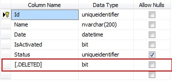

# Database.Delete()

In this lesson, we will learn about possible ways to delete a record from the database. M# provides `Database.Delete()` method for this purpose, which requires an entity instance to be deleted from database. 

M# provides three overloads of `Database.Delete()` method. In this lesson, we will work with the *Employee* entity and will see how we can call `Database.Delete()` on an entity instance(s).

> **Note:** In the codes below, the keyword `this` represents the current instance of an *Employee* entity.

## Soft Deleting
M# allows developers to soft delete records in the database. You can mark an entity as *Soft Delete* in M# and calling `Database.Delete()` method on the entity instances updates the `.Deleted` special column on the record as `True`, rather than deleting the record permanently.

### Setting an Entity as Soft Delete

You can mark an entity as Soft Delete by selecting `SoftDelete();` method on the Entity in M# Model Management Section, as shown below:

> For more information on entities in M#, please read lesson [M# Concepts](https://github.com/Geeksltd/MSharp.Docs/blob/master/Basics/Concepts.md).

```csharp
using MSharp;

namespace Domain
{
    public class Employee : SubType<User>
    {
        public Employee()
        {
            SoftDelete();

            String("Code");
        }
    }
}
```

M# updates the entity class and marks the class with `[SoftDelete]` attribute, as in our case the Employee entity class is marked as **Soft Delete**, as shown below:

```csharp
/// <summary>Represents an instance of Employee entity type.</summary>
[SoftDelete]
[EscapeGCop("Auto generated code.")]
public partial class Employee : User
```

M# creates a new column on the SQL Table shown below to manage soft delete records.



## Overloads

```csharp
Task Delete(IEntity instance);
Task Delete(IEntity instance, DeleteBehaviour behaviour);
Task Delete<T>(IEnumerable<T> instances) where T : IEntity;
```

#### Example

```csharp
/// Delete Single Employee Record
Database.Delete(this);
```

```csharp
// Delete Collection of Employee Records
Database.Delete(lstEmployees);
```

```csharp
// Delete Single Employee with Delete behaviour
Database.Delete(this,DeleteBehaviour.BypassDeleting);
```

The code above shows that we are deleting a record of *Employee*,  also supplying an additional parameter `DeleteBehaviour`. The additional parameter is used in special cases when you want to bypass any event in the workflow of the `Database.Delete()` method. `DeleteBehaviour` enum and the events raised by M# while deleting an instance are discussed below.

## Events Raised During Database.Delete

```csharp
protected override Task OnDeleting(CancelEventArgs e)
{
    // Perform any pre-deleting business logic. Fires just befor an instance is deleted
    return base.OnDeleting(e);
}
```

```csharp
protected override Task OnDeleted(EventArgs e)
{
    // Perform any post-deleting business logic. Fires just after an instance is deleted
    return base.OnDeleted(e);
}
```

## Delete Behaviour Enum

M# provides `Database.Delete()` method overload with an extra parameter of an enum type `DeleteBehaviour`. This enum type is used to bypass the events raised while deleting an entity instance as required in the business logic, the enum options are shown below:

```csharp
namespace Olive.Entities
{
    [Flags]
    public enum DeleteBehaviour
    {
        Default = 1,
        BypassDeleting = 2,
        BypassDeleted = 4,
        BypassLogging = 8,
        BypassAll = 14
    }
}
```