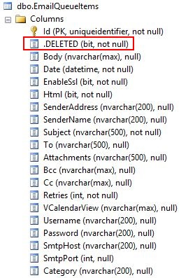

# Understanding Entity Types
The entity type is the fundamental building block for describing the structure of data within the Entity Data Model (EDM). In a conceptual model, an entity type represents the structure of top-level concepts, such as customers or orders. An entity type is a template for entity type instances. Each template contains the following information:

- A unique name.
- An entity key defined by one or more properties.
- Data in the form of properties.
- Navigation properties that allows navigation between associations.

In an application, an instance of an entity type represents a specific object (such as a specific customer or order). Each instance of an entity type must have a unique entity key within an entity set.

## Defining Entity Types
As explained in the previous chapter, M# provides a very detailed and user friendly UI to define Entities and facilitates development of a Business Domain Model. M# fully supports and automates most of the tasks required to create associations between entities and generates SQL Tables and related .Net classes.

### Methods

#### Base type

This property allows you to specify a base type for the current entity. It is particularly useful when entities contain similar data, you don't need to define the same properties for all related entities, you can work with the base type instead of duplicating logic and methods.
For example the base type of a "Developer" Entity or "Director" Entity could also be an "Employee" because they have a similar schema: Personal/Contact details, and share logic requirements e,g. if you need to store all login attempts you can use the generic "Employee".

By specifying a base class, M# implements inheritance among the entities and generates SQL database tables in a normalized fashion using foreign key relationships between tables using “ID” column. For more details please refer to tutorial [Inheritance](Inheritance.md)

#### Name(string value)
This is the name of the entity.

#### InstanceAccessors(bool value = true)
By setting this to true M# will generates accessors for instances.
For example if you create a "Status" entity and set this to true you will be able to use:
`myUser.Status = Status.Activated;`

#### ClassName(string value)
This is the name of the generated C# class.

#### DatabaseMode(DatabaseOption value)
This allows you to specify a mode for the database. We will explain this in future chapters.

#### Documentation(string value)
Use this if you want to add a custom documentation for the generated class.
Default documentation:

Custom documentation:

#### EagerLoadData(bool value = true)
Set this method if you don't want to defer the initialization of the object (lazy loading).

#### GenerateParseMethod(bool value = true)
This method will create a static function that returns the Employee instance that is textually represented by a specified string value, or null if no such object is found.

The search criteria is the ToString value of your instances.

#### GenerateUnitTests(bool? value = true)
Set this to false if you don't want to unit test this entity.

#### Abstract(bool value = true)
Set this method if you want to generate the class as abstract.

#### Cachable(bool? value = true)
If you want to allow this type to be cached set the value to True, if you don't set it to False.

#### IsHirarchy(bool value = true)
Set this object as hierarchical.

#### IsInterface(bool value = true)
Transforms your class to an Interface.
If your entity is an Interface you have to set the database mode to "Transient".

#### LogEvents(bool value = true)
By default M# stores all events for all the instances, e.g. insert, update, delete. This method allows you to disable this behaviour.

#### Notes(string value)
This method has no impact on the generated C# or SQL code, it is only a note for developers.

#### PluralName(string value)
This is automatically generated by M#, this method allows you to define a custom value.

#### PrimaryKeyType(string value)
This is the type of the primary key. By default the type is a Guid and your entity implements the interface

#### Schema(string value)
Schema of the database, "dbo" is the default value.

#### SoftDelete(bool value = true)
This method is very useful if you need to allow the user to delete data, but you want to retain a copy in the database. If you use Soft delete M# will create a hidden column in the SQL table: `[.Deleted] bit NOT NULL`

If you call `Database.Delete()` M# will set this flag to "1" and you won't be able to get this instance by calling `Database.GetList()`

#### SortDescending(bool value = true)
If you set this to true M# will sort your data by descending when you will use `Database.GetList()`

#### ToStringExpression(string value)
Specify the value of ToString(). It is similar to the "Default property" method, except that you can write a custom code instead of using a persisted/calculated property.