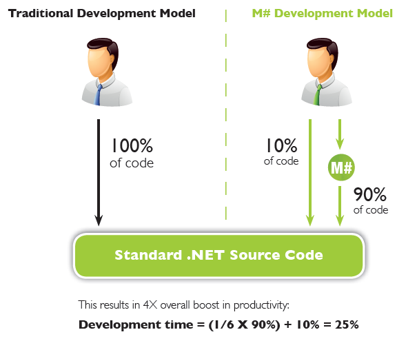

# What is M#?

M# is a model-driven declarative programming model intended for developing data-focused .NET web applications. M# CLI (msharp.exe) will transform everything into standard ASP.NET MVC and C# project source code. So it's safe to adopt for mission critical projects.

## Is C# not enough?
In every business application or website there are common patterns in the code that repeat over and over. Examples include data access code, business entities, user interface pages, data entry forms, list views, search modules, validation... These elements usually comprise 90% of the total application code.

Even though such code patterns are very common, but they are not identical. Actual code will vary slightly from project to project, or among different entities within the same project. That’s why typical methods of code or component reuse have limited use for business applications.

3rd generation languages such as C# are inherently unable to facilitate reuse, automation, or high level expression of such common patterns. Therefore the developers will have to code them manually every time.

## The M# philosophy
In conventional programming you have to explicitly specify "all the details" that form your application. The IDE and compiler are unaware of your "requirements" or "semantics" of what you want to achieve. So they can't help you much beyond simple intellisense.

The philosophy of M# is to program around common sense and semantics. Unlike traditional languages, with M# you start by specifying your intention as opposed to jumping into the "details". It will then fill in the details using its native understanding of:

- Your project's domain model
- Best practices for object-oriented programming
- Domain-driven-design principals
- Modern web UI standards, Html(5), Css, jQuery, etc
- Common sense and usability conventions

For 90% of the details, you completely rely on the assumptions of M#. For the remaining 10%, you will simply lead M# by providing just enough "details" to make the final code a 100% match for your exact requirements with no workarounds or rework.

## How does M# work?
By introducing domain-driven and high-level language concepts, M# enables the developers to define common application structure and behaviour at a higher level of abstraction at a sixth of the time.

The IDE and compiler of M# can interpret and understand business domain entities including their structure, rules and relationships. They are also aware of the above-mentioned code patterns.That combination, plus the developer’s specific instructions (configurations) enable M# to infer the C# and ASP.NET code and automatically generate it.

The remaining 10% of the code, usually containing custom business logic or specific user-interface features, will be written in C# and ASP.NET directly by the developer. Therefore M# provides an exceptionally rapid and productive route to production of a standard and complete .NET solution.

## Declarative & Imperative
Imagine the best of the two paradigms combined: productivity of declarative programming, plus the flexibility of imperative languages. That's where the magic of M# lies.

Imperative and general purpose languages are powerful, flexible and suitable for a wide range of programming activities. However they are quite verbose and  slow in developer productivity. On the other hand declarative languages are domain-specific and limited in use, yet highly productive and efficient in what they do.

M# mixes the best of the two worlds. It provides a declarative high level language that is very productive and effective. At the same time by providing native support for C# imperative expressions it bypasses any inherent limitations of declarative languages, resuling in a powerful and unlimited yet very productive programming experience.
