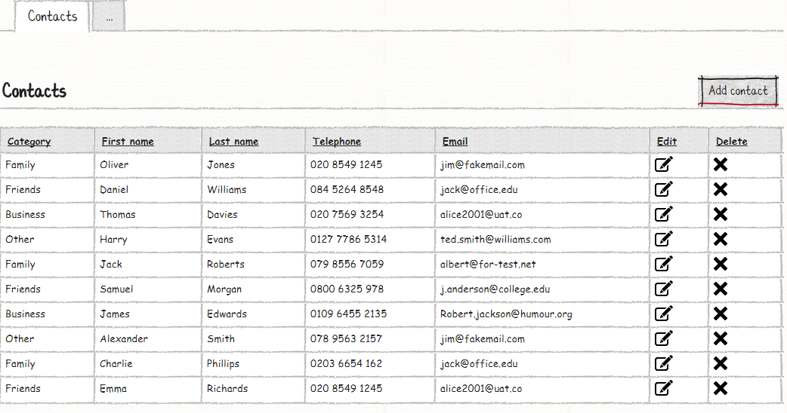
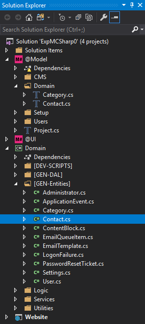
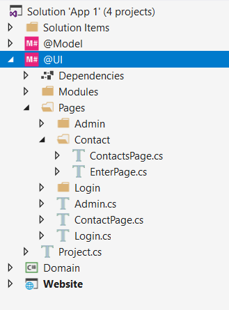

# Your First M# App
This tutorial is assuming readers' familiarity with the M# framework obtained from the preceding chapters.  
In this tutorial you will work with the following components:

- Entity types
- Association between entity types
- Pages and navigation
- Action buttons
- A list module
- A form module
- A menu

## Requirements
Implement a contact book that lets the user list all contacts and do *CRUD* operation on them.  
Sketches for the list and form modules are given below.




## Implementation
From the sample requirements we can identify two entity types called "Contact" and "Category".  
We also understand that they have a Many-to-One relationship since many contacts can belong to the same category.  
Now let's create the corresponding classes in the *#Model* project.

#### Creating M# Entity Types
In Solution Explorer of your Visual Studio under your *#Model* project make sure you have a folder named "Domain".
Right click the folder and add a class called "Category" to it.


Please note that ASP.NET consumes classes in the *Domain* project and expects to find the business logic there not here.  
M# translates the code we write here in the *Model* project and *Model* namespace to appropriate classes in the *Domain* project for ASP.NET to consume.  
Therefore, do not expect the code we're writing here to work elsewhere in the solution.  
In order to equip your entity type with all the functionality that M# offers, make it public and inherit from a class called "EntityType".
This class is part of the M# framework, so at the top of your document you need to reference the *MSharp* namespace as shown here:

```C#
using System;
using System.Collections.Generic;
using System.Text;
using MSharp;

namespace Model
{
    public class Category : EntityType
    {
        public Category()
        {
            String("Name").Mandatory();
        }
    }
}
```

In M# we use the default constructor to add properties to entity types.  
The only property of the *Category* class is of type *string* and is called *Name*.
You can find the corresponding line in the above snippet.  
In order to make this property mandatory we only need to call the *.Mandatory()* method using M# fluent API.  
  
In a similar way add another entity type called *Contact* but this time with a set of properties shown in the snippet below:

```C#
using System;
using System.Collections.Generic;
using System.Text;
using MSharp;

namespace Model
{
    public class Contact : EntityType
    {
        public Contact()
        {
            Associate<Category>("Category").Mandatory();
            String("First name").Mandatory();
            String("Last name").Mandatory();
            String("Tel").Mandatory();
            String("Email").Mandatory().Accepts(TextPattern.EmailAddress);
        }
    }
}
```

One of the strengths of M# is its fluent API that makes the code easily decipherable to everyone.  
As you can see we have created an association between *Contact* and *Category*.  
We have a number of mandatory string properties and for the Email we have applied text pattern validation.

**Note:** Always use singular names for entity types. M# is smart enough to automatically use their plural forms when necessary.
  
Now it's time to feed our two entity types to M# code generator. You invoke it by building the *#Model* project.  
In solution explorer, right click the *#Model* project and select *Build*.  
After the build process you can find the resulting files in the *Domain* project under the *[GEN-Entities] branch as shown below:  



The branch is so named to always remind us that everything under it is GENerated and gets overwritten every time we build the *#Model* project.  
There are other related classes under the *[GEN-DAL]* branch as well. They are responsible for generating and persisting data for entities of these types in the database. They form *data access layer* of the solution architecture and are again generated.

According to the requirements, each contact should have one category and these categories are fixed and user can just select them from the dropdown. For this purpose, we should insert the values for the first time that the M# generate a database for us and initialize its values. Under [DEV-SCRIPTS] folder, open **ReferenceData.cs** and add **CreateCategory()** method like below:

```C#
public class ReferenceData
    {
        static Task Create(IEntity item) => Database.Instance.Save(item, SaveBehaviour.BypassAll);

        public static async Task Create()
        {
            await Create(new Settings { Name = "Current", PasswordResetTicketExpiryMinutes = 2 });

            await CreateContentBlocks();
            await CreateAdmin();

            await CreateCategory();
        }

        static async Task CreateCategory()
        {

            await Create(new Category
            {
                Name = "Family"
            });
            await Create(new Category
            {
                Name = "Friends"
            });
            await Create(new Category
            {
                Name = "Business"
            });
            await Create(new Category
            {
                Name = "Other"
            });

        }
        
        //Other blocks of code
        ...
}
```

As you can see we have added a method with the name of **CreateCategory()** and initiate category value in it.

Before moving on to developing the UI let's build the *Domain* project to make sure everything regarding it is fine.

## Developing UI
In **#UI** project we have three main steps to do:
1. Add Pages
2. Config Menu
3. Add Modules To Pages

In our example, we have a contact page that list our contacts and another one for adding and editing contact.

### Creating Contact Pages
Until now, we have done these steps:
1. Created our entities in **#Model** project and build the project in visual studio
2. Then build **Domain** project in visual studio.
Now it's time to create our first page. Here we have two pages, one that is responsible for showing a contacts list and the other for adding and editing contact, these two pages can have some property in common, so first we create a parent page and then inherit other required page according to our example.

```C#
public class ContactPage : RootPage
{
    public ContactPage()
    {
        Add<MainMenu>();

        OnStart(x => x.Go<ContactsPage>().RunServerSide());
    }
}
```
This  is our root class that inherits from **RootPage** class, **RootPage** is a special class that tell M# framework how to deal with page. In **ContactPage.cs** I have mentioned that by the running this page, it should navigate to **ContactsPage.cs** that list all of my Contacts. So our next step is to create **ContactsPage.cs**

#### Creating Contact List Page & Contact List Module

```C#
public class ContactsPage : SubPage<ContactPage>
{
    public ContactsPage()
    {
        Layout(Layouts.FrontEnd);

        Add<ContactsList>();
    }
}
```
This class inherits from *ContactPage* and include Layout and Modules. With *Layout(Layouts.FrontEnd)* method I have specified page layout and by calling *Add\<ContactList>()* I told M# that this page should show ContactList module. Implementation of **ContactList.cs** class is like this:
```C#
public class ContactsList : ListModule<Domain.Contact>
{
    public ContactsList()
    {
        Column(x => x.Category);

        Column(x => x.FirstName);

        Column(x => x.LastName);

        Column(x => x.Tel).LabelText("Telephone");

        Column(x => x.Email);

        ButtonColumn("Edit").HeaderText("Actions").GridColumnCssClass("actions").Icon(FA.Edit)
            .OnClick(x => x.Go<EnterPage>()
            .Send("item", "item.ID").SendReturnUrl(false));

        ButtonColumn("Delete").HeaderText("Actions")
            .GridColumnCssClass("actions")
            .ConfirmQuestion("Are you sure you want to delete this Contact?")
            .CssClass("btn-danger")
            .Icon(FA.Remove)
            .OnClick(x =>
            {
                x.DeleteItem();
                x.RefreshPage();
            });

        Button("Add Contact")
            .Icon(FA.Plus)
            .OnClick(x => x.Go<EnterPage>().SendReturnUrl(false));
    }
}
```
In this class we have included our needed column according to the picture and add *Edit, Delete* and *Add Contact* buttons with their navigation instruction. You should notice that we have inherited from **ListModule** class, this class is a special class that tells M# framework how to generate code for showing this class.

#### Creating Contact Form Page & Contact Form Module
After creating a contact list its time to create a contact form page that is responsible for adding and editing operation. We continue our work by creating a contact form page in **#UI** project
```C#
public class EnterPage : SubPage<ContactsPage>
{
    public EnterPage()
    {
        Layout(Layouts.FrontEnd);

        Add<ContactForm>();
    }
}
```
As you can see, this class inherits from Contacts page and by using **Add\<ContactForm\>** it instruct M# framework that this page is responsible for showing contact form module.
```C#
public class ContactForm : FormModule<Domain.Contact>
{
    public ContactForm()
    {
        HeaderText("Contact Details");

        Field(x => x.Category).Control(ControlType.DropdownList);

        Field(x => x.FirstName).Control(ControlType.Textbox).Mandatory();

        Field(x => x.LastName).Control(ControlType.Textbox);

        Field(x => x.Email).Control(ControlType.Textbox);

        Field(x => x.Tel).Control(ControlType.Textbox).Label("Telephone");

        Button("Cancel").CausesValidation(false)
            .OnClick(x => x.ReturnToPreviousPage());

        Button("Save").IsDefault().Icon(FA.Check)
            .OnClick(x =>
            {
                x.SaveInDatabase();
                x.GentleMessage("Saved successfully.");
                x.ReturnToPreviousPage();
            });
    }
}
```
Another important module is form module that deals with add or edit entity. This class inherits from **FormModule** class that tell M# framework how to deal with this class. This special class tells M# that it should generate a form page.

### Adding Contact List Page to Menu
Our last step is to include a *contact list page* in the main menu, for doing this open **MainMenu.cs** class *(you can find it in the folder Modules/-Menues of #UI project)* and add *ContactPage* class here as a menu item.
```C#
public class MainMenu : MenuModule
{
    public MainMenu()
    {
        AjaxRedirect().IsViewComponent().UlCssClass("nav navbar-nav dropped-submenu");

        Item("Login").Icon(FA.UnlockAlt).VisibleIf(AppRole.Anonymous)
            .OnClick(x => x.Go<LoginPage>());

        Item("Settings").Icon(FA.Cog).VisibleIf(AppRole.Administrator)
            .OnClick(x => x.Go<SettingsPage>());

        Item("Contacts").Icon(FA.Cog)
            .OnClick(x => x.Go<ContactPage>());
    }
}
```
By adding *ContactPage* class as menu item here, we tell M# framework that by clicking on Contacts link, it should navigate user to *ContactPage* that shows a list of all contacts in our database. 

#### Final Step
Now its time to build **#UI** project, this project generated related files in **WebSite** project, after building **#UI** project set the **WebSite** project as your default *StartUp* project and then set your *connection string* in **appsetting.json** file and hit F5 to see M# magic. Your project is ready to use in a short time.
