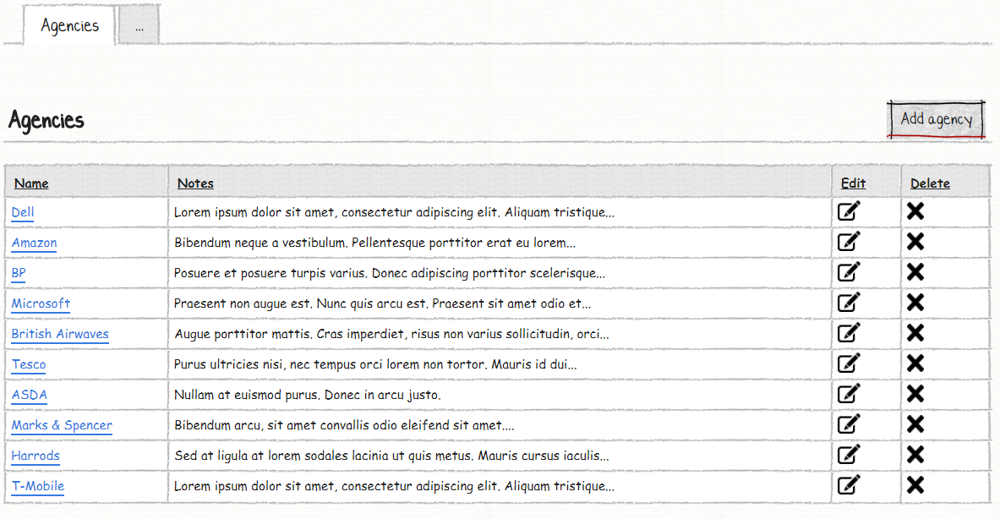
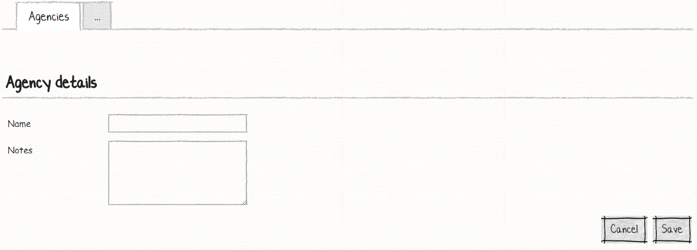
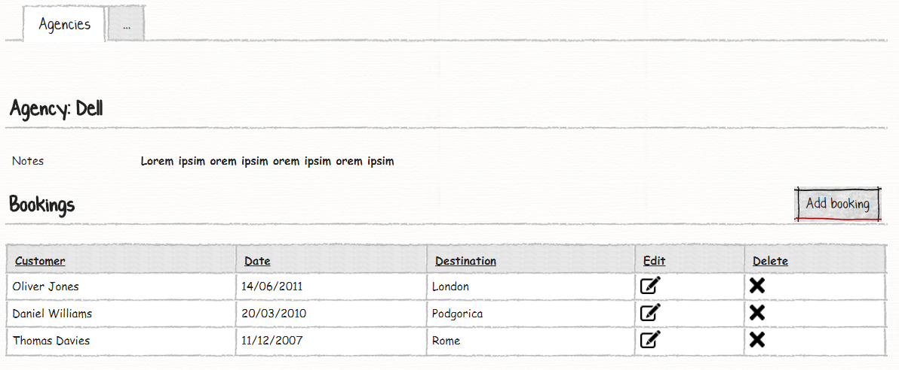
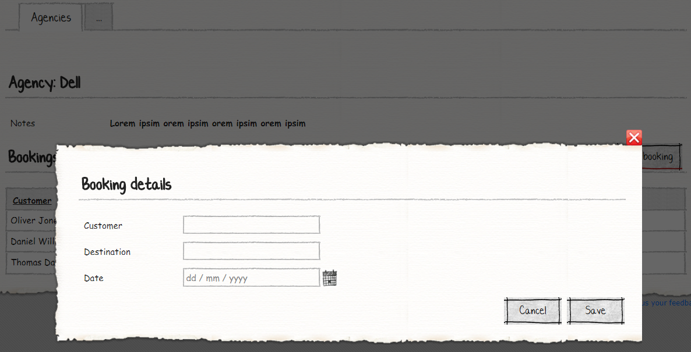

# Your Tenth M# Application
In this tutorial you will learn:

-  List data source
-  View module property
-  Link button

## Requirements
In this tutorial we are going to develop a website that lists agencies and their bookings. In agency page user can see all agencies and do CRUD operations. In agency view page user can see agency detail and its related bookings and do CRUD operations.

### Agencies:




The agency page is simple, It just shows a list of all agencies and let users do CRUD operation. The first column is a link button that shows detail information about each agency.

### Agency Detail:


On the agency view page, user can see agency detail information and its related bookings, in this page we should change title dynamically and list related bookings and let users do CRUD operations on bookings.



User can add booking by clicking on "Add booking" button, it will show a modal that lets user insert custom booking.


## Creating Entities
Let's start with creating **Agency** and **Booking** classes in a *#Model* project under *Domain* folder:

```C#
using MSharp;

namespace Domain
{
    public class Agency : EntityType
    {
        public Agency()
        {
            String("Name");

            String("Notes").Lines(5);

            InverseAssociate<Booking>("Bookings", "Agency");
        }
    }
}
```
*Agency* class has "Name" string property. "Notes" string property with `.Lines()` fluent M# method that generates a text area with 5 lines and an inverse associate property that list all agency bookings.
```C#
using MSharp;

namespace Domain
{
    public class Booking : EntityType
    {
        public Booking()
        {
            String("Customer");

            String("Destination");

            Date("Date");

            Associate<Agency>("Agency").Mandatory();
        }
    }
}
```
The *Booking* class has two string properties named "Customer" and "Destination". Also a date property with the name of "Date" and a one to many associate property with the name of "Agency".
In solution explorer, right click the *#Model* project and select *Build* and then build the *Domain* project to make sure everything regarding it is fine.

## Developing UI
According to the requirements, we have these pages to develop:

- Agencies List
  - Add / Edit Agency
- Agency View
  - Bookings List
  - Add / Edit Booking

### Creating Service Type Pages
Use the M# context menu to add the *Agency* root page to the "Pages" folder of "#UI" project:
```C#
using MSharp;

public class AgencyPage : RootPage
{
    public AgencyPage()
    {
        Add<Modules.AgenciesList>();
    }
}
```
The "AgencyPage" holds agency list module that we are going to create it in the next steps.
Create a folder with the name of "Agencies" under "Pages" folder and add *EnterPage* sub page class as shown bellow:
```C#
using MSharp;

namespace Agencies
{
    class EnterPage : SubPage<AgencyPage>
    {
        public EnterPage()
        {
            Layout(Layouts.FrontEnd);

            Add<Modules.AgencyForm>();
        }
    }
}
```
The "EnterPage" class holds agency form module and we have to set it's layout to `Layouts.FrontEnd` as requirement told us.
Create *ViewPage* sub page class which holds agency view module like below:
```C#
using MSharp;

namespace Agencies
{
    class ViewPage : SubPage<AgencyPage>
    {
        public ViewPage()
        {
            Add<Modules.AgencyView>();

            Add<Modules.BookingsList>();
        }
    }
}
```

#### Creating Agency List Module
Add a folder with the name of *Agency* under the *Modules* folder of the *#UI* project and add *AgenciesList* using the M# context menu like below:

```C#
using MSharp;

namespace Modules
{
    public class AgenciesList : ListModule<Domain.Agency>
    {
        public AgenciesList()
        {
            HeaderText("Agencies")
                .ShowHeaderRow();

            ButtonColumn("c#:item.Name").HeaderText("Name")
                .Style(ButtonStyle.Link)
                .OnClick(x => x.Go<Agencies.ViewPage>()
                .Send("item", "item.ID"));

            Column(x => x.Notes);

            ButtonColumn("Edit").Icon(FA.Edit)
                .OnClick(x => x.Go<Agencies.EnterPage>()
                .SendReturnUrl()
                .Send("item", "item.ID"));

            Button("Add agency").Icon(FA.Plus)
                .OnClick(x => x.Go<Agencies.EnterPage>()
                .SendReturnUrl());
        }
    }
}
```
First column of an agency list module should be a hyper link button and when a user click on this page he should be navigated to an agency's detail page. For this purpose we have used `ButtonColumn()` M# fluent method and set its name property dynamically by using string expression `c#:item.Name`, this expression tell M# that button name should come from related item and because its link styled, we have used `.Style(ButtonStyle.Link)` method. By calling `.OnClick(x => x.Go<Agencies.ViewPage>()` we navigate users to agency view page and we pass agency Id by calling `.Send("item", "item.ID")`.

#### Creating Agency Form Module
Add a form module with the name of *AgencyForm* using the M# context menu like below:
```C#
using MSharp;

namespace Modules
{
    public class AgencyForm : FormModule<Domain.Agency>
    {
        public AgencyForm()
        {
            HeaderText("Agency details");

            Field(x => x.Name);

            Field(x => x.Notes);

            Button("Cancel").OnClick(x => x.ReturnToPreviousPage());

            Button("Save").IsDefault().Icon(FA.Check)
            .OnClick(x =>
            {
                x.SaveInDatabase();
                x.GentleMessage("Saved successfully.");
                x.ReturnToPreviousPage();
            });
        }
    }
}
```

#### Creating Agency View Module
Add a form module with the name of *AgencyForm* by using the M# context menu like below:
```C#
using MSharp;

namespace Modules
{
    public class AgencyView : ViewModule<Domain.Agency>
    {
        public AgencyView()
        {
            HeaderText("Agency @item.Name");

            Field(x => x.Notes);
        }
    }
}
```
The header text of view module is dynamic, so for this purpose we have used `HeaderText("Agency @item.Name")` property with `"Agency @item.Name"` string expression. `@item.name` tells M# that its header should come from selected agency.

### Creating Booking Pages
Use M# context menu to add *Booking* root page to the "Pages" folder of "#UI" project:
```C#
using MSharp;

public class BookingPage : RootPage
{
    public BookingPage()
    {
        // I'm blank!!
    }
}
```
Because booking doesn't have any independent list page, we have let this page blank and use it as a root page for "EnterPage" subclass.
Create a folder with the name of "Bookings" under "Pages" folder and add *EnterPage* sub page:
```C#
using MSharp;

namespace Bookings
{
    class EnterPage : SubPage<BookingPage>
    {
        public EnterPage()
        {
            Layout(Layouts.FrontEndModal);

            Add<Modules.BookingForm>();
        }
    }
}

```

#### Creating Booking List Module
Add a folder with the name of *Booking* under the *Modules* folder of the *#UI* project and add *BookingsList* by using the M# context menu like below:

```C#
using MSharp;

namespace Modules
{
    public class BookingsList : ListModule<Domain.Booking>
    {
        public BookingsList()
        {
            HeaderText("Bookings");

            Column(x => x.Agency);

            Column(x => x.Customer);

            Column(x => x.Date);

            Column(x => x.Destination);

            ButtonColumn("Edit").Icon(FA.Edit)
                .OnClick(x => x.PopUp<Bookings.EnterPage>()
                .Send("item", "item.ID")
                .Send("agency", "item.AgencyId"));

            Button("Add booking").Icon(FA.Plus)
                .OnClick(x => x.PopUp<Bookings.EnterPage>()
                .Send("agency", "info.Agency.ID"));

            ViewModelProperty("Agency", "Agency").FromRequestParam("item");

            DataSource("info.Agency.Bookings.GetList().Result");
        }
    }
}
```
"BookingsList" class has four important parts:

 - `ViewModelProperty()`: This  method tells M# that this list module has a property with the name of "Agency" and this agency come from query string with the key of **item** that we have introduced in  **AgenciesList** module with the button property. With the help of this view model property, when a user click on an agency and come to its detail page, M# will use a query string to select a related agency and now as a developer, we have selected agency in this view module by calling `ViewModelProperty("Agency", "Agency").FromRequestParam("item")` method.
 - `DataSource()`: This view module should just list bookings that related to selected agency, for this purpose we have used `DataSource("info.Agency.Bookings.GetList().Result")` which changes the default data source and as requirement told us we should traverse from agency to its related booking.
 - `ButtonColumn()`: This method should navigate users to the edit page. This page should be aware of selected booking and agency, so we should pass two query string with the key of **item** and **agency**. For this purpose we have used `.Send("item", "item.ID").Send("agency", "item.AgencyId")`.
 - `Button()`*: When a user click on add booking, a modal should be open and this modal should be aware of selected agency, so we should send agency Id to the modal with the help of query string and we have used: `.Send("agency", "info.Agency.ID")` this method use view model property and sent selected agency Id to the modal.

#### Creating Booking Form Module
Add form module with the name of *BookingForm* by using the M# context menu like below:
```C#
using MSharp;

namespace Modules
{
    public class BookingForm : FormModule<Domain.Booking>
    {
        public BookingForm()
        {
            HeaderText("Booking details");

            Field(x => x.Customer);

            Field(x => x.Destination);

            Field(x => x.Date);

            Button("Cancel").OnClick(x => x.CloseModal());

            Button("Save").IsDefault().Icon(FA.Check)
            .OnClick(x =>
            {
                x.SaveInDatabase();
                x.GentleMessage("Saved successfully.");
                x.CloseModal(Refresh.Full);
            });

            AutoSet(x => x.Agency);
        }
    }
}
```
The "BookingForm" has a very important method with the name of `AutoSet()`. As you can remember from former section, when a user click on add / edit button he will be navigated to this page and this page expect two query string, one of them should be *item* that will be used by default in M# to get selected booking and the other one will be *agency* that will select agency for this booking. For this kind of scenario that we want to preselect a property, we should use `AutoSet()` method.

#### Adding Pages to Menu
The last step is to add a root page to the main menu:
```C#
using MSharp;

namespace Modules
{
    public class MainMenu : MenuModule
    {
        public MainMenu()
        {
            AjaxRedirect().IsViewComponent().UlCssClass("nav navbar-nav dropped-submenu");

            Item("Login")
                .Icon(FA.UnlockAlt)
                .VisibleIf(AppRole.Anonymous)
                .OnClick(x => x.Go<LoginPage>());

            Item("Settings")
                .VisibleIf(AppRole.Admin)
                .Icon(FA.Cog)
                .OnClick(x => x.Go<Admin.SettingsPage>());

            Item("Booking")
               .Icon(FA.Cog)
               .OnClick(x => x.Go<BookingPage>());

            Item("Agencies")
               .Icon(FA.Cog)
               .OnClick(x => x.Go<AgencyPage>());
        }
    }
}
```
### Final Step
Build **#UI** project, set the **WebSite** project as your default *StartUp* project and configure your *connection string* in **appsetting.json** file and hit F5. Your project is ready to use.
