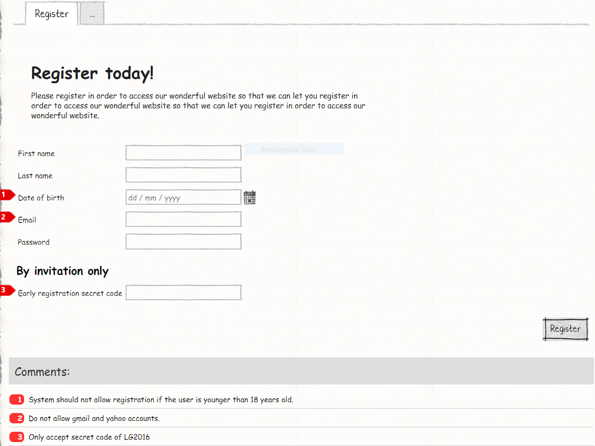

# M# Tutorial - Episode 12: Advanced validation

In this tutorial you will learn:

- `Validate()` method of objects
- Form level custom validation
- Form element header markup
- Module header text

## Requirements

In this tutorial we are going to implement a registration form that lets user to enter contact information. There are three criteria:

- System should not allow registration if the user is younger than 18 years old.
- Do not allow gmail and yahoo accounts.
- Only accept secret code of **SuperSecretFormula**

If the user enters valid data, his information will be saved and if criteria did not pass, related error message will be shown to the user.

### Register Form:



This is the only page that we are going to implement, in this page user fill the form and get a suitable response from the web site.

## Implementation: Entities

From requirements, one entity can be identified, "Register". In registering entity, there are five properties: "First name", "Last name", "Date of birth", "Email", "Password" and a view model property for an invitation code. All criteria will be implemented on business logic layer.
After understanding requirements and identifying its related properties, it's time to create them. Now let's create the corresponding classes in the *#Model* project.

Navigate to the **#Model** project and create a **Domain** folder, *right click > Add > M#* and then add this class:

```csharp
using MSharp;

namespace Domain
{
    public class Register : EntityType
    {
        public Register()
        {
            String("First name").Mandatory();

            String("Last name").Mandatory();

            Date("Date of birth").Mandatory();

            String("Email").Accepts(TextPattern.EmailAddress);

            String("Password");

            String("InvitationCode").Calculated();
        }
    }
}
```

The register class just uses simple M# property and for email address there is a restriction for entering just valid email. The *InvitationCode* property is using `.Calculated()` method, this property is read-only and hold user entered value in the UI and if the value is "SuperSecretFormula" form will be saved.
Now it's time to feed our entity to M#. In the solution explorer, right click the *#Model* project and select *Build* and then build the *Domain* project to make sure everything regarding it is fine.

## Implementation: Logic

Navigate to *Logic* folder of the *#UI* project; then add a class named *Register* and add logic as shown bellow:

```csharp
using Olive;
using Olive.Entities;
using System;
using System.Threading.Tasks;

namespace Domain
{
    public partial class Register
    {
        public override Task Validate()
        {
            if (LocalTime.Now.Subtract(this.DateOfBirth) < TimeSpan.FromDays(365 * 18))
            {
                throw new ValidationException("User must be at least 18 years old to register.");
            }

            if (Email.ContainsAny(new[] { "@gmail.", "@yahoo." }, caseSensitive: false))
            {
                throw new ValidationException("Gmail and Yahoo emails are not accepted.");
            }

            return base.Validate();
        }
    }
}
```

The register class is a partial C# class that holds all business logic, for adding validation criteria we should override `Validate()` method and add our custom logics. According to the requirements there are two criteria:

- System should not allow registration if the user is younger than 18 years old.
- Do not allow gmail and yahoo accounts.

## Implementation: UI

According to the requirements, there is just one root page named "RegisterPage".

### Creating Register Page

Go to **Pages** folder of **#UI**, *right click > Add > M#*  then create **RegisterPage** rootpage:

```csharp
using MSharp;

public class RegisterPage : RootPage
{
    public RegisterPage()
    {
        Add<Modules.RegisterForm>();
    }
}
```

As you can see, we have added `Add<Modules.RegisterForm>();` (which will be implemented later), this class holds the register form module.

### Creating required module of Register Pages

Navigate to **Modules** folder of **#UI** project and create folder named **Register**. Then add a *List module* named **RegisterForm** using M# context menu:

```csharp
using MSharp;

namespace Modules
{
    public class RegisterForm : FormModule<Domain.Register>
    {
        public RegisterForm()
        {
            HeaderText("Register today!");

            Header("Please register in order to access our wonderful website.");

            Field(x => x.FirstName);

            Field(x => x.LastName);

            Field(x => x.DateOfBirth);

            Field(x => x.Email);

            Field(x => x.Password);

            Field(x => x.InvitationCode).HeaderText("<h2>By invitation only</h2>").Label("Early registration secret code");

            SupportsEdit(false);

            Button("Register").IsDefault()
            .OnClick(x =>
            {
                x.If("info.InvitationCode != \"SuperSecretFormula\"").GentleMessage("Invalid registration key.").Exits();

                x.SaveInDatabase();
            });
        }
    }
}
```

This class has responsibility for generating related forms for adding entity. According the requirements, there is an invitation code property that lets user enter any number, but if the user enter *SuperSecretFormula* user will be legible to save the form. This property is not going to be saved in the database, because it just acts like a validation, for this purpose we have used `ViewModelProperty<string>("InvitationCode")` generic method. By using this method M# just create a view model property that is related to our DTO object and will not be saved on database. We have used **InvitationCode** property in the `.OnClick()` method for adding criteria and checked user entered value. After creating this module, add it to *RegisterPage.cs* class that is our root page if you have let them empty in previous sections.

### Adding Pages to the Menu

After you ended up with the pages, you need to add them to the main menu:

```csharp
using MSharp;

namespace Modules
{
    public class MainMenu : MenuModule
    {
        public MainMenu()
        {
            AjaxRedirect().IsViewComponent().UlCssClass("nav navbar-nav dropped-submenu");

            Item("Login")
                .Icon(FA.UnlockAlt)
                .VisibleIf(AppRole.Anonymous)
                .OnClick(x => x.Go<LoginPage>());

            Item("Settings")
                .VisibleIf(AppRole.Admin)
                .Icon(FA.Cog)
                .OnClick(x => x.Go<Admin.SettingsPage>());

            Item("Register")
                .Icon(FA.Cog)
                .OnClick(x => x.Go<RegisterPage>());
        }
    }
}
```

### Final Step

Build **#UI** project, set the **WebSite** project as your default *StartUp* project and configure your *connection string* in **appsetting.json** file and hit F5. Your project is ready to use.
