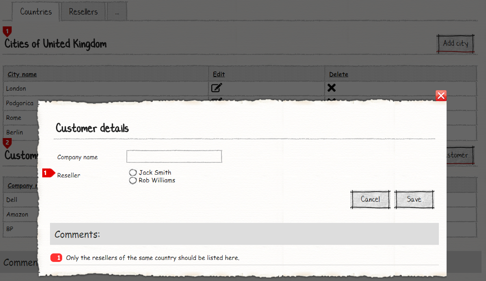
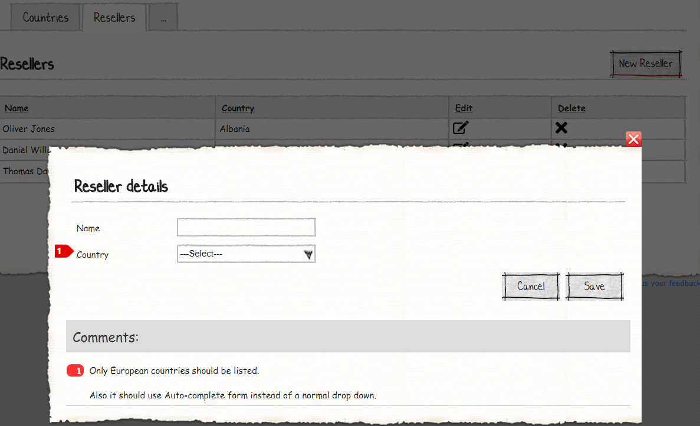

# M# Tutorial - Episode 13: Form element

In this tutorial you will learn:

- Control type
- Form element data source
- Form element source criteria

## Requirements

In this tutorial we are going to implement a web site that manages countries and resellers. Countries can be from anywhere worldwide, but resellers can be just from European countries. By clicking on each country use can see its related cities and customers.

### Countries


In country page users can see a list of all countries and they can do CRUD operations. Users are also able to click on each country and see its detail like below:




In country detail page users can see all related cities and customers; Also users are able to do CRUD operations. There are some criteria for concern:

- Only cities that are linked to the CURRENTLY selected Country should be listed here, instead of All cities.
- Only customers that are linked to the CURRENTLY selected Country should be listed here, instead of All customers.

According to the requirements, we should just load selected country's cities and customers.

### Resellers




In the reseller page users are able to see all resellers and they can do CRUD operations as well. But there's a criteria for adding new resellers :

- Only European countries should be listed.

## Implementation: Entities

As we can see in the requirements, *four* entities can be identified, **Country**, **Reseller**, **City** and **Customer**. Country entity has many cities, customers and resellers. Reseller entity has one country. City entity has one country. Customer has one reseller and one country.
After analyzing the requirements and identifying related properties, it's time to create them. Now let's create the corresponding classes in the **#Model** project.

Navigate to **Domain** folder and add these classes:

```csharp
using MSharp;

namespace Domain
{
    public class City : EntityType
    {
        public City()
        {
            String("Name");

            Associate<Country>("Country").Mandatory();
        }
    }
}
```

```csharp
using MSharp;

namespace Domain
{
    public class Country : EntityType
    {
        public Country()
        {
            String("Name");

            Bool("Is european").Mandatory();

            InverseAssociate<City>("Cities", "Country");

            InverseAssociate<Customer>("Customers", "Country");

            InverseAssociate<Reseller>("Resellers", "Country");
        }
    }
}
```

```csharp
using MSharp;

namespace Domain
{
    public class Customer : EntityType
    {
        public Customer()
        {
            String("Name");

            Associate<Reseller>("Reseller").Mandatory();

            Associate<Country>("Country").Mandatory();
        }
    }
}
```

```csharp
using MSharp;

namespace Domain
{
    public class Reseller : EntityType
    {
        public Reseller()
        {
            String("Name");

            Associate<Country>("Country").Mandatory();
        }
    }
}
```

After you added these classes, build **#Model** and after that **Domain** project to make sure everything regarding it is fine.

## Implementation: UI

As we can see in the requrements, we should develop these pages:

- Countries
  - Countries view (Contians list of cities and customers)
    - Add city
    - Add customer
  - Add country
-Resellers
  - Add seller

Let's start with the tough one! We'll it's not that tough actually when there's M#. Go to **Pages** folder of **#UI**, right *click > Add > M#*  then create **Reseller** rootpage:

```csharp
using MSharp;

public class CountryPage : RootPage
{
    public CountryPage()
    {
        Layout(Layouts.FrontEnd);

        Add<Modules.CountriesList>();
        //Adds a country list into this page. Countries list will be implemented later
    }
}
```

Now create a folder named **Country** under the **Pages** folder. Then add an **Enter** class here:

```csharp
using MSharp;

namespace Country
{
    public class EnterPage : SubPage<CountryPage>
    {
        public EnterPage()
        {
            Layout(Layouts.FrontEndModal);

            Add<Modules.CountryForm>();
            // Adds a country form
        }
    }
}

```

Then add another *subpage* class named **ViewPage**:

```csharp
using MSharp;

namespace Country
{
    public class ViewPage : SubPage<CountryPage>
    {
        public ViewPage()
        {
            Layout(Layouts.FrontEnd);

            Add<Modules.CitiesList>();
            // Adds cities list to this page

            Add<Modules.CustomersList>();
            // Adds customer's list to this page
        }
    }
}
```

Create a folder with the name of **City** into **Countries** folder then add **Enter** *subpage* class like this:

```csharp
using MSharp;

namespace Country.City
{
    public class CityEnterPage : SubPage<ViewPage>
    {
        public CityEnterPage()
        {
            Layout(Layouts.FrontEndModal);

            Add<Modules.CityForm>();
            //Adds a city form into this page
        }
    }
}

```

Now create a folder with the name of **Customer** into **Countries** folder then add **Enter** *subpage* class:

```csharp
using MSharp;

namespace Country.Customer
{
    public class CustomerEnterPage : SubPage<ViewPage>
    {
        public CustomerEnterPage()
        {
            Layout(Layouts.FrontEndModal);

            Add<Modules.CustomerForm>();
            //Adds a customer form into this page
        }
    }
}
```

### Creating required modules of country

Navigate to **Modules** folder of **M#** project and create folder named **Country**. Then add a *list module* named **CitiesList** using M# context menu:

```csharp
using MSharp;

namespace Modules
{
    public class CountriesList : ListModule<Domain.Country>
    {
        public CountriesList()
        {
            HeaderText("Countries")
                .ShowHeaderRow();

            LinkColumn("c#:item.Name").OnClick(x => x.Go<Country.ViewPage>()
            .Send("item", "item.ID"));

            Column(x => x.IsEuropean).LabelText("Is European?");

            ButtonColumn("Edit").Icon(FA.Edit)
                .OnClick(x => x.PopUp<Country.EnterPage>().Send("item", "item.ID"));

            Button("Add Country").Icon(FA.Plus)
                .OnClick(x => x.PopUp<Country.EnterPage>());
        }
    }
}
```

Then add the **CountryForm** module:

```csharp
using MSharp;

namespace Modules
{
    public class CountryForm : FormModule<Domain.Country>
    {
        public CountryForm()
        {
            HeaderText("Country details");

            Field(x => x.Name);

            Field(x => x.IsEuropean).Control(ControlType.HorizontalRadioButtons);

            Button("Cancel").OnClick(x => x.CloseModal());

            Button("Save").IsDefault().Icon(FA.Check)
            .OnClick(x =>
            {
                x.SaveInDatabase();
                x.GentleMessage("Saved successfully.");
                x.CloseModal(Refresh.Full);
            });
        }
    }
}
```

Now add a folder named **City** into **Modules**. Then add a *list module* named **CitiesList** using M# context menu:

```csharp
using MSharp;

namespace Modules
{
    public class CitiesList : ListModule<Domain.City>
    {
        public CitiesList()
        {
            HeaderText("Cities of @info.Country.Name");

            Column(x => x.Name).LabelText("City name");

            ButtonColumn("Edit").Icon(FA.Edit)
                .OnClick(x => x.PopUp<Country.City.CityEnterPage>()
                .Send("item", "item.ID")
                .Send("country", "item.CountryId"));

            Button("New City").Icon(FA.Plus)
                .OnClick(x => x.PopUp<Country.City.CityEnterPage>()
                .Send("country", "info.Country.ID"));

            ViewModelProperty("Country", "Country").FromRequestParam("item");

            DataSource("await info.Country.Cities.GetList()");
        }
    }
}
```

Here, create **CityForm** which is a *form module* via M# context menu:

```csharp
using MSharp;

namespace Modules
{
    public class CityForm : FormModule<Domain.City>
    {
        public CityForm()
        {
            HeaderText("City details");

            Field(x => x.Name);

            AutoSet(x => x.Country);

            Button("Cancel").OnClick(x => x.CloseModal());

            Button("Save").IsDefault().Icon(FA.Check)
            .OnClick(x =>
            {
                x.SaveInDatabase();
                x.GentleMessage("Saved successfully.");
                x.CloseModal(Refresh.Full);
            });
        }
    }
}
```

We're done with city! The next step is the *Customer*. So create a *form module* named **CustomerForm** using M# context menu and place this code inside:

```csharp
using MSharp;

namespace Modules
{
    public class CustomerForm : FormModule<Domain.Customer>
    {
        public CustomerForm()
        {
            HeaderText("Customer details");

            Field(x => x.Name).Label("Customer name");

            Field(x => x.Reseller).Control(ControlType.VerticalRadioButtons);

            AutoSet(x => x.Country);

            Button("Cancel").OnClick(x => x.CloseModal());

            Button("Save").IsDefault().Icon(FA.Check)
            .OnClick(x =>
            {
                x.SaveInDatabase();
                x.GentleMessage("Saved successfully.");
                x.CloseModal(Refresh.Full);
            });
        }
    }
}
```

Now it's time to add the **CustomersList** module:

```csharp
using MSharp;

namespace Modules
{
    public class CustomersList : ListModule<Domain.Customer>
    {
        public CustomersList()
        {
            HeaderText("Customers")
                .ShowHeaderRow();

            Column(x => x.Name);
            Column(x => x.Reseller);

            ButtonColumn("Edit").Icon(FA.Edit)
                .OnClick(x => x.PopUp<Country.Customer.CustomerEnterPage>()
                .Send("item", "item.ID")
                .Send("country", "item.CountryId"));

            Button("Add Customer").Icon(FA.Plus)
                .OnClick(x => x.PopUp<Country.Customer.CustomerEnterPage>()
                .Send("country", "info.Country.ID"));

            ViewModelProperty("Country", "Country").FromRequestParam("item");

            DataSource("await info.Country.Customers.GetList()");
        }
    }
}
```

We are done with *country* and it's subpages. Let's finish up with *reseller*.

This project containes a dedicated page for *resellers*. So add a *root page* class named **ResellerPage** under **Pages** folder of **#UI** using M# context menu (or any oher way that yu are comfortable with):

```csharp
using MSharp;

public class ResellerPage : RootPage
{
    public ResellerPage()
    {
        Layout(Layouts.FrontEnd);

        Add<Modules.ResellersList>();
    }
}
```

Now add a folder named **Reseller** under **Pages** folder, then add an **Enter** *sub page* class:

```csharp
using MSharp;

namespace Reseller
{
    public class EnterPage : SubPage<ResellerPage>
    {
        public EnterPage()
        {
            Layout(Layouts.FrontEndModal);

            Add<Modules.ResellerForm>();
            // Adds a reseller form into the webpage
        }
    }
}

```

### Creating required modules of reseller

Move on to **Modules** folder of **#UI** and add a folder with the name of **Reseller** which will contain related modules of *reseller* view.
Now use M# context menu and add a *form module* named **ResellerForm**:

```csharp
using MSharp;

namespace Modules
{
    public class ResellerForm : FormModule<Domain.Reseller>
    {
        public ResellerForm()
        {
            HeaderText("Reseller details");

            Field(x => x.Name);

            Field(x => x.Country).Control(ControlType.AutoComplete)
                .DataSource("await Database.GetList<Country>().Where(x => x.IsEuropean)");

            Button("Cancel").OnClick(x => x.CloseModal());

            Button("Save").IsDefault().Icon(FA.Check)
            .OnClick(x =>
            {
                x.SaveInDatabase();
                x.GentleMessage("Saved successfully.");
                x.CloseModal(Refresh.Full);
            });
        }
    }
}
```

And also a *listmodule* named **ResellersList**:

```csharp
using MSharp;

namespace Modules
{
    public class ResellersList : ListModule<Domain.Reseller>
    {
        public ResellersList()
        {
            HeaderText("Resellers")
                .ShowHeaderRow();

            Column(x => x.Name);

            Column(x => x.Country);

            ButtonColumn("Edit").Icon(FA.Edit)
                .OnClick(x => x.PopUp<Reseller.EnterPage>().Send("item", "item.ID"));

            Button("New Reseller").Icon(FA.Plus)
                .OnClick(x => x.PopUp<Reseller.EnterPage>());
        }
    }
}
```

And yes! now we are done with views.

### Adding Pages to the Menu

After you ended up with views, you need to add those to the main menu:

```csharp
using MSharp;

namespace Modules
{
    public class MainMenu : MenuModule
    {
        public MainMenu()
        {
            AjaxRedirect().IsViewComponent().UlCssClass("nav navbar-nav dropped-submenu");

            Item("Login")
                .Icon(FA.UnlockAlt)
                .VisibleIf(AppRole.Anonymous)
                .OnClick(x => x.Go<LoginPage>());

            Item("Settings")
                .VisibleIf(AppRole.Admin)
                .Icon(FA.Cog)
                .OnClick(x => x.Go<Admin.SettingsPage>());

            Item("Countries")
                .Icon(FA.Cog)
                .OnClick(x => x.Go<CountryPage>());

            Item("Reseller")
                .Icon(FA.Cog)
                .OnClick(x => x.Go<ResellerPage>());
        }
    }
}
```

### Final Step

Build **#UI** project, set the **WebSite** project as your default *StartUp* project and configure your *connection string* in **appsetting.json** file and hit F5. Your project is ready to use.