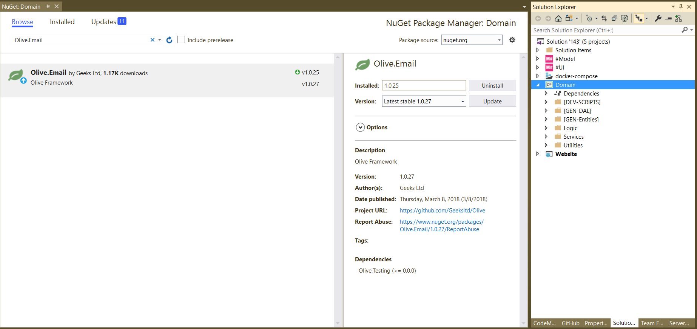

# M# Tutorial - Episode 14: Sending email

In this tutorial you will learn:

- Boolean form element (true, false text), 
- Custom workflow action
- Sending emails
- Email Templates

## Requirements

In this tutorial we are going to implement a registration form that get users information and send an email to the users after successful registration.

### Register Form:


In this form users enter their required information and after click on the register button, website will send an email to confirm their registration process.

## Implementation: Entities

As we can see in the requirements, *one* entity can be identified and it is **Registration**. This entity has just three *string* properties and one *boolean* property. The only business login is to send email after successful registration.
After analyzing the requirements and identifying related properties, it's time to create them. Now let's create the corresponding classes in the **#Model** project.

Create a **Domain** folder and add this class:

```csharp
using MSharp;

namespace Domain
{
    public class Registration : EntityType
    {
        public Registration()
        {
            String("First name");

            String("Last name");

            String("Email");

            Bool("IsSubscribed").Mandatory();
        }
    }
}
```

According to the requirements, the system should send an email after user registration. Olive exposes `IEmailMessage` interface under `Olive.Email` namespace, which enables you to implement email sending functionality. In order to send an email from your project using Olive, you must have an entity which implements this interface and you must have a database table having columns as per the properties in this interface. In the following code we have created an M# entity named `EmailMessage` that this class will implement `IEmailMessage` as shown below:

```csharp
using MSharp;

namespace Domain
{
    public class EmailMessage : EntityType
    {
        public EmailMessage()
        {
            SoftDelete().Implements("Olive.Email.IEmailMessage");

            BigString("Body").Lines(5).Mandatory();
            String("From address");
            String("From name");
            String("Reply to address");
            String("Reply to name");
            String("Subject");
            String("To");
            BigString("Attachments");
            String("Bcc").Max(2000);
            String("Cc").Max(2000);
            String("VCalendarView");
            Int("Retries").Mandatory();
            DateTime("Sendable date").Default("c#:LocalTime.Now").Mandatory();
            Bool("Html").Mandatory();
        }
    }
}
```

If you want to create a custom template for your email content you can create another M# entity in your **#Model** project and inherit from `IEmailTemplate`. This class is optional and you can hard-code email style in email message body, but in a real project, you would always have many styles for email and you have to implement this class. In the code below we have created an entity named `EmailTemplate`:

```csharp
using MSharp;

namespace Domain
{
    public class EmailTemplate : EntityType
    {
        public EmailTemplate()
        {
			InstanceAccessors("RegistrationConfirmationEmail");
			Implements("Olive.Email.IEmailTemplate");

			DefaultToString = String("Key").Mandatory().Unique();
			String("Subject").Mandatory();
			BigString("Body", 10).Mandatory();
			String("Mandatory placeholders");
        }
    }
}
```

After adding this class, build **#Model** and after that **Domain** project to make sure everything regarding it is fine.

### Implementation: Logic

Now it's time to add our business logic, we should add any business logic to the **Logic** folder of **Domain** project. But before adding any class, please add **Olive.Email** package to the **Domain** project like below:



Now create a partial class named **Registration** under *Logic* folder like below:

```csharp
public partial class Registration
{
    public void SendConfirmation()
    {
		var template = EmailTemplate.RegistrationConfirmationEmail;

		var placeHolderValues = new
		{
			FirstName = this.FirstName,
			LastName = this.LastName
		};

		var emailMessage = new EmailMessage
		{
			Subject = template.MergeSubject(placeHolderValues),
			To = this.Email,
			Body = template.MergeBody(placeHolderValues)
		};

		Database.Save(emailMessage);
    }
}
```
After creating email template, you should used **.MergeSubject()** and **.MergeBody()** fluent method to replace any custom format with registration form entity properties, and in the end we used **Database.Save()** to save email.

Now you should initialize `EmailTemplate`, in the **Domain** project open `ReferenceData.cs` under **[DEV-SCRIPTS]** folder and add `CreateEmailTemplate()` method to the `Create()` method as shown below:

```csharp
static async Task CreateEmailTemplate()
{
    await Create(new EmailTemplate
    {
        Key = "RegistrationConfirmationEmail",
        Subject = "Welcome to our website",
        Body = "Dear [#FIRSTNAME#] [#LASTNAME#] <br/> <br/> <br/> Thanks for registering <br/> Regards."
        MandatoryPlaceholders = "FIRSTNAME, LASTNAME"

    });
}
```

Please note that for sending email M# need to know your *SMTP* configuration, you can specify these configuration in the **appsettings.json** file under the **Website** project like below:

```JSON
"Email": {
    "From": {
      "Name": "My Company",
      "Address": "noreply@mycompany.com"
    },
    "Permitted": {
      "Domains": "mycompany.com",
      "Addresses": "..."
    },
    "ReplyTo": {
      "Name": "My Company",
      "Address": "support@mycompany.com"
    },
    "EnableSsl": "true",
    "SmtpPort": "587",
    "SmtpHost": "...",
    "Username": "...",
    "Password": "...",
    "MaxRetries": "4"
 }
```
M# will use this information to send emails and if there is any problem with sending emails, M# will enqueue emails and send them later.

Build the *Domain* project to make sure everything regarding is fine.

## Implementation: UI

As we can see in the requrements, we should develop one page:

- Register

### Register Page

Go to **Pages** folder of **#UI**, right *click > Add > M#*  then create **Registration** rootpage:

```csharp
using MSharp;

public class RegistrationPage : RootPage
{
    public RegistrationPage()
    {
        Add<Modules.RegistrationForm>();
    }
}

```

### Creating required module of Register Page

Navigate to **Modules** folder of **M#** project and create folder named **Registration**. Then add a *Form module* named **RegistrationForm** using M# context menu:

```csharp
using MSharp;

namespace Modules
{
    public class RegistrationForm : FormModule<Domain.Registration>
    {
        public RegistrationForm()
        {
            HeaderText("Register for Event");

            Field(x => x.FirstName).Mandatory();

            Field(x => x.LastName).Mandatory();

            Field(x => x.Email).Mandatory();

            Field(x => x.IsSubscribed)
                .Label("Interested in our Newsletter?")
                .TrueText("Yes, I'd like to subscribe and receive your newsletter")
                .FalseText("No, thanks.");

            Button("Cancel").OnClick(x => x.ReturnToPreviousPage());

            Button("Save").IsDefault().Icon(FA.Check)
            .OnClick(x =>
            {
                x.RunInTransaction(false);
                x.SaveInDatabase();
                x.CSharp("info.Item.SendConfirmation();");
                x.Display("Saved successfully.")
                .DisplayOnModule();
            });
        }
    }
}
```
This is the only form that our web site has, now it's time to add this page to the menu.

### Adding Pages to the Menu

After you ended up with form page, you need to add it to the main menu:

```csharp
using MSharp;

namespace Modules
{
    public class MainMenu : MenuModule
    {
        public MainMenu()
        {
            AjaxRedirect().IsViewComponent().UlCssClass("nav navbar-nav dropped-submenu");

            Item("Login")
                .Icon(FA.UnlockAlt)
                .VisibleIf(AppRole.Anonymous)
                .OnClick(x => x.Go<LoginPage>());

            Item("Settings")
                .VisibleIf(AppRole.Admin)
                .Icon(FA.Cog)
                .OnClick(x => x.Go<Admin.SettingsPage>());

            Item("Register")
                .Icon(FA.Cog)
                .OnClick(x => x.Go<RegistrationPage>());
        }
    }
}
```

### Final Step

Build **#UI** project, set the **WebSite** project as your default *StartUp* project and configure your *connection string* in **appsetting.json** file and hit F5. Your project is ready to use.