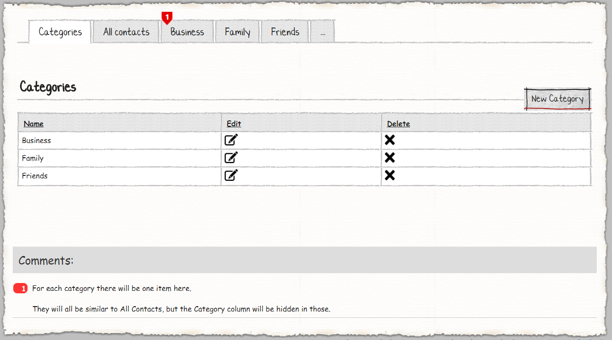
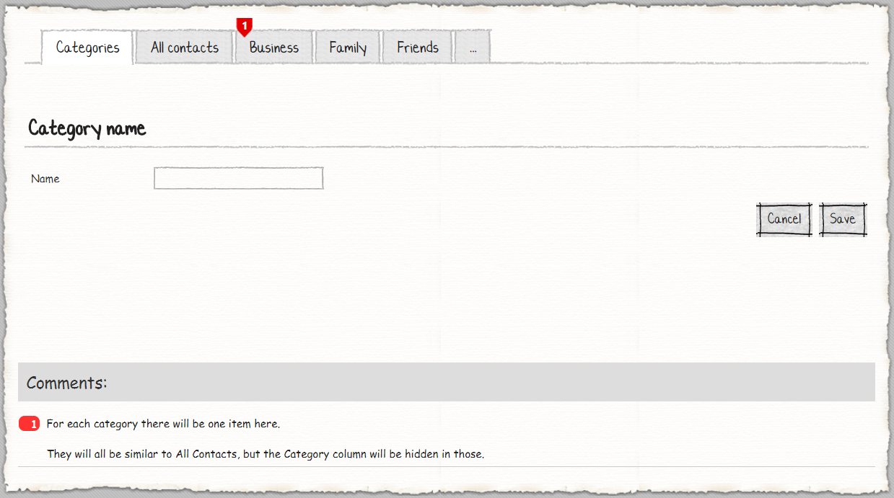
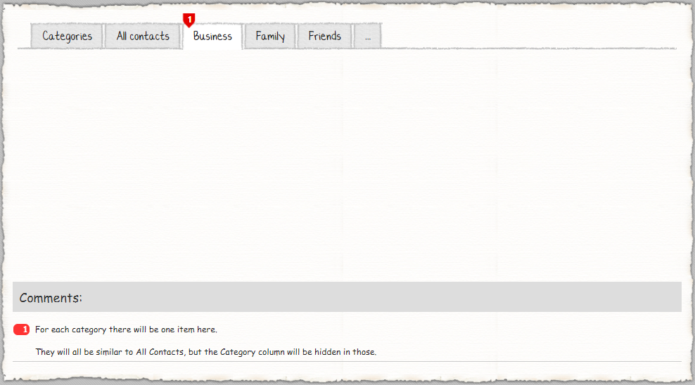
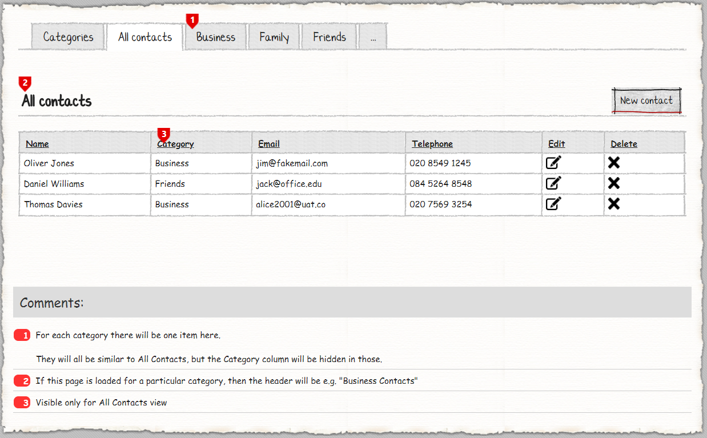

# M# Tutorial - Episode 17: Dynamic menu

In this tutorial you will learn:

- Dynamic menu item
- Custom Active menu item
- Visibility
- Module box
- After control, Before control settings

## Requirements

In this tutorial, we are going to implement a website that lets users create categories and assign contacts to each category, by adding a new category that category must be dynamically added to the main menu and when users click on the category menu item they should see only related contacts.

### Categories





This page shows a list of all categories and let users do CRUD operations. When a user add a new category that category should be added to the menu and when user click on each category menu item, he should see just related contacts.

### Contacts




On this page, users should select a related category for contact and there is two separate parts named **Address** and **Notes** that hold related properties. When a user come to this page from selected categories on the menu, the category dropdown list should be selected by default.

## Implementation : Entities

As we can see in the requirements, the two entities can be identified, **Category** and **Contact**. The category entity has many contacts and each contact has one category. After analyzing the requirements and identifying related properties, it's time to create them. Now let's create the corresponding classes in the **#Model** project.

Create a **Domain** folder and add these classes:

```C#
using MSharp;

namespace Domain
{
    public class Category : EntityType
    {
        public Category()
        {
            String("Name").Mandatory();

            InverseAssociate<Contact>("Contacts", "Category");
        }
    }
}
```

Category class has one mandatory string property and an inverse association with **Contact** entity.

```C#
using MSharp;

namespace Domain
{
    public class Contact : EntityType
    {
        public Contact()
        {
            Associate<Category>("Category").Mandatory();

            String("Name");

            String("Email");

            String("Telephone");

            String("Address line 1");

            String("Address line 2");

            String("Town");

            String("Postcode");

            String("Comments").Lines(5);

            Date("Date of birth");
        }
    }
}
```

Contact class has association with **Category** entity and other related properties are written based on requirements.

After adding these classes, build **#Model** and after that **Domain** project to make sure everything regarding it is fine.

## Implementation: UI

As we can see in the requirements, we should develop these pages:

- Categories
  - Add / Edit Category
- Contacts
  - Add / Edit Contact

### Category Pages

Go to **Pages** folder of **#UI**, *right click > Add > M#*  then create **Category** rootpage:

```C#
using MSharp;

public class CategoryPage : RootPage
{
    public CategoryPage()
    {
        Add<Modules.CategoryForm>();
        //will be implemented soon.
    }
}
```

Now create a folder named **Category** under the **Pages** folder. Then add an **Enter** class here:

```C#
using MSharp;

namespace Category
{
    public class EnterPage : SubPage<CategoryPage>
    {
        public EnterPage()
        {
            Add<Modules.CategoryForm>();
            //will be implemented soon.
        }
    }
}
```

#### Creating required module of Category Pages

Navigate to **Modules** folder of **#UI** project and create folder named **Category**. Then add a *List module* named **CategoriesList** using M# context menu:

```C#
using MSharp;

namespace Modules
{
    public class CategoriesList : ListModule<Domain.Category>
    {
        public CategoriesList()
        {
            HeaderText("Categories");

            Column(x => x.Name);

            ButtonColumn("Edit").Icon(FA.Edit)
                .OnClick(x => x.Go<Category.EnterPage>().Send("item", "item.ID")
                .SendReturnUrl());

            Button("New Category").Icon(FA.Plus)
                .OnClick(x => x.Go<Category.EnterPage>());
        }
    }
}
```
Continue our work be adding *Form module* named **CategoryForm** like above:
```C#
using MSharp;

namespace Modules
{
    public class CategoryForm : FormModule<Domain.Category>
    {
        public CategoryForm()
        {
            HeaderText("Category details");

            Field(x => x.Name);

            Button("Cancel").OnClick(x => x.ReturnToPreviousPage());

            Button("Save").IsDefault().Icon(FA.Check)
            .OnClick(x =>
            {
                x.SaveInDatabase();
                x.GentleMessage("Saved successfully.");
                x.ReturnToPreviousPage();
            });
        }
    }
}
```
Now its time to add these modules to their related root and sub pages. Add them if you let them empty in previous steps.

### Contact Pages

Go to **Pages** folder of **#UI**, *right click > Add > M#*  then create **Contact** rootpage:

```C#
using MSharp;
public class ContactPage : RootPage
{
    public ContactPage()
    {
        Add<Modules.ContactsList>();
        //will be implemented soon.
    }
}
```

Now add a folder named **Contact** under **Pages** folder, then add an **Enter** *sub page* class:

```C#
using MSharp;

namespace Contact
{
    public class EnterPage : SubPage<ContactPage>
    {
        public EnterPage()
        {
            Add<Modules.ContactForm>();
        }
    }
}
```

#### Creating required module of Contact Pages

Move on to the **Modules** folder of **#UI** and add a folder with the name of **Contact** which will contain related modules of *Contact*.
Now use the M# context menu and add a *List module* named **ContactsList**:

```C#
using MSharp;

namespace Modules
{
    public class ContactsList : ListModule<Domain.Contact>
    {
        public ContactsList()
        {
            HeaderText("Contacts");

            Column(x => x.Name);

            Column(x => x.Category).VisibleIf("info.Category == null");

            Column(x => x.Email);

            Column(x => x.Telephone);

            ViewModelProperty("Category", "Category").FromRequestParam("category");

            DataSource("info.Category == null ? await  Database.GetList<Contact>() : await info.Category.Contacts.GetList()");

            ButtonColumn("Edit").Icon(FA.Edit)
                .OnClick(x => x.Go<Contact.EnterPage>().Send("item", "item.ID"));

            Button("New Contact").Icon(FA.Plus)
                .OnClick(x => x.Go<Contact.EnterPage>().Send("category", "item.CategoryId"));
        }
    }
}
```
In this class, if user come here by clicking on *All contacts*, they should see all contacts and **Category** should be visible but when users click on a specific category from menu item they should see only related contacts and **Category** should be hidden. We pass **Category Id** in menu item and if users click on *All contacts* menu item there is no available category , so related category property is null, we have used this feature and set visible state of *Category* property by calling **.VisibleIf()** method. We have also set **DataSource()** method by checking property state.

Now add *Form module* named **ContactForm** like below:

```
using MSharp;

namespace Modules
{
    public class ContactForm : FormModule<Domain.Contact>
    {
        public ContactForm()
        {
            HeaderText("Contact details");

            Field(x => x.Category);

            Field(x => x.Name);

            Field(x => x.Email);

            Field(x => x.Telephone).AfterControl("Mobile, land line, or office");

            var addressBox = Box("Address", BoxTemplate.HeaderBox);

            Field(x => x.AddressLine1).Box(addressBox);

            Field(x => x.AddressLine2).Box(addressBox);

            Field(x => x.Town).Box(addressBox);

            Field(x => x.Postcode).Box(addressBox);

            var notesBox = Box("Notes", BoxTemplate.HeaderBox);

            Field(x => x.Comments).Box(notesBox);

            Field(x => x.DateOfBirth).Box(notesBox);

            AutoSet(x => x.Category);

            Button("Cancel").OnClick(x => x.ReturnToPreviousPage());

            Button("Save").IsDefault().Icon(FA.Check)
            .OnClick(x =>
            {
                x.SaveInDatabase();
                x.GentleMessage("Saved successfully.");
                x.ReturnToPreviousPage();
            });
        }
    }
}
```
On this page there is a new M# method named **Box()**. Where you need to group your form elements, you should call *.Box()* method and add related elements to that box. According to the requirements, if category id is available category should be selected by default and for this purpose, we have called **AutoSet()** method for category property.

#### Adding Pages to Menu

After you ended up with form pages, you need to add it to the main menu:

```C#
using MSharp;

namespace Modules
{
    public class MainMenu : MenuModule
    {
        public MainMenu()
        {
            AjaxRedirect().IsViewComponent().UlCssClass("nav navbar-nav dropped-submenu");

            Item("Login")
                .Icon(FA.UnlockAlt)
                .VisibleIf(AppRole.Anonymous)
                .OnClick(x => x.Go<LoginPage>());

            Item("Settings")
                .VisibleIf(AppRole.Admin)
                .Icon(FA.Cog)
                .OnClick(x => x.Go<Admin.SettingsPage>());

            Item("Categories")
               .Icon(FA.Cog)
               .OnClick(x => x.Go<CategoryPage>());

            Item("All Contacts")
               .Icon(FA.Cog)
               .OnClick(x => x.Go<ContactPage>());

            Item<ContactPage>()
               .DataSourceType<Domain.Category>()
               .Name("Category")
               .Key("C#:item.ID")
               .Icon(FA.Cog)
               .OnClick(x => x.Go<ContactPage>().Send("category", "item.ID"));
        }
    }
}
```
In this class, menu items should be added dynamically according to the categories. For this purpose, we should call **.DataSourceType<Domain.Category>()** with its related name and key method as shown above.

### Final Step

Build **#UI** project, set the **WebSite** project as your default *StartUp* project and configure your *connection string* in **appsetting.json** file and hit F5. Your project is ready to use.


