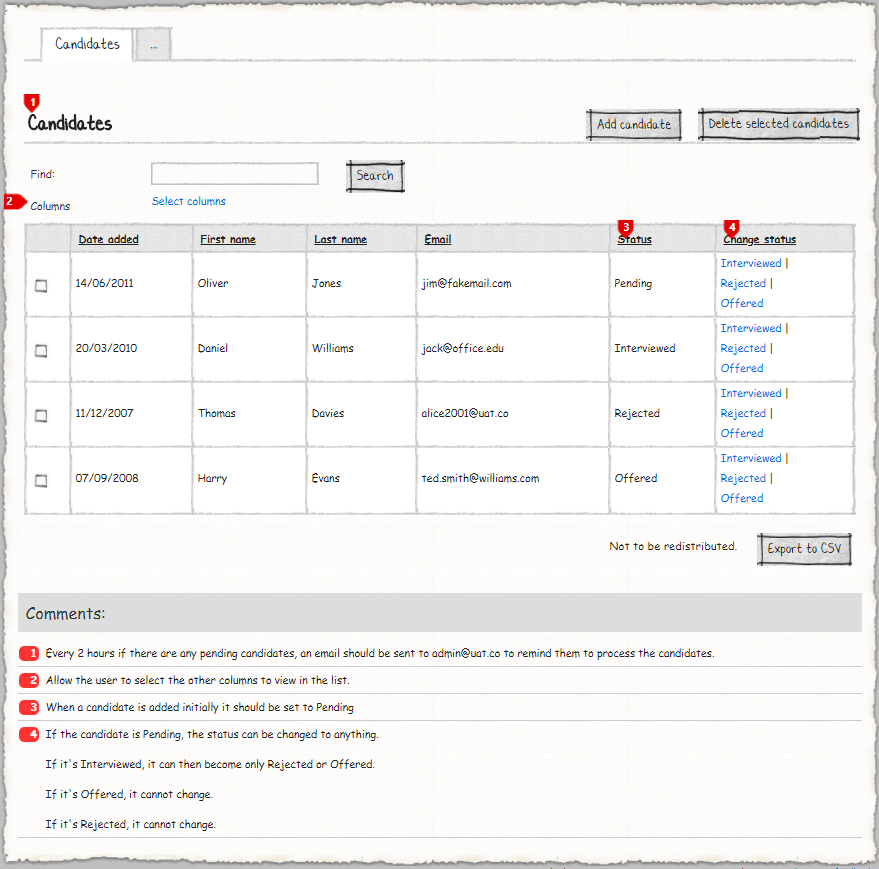
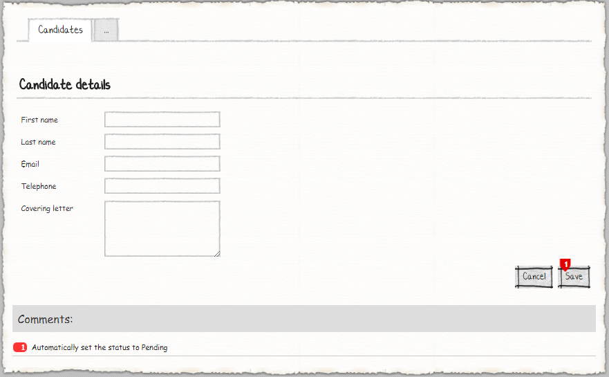

# M# Tutorial - Episode 18: Automated tasks

In this tutorial you will learn:

- Repeated buttons
- Button markup template
- Checkbox column for list modules
- Display option for columns
- Instance accessor for entity types
- Automated tasks

## Requirements

In this tutorial, we are going to implement a website that manages candidates. Users can do CRUD operations on candidates and change their status. There are some criteria listed below:

- Application should send a reminder email to *admin@uat.co* if there's any new pending candidates to proceed.
- Allow the user to select the other columns to view in the list.
- When a candidate is added initially it should be set to *Pending*
- The candidate status can change during the application lifetime with these conditions:
  - If the candidate is *Pending*, the status can turn into either *Interviewed*, *Offered* or *Rejected*.
  - If it's *Interviewed*, it can then become only *Rejected* or *Offered*.
  - If it's *Offered*, it cannot change.
  - If it's *Rejected*, it cannot change.

### Candidates




Candidate page shows a list of all candidates and lets users to do CRUD operations. When a user adds a new candidate, initially its status should be *Pending* and after adding a candidate, the user is able to change candidate status to any other status. In list page, users are able to export the candidates list to *CSV*, search, delete selected candidates and select specific columns to show.

## Implementation : Entities

As we can see in the requirements, one entity can be identified; **Candidate**. The candidate has a status that we consider is as a class. After analyzing the requirements and identifying related properties, it's time to create them. Now let's create the corresponding classes in the **#Model** project.

Create a **Domain** folder and add these classes:

```C#
using MSharp;

namespace Domain
{
    public class Candidate : EntityType
    {
        public Candidate()
        {
            String("First name").Mandatory();

            String("Last name").Mandatory();

            String("Email").Accepts(TextPattern.EmailAddress);

            String("Telephone").Accepts(TextPattern.UKMobilePhoneNumber);

            String("Convering letter").Lines(5);

            Date("Date Added").Mandatory().Default("C#:LocalTime.Now");

            Associate<Status>("Status").Default("Pending");
        }
    }
}
```

Candidate class has four string properties with thier related M# fluent methods and a date property and a association with *status* class. Accoding to the requiremtns *status* property should be initially selected and for this purpose we have used `.Default()` method with *Pending* string value.

```C#
using MSharp;

namespace Domain
{
    public class Status : EntityType
    {
        public Status()
        {
            GenerateParseMethod();

            IsEnumReference();

            InstanceAccessors(new[] { "Pending", "Interviewed", "Rejected", "Offered" });

            String("Name");
        }
    }
}
```

Status class is acting like a Enum, for this purpose we have used `IsEnumReference()` method and initial it by calling `InstanceAccessors()`. In *Candidate* class we initialized *Status* property with a *Pending* string value, for this purpose, we should use `GenerateParseMethod()` method.

After adding these classes, build **#Model** and after that **Domain** project to make sure everything regarding it is fine.

## Implementation : Logic

According to the requirements there's three blocks of logic to implement:

- A method to check candidates status every 2 hours and send reminder email to *admin@uat.co* if necessary.
- A method to change candidate status.
- A method to show available status.

In **Domain** project under **Logic** folder create a partial class named **Candidate** like below:

```C#
public partial class Candidate
{
    public void UpdateStatus(Status status)
    {
        Database.Update(this, x => x.Status = status);
    }

    public static async void RemindAdminForPendingCandidates()
    {
        var pendingCandidates = await Database.GetList<Candidate>(x => x.Status == Status.Pending);

        if (pendingCandidates.None())
        {
            return;
        }

        await EmailService.Send(new EmailMessage() { Subject = "Candidate pending reminder", Body = "...", To = "admin@uat.co" });
    }
}
```

We will use these methods in **#UI** project soon, but for now you should know that `UpdateStatus()` method will change selected candidate status to specified value and `RemindAdminForPendingCandidates()` method will gather all pending candidates and send a reminder email to the admin (for more information about sending email in M# please go to [tutorial 14](https://github.com/Geeksltd/MSharp.Docs/blob/master/Tutorials/14/README.md)).

Create another partial class named **Status** like below:

```C#
using System.Collections.Generic;
using System.Linq;

namespace Domain
{
    public partial class Status
    {
        public IEnumerable<Status> GetPossibleChanges()
        {
            if (this == Pending)
            {
                return new[] { Interviewed, Offered, Rejected };
            }

            if (this == Interviewed)
            {
                return new[] { Offered, Rejected };
            }

            return Enumerable.Empty<Status>();
        }
    }
}
```

According to the requirements, `GetPossibleChanges()` method returns available status.

## Implementation: UI

As we can see in the requirements, we should develop these pages:

- Candidates
  - Add / Edit Candidate

### Candidate Pages

Go to **Pages** folder of **#UI**, *right click > Add > M#*  then create **Candidate** rootpage:

```C#
using MSharp;
public class CandidatePage : RootPage
{
    public CandidatePage()
    {
        Add<Modules.CandidatesList>();
    }
}
```

Now create a folder named **Candidate** under the **Pages** folder. Then add an **Enter** class here:

```C#
using MSharp;
using MSharp;

namespace Candidate
{
    public class EnterPage : SubPage<CandidatePage>
    {
        public EnterPage()
        {
            Add<Modules.CandidateForm>();
        }
    }
}
```

#### Creating required module of Canidate Pages

Navigate to **Modules** folder of **#UI** project and create folder named **Candidate**. Then add a *List module* named **CandidatesList** using M# context menu:

```C#
using MSharp;

namespace Modules
{
    public class CandidatesList : ListModule<Domain.Candidate>
    {
        public CandidatesList()
        {
            HeaderText("[#BUTTONS(NewCandidate)#][#BUTTONS(DeleteSelectedCandidates)#]Candidates")
                .ShowHeaderRow()
                .ShowFooterRow()
                .SelectCheckbox();

            Search(GeneralSearch.AllFields).Label("Find:");

            SearchButton("Search");

            Column(x => x.DateAdded);

            Column(x => x.FirstName);

            Column(x => x.LastName);

            Column(x => x.Email);

            Column(x => x.Telephone).DisplayMode(DisplayMode.Selectable);

            Column(x => x.ConveringLetter).DisplayMode(DisplayMode.Selectable);

            Column(x => x.Status);

            ButtonColumn("Option Name").RepeatDataSource("item.Status.GetPossibleChanges()")
                .RepeatDataSourceType("Status")
                .SeperatorTemplate("|")
                .Text("@option.Name")
                .OnClick(x =>
                {
                    x.CSharp("item.UpdateStatus(option);");
                    x.Reload();
                })
                .Style(ButtonStyle.Link);

            ButtonColumn("Edit").Icon(FA.Edit)
                .OnClick(x => x.Go<Candidate.EnterPage>()
                .Send("item", "item.ID")
                .SendReturnUrl());

            ButtonColumn("Delete").Icon(FA.Remove)
                .OnClick(x =>
                {
                    x.DeleteItem();
                    x.Reload();
                });

            Button("New Candidate").Icon(FA.Plus)
                .CssClass("pull-right")
                .OnClick(x => x.Go<Candidate.EnterPage>()
                .SendReturnUrl());

            Button("Delete selected candidates")
                .CssClass("pull-right")
                .OnClick(x =>
                {
                    x.CSharp("await Database.Delete<Candidate>(await info.SelectedItems);");
                    x.Reload();
                });

            Button("Export to CSV")
                .MarkupTemplate("Not to be redistributed. [#Button#]")
                .OnClick(x => x.Export(ExportFormat.Csv));
        }
    }
}
```

According to the requirements users should be able to select custom columns; So we have used `.DisplayMode(DisplayMode.Selectable)` M# fluent method with **DisplayMode.Selectable** parameter to let users make these columns visible or hidden. We should also put *Add candidate* and *Delete selected candidates* to the top right side of the page, so we have put their name with special format in `HeaderText()` method. For showing available status based on current candidate status, we have used `ButtonColumn()` method with other special M# fluent methods. `.RepeatDataSource()` and `.RepeatDataSourceType()` methods configure M# to use our custom method to feed its data. By calling `.SeperatorTemplate()` method we have used "|" as a separator for each value and by calling `.OnClick()` method we have called our custom method for changing selected candidate status.

Let's continue with adding *Form module* named **CandidateForm** like below:

```C#
using MSharp;

namespace Modules
{
    public class CandidateForm : FormModule<Domain.Candidate>
    {
        public CandidateForm()
        {
            HeaderText("Candidate details");

            Field(x => x.FirstName);

            Field(x => x.LastName);

            Field(x => x.Email);

            Field(x => x.Telephone);

            Field(x => x.ConveringLetter);

            Button("Cancel").OnClick(x => x.ReturnToPreviousPage());

            Button("Save").IsDefault().Icon(FA.Check)
            .OnClick(x =>
            {
                x.SaveInDatabase();
                x.GentleMessage("Saved successfully.");
                x.ReturnToPreviousPage();
            });
        }
    }
}
```

Now its time to add these modules to their related root and sub pages. Add them if you let them empty in previous steps.

#### Adding Pages to Menu

After you ended up with form pages, you need to add it to the main menu:

```C#
using MSharp;
using Domain;

namespace Modules
{
    public class MainMenu : MenuModule
    {
        public MainMenu()
        {
            AjaxRedirect().IsViewComponent().UlCssClass("nav navbar-nav dropped-submenu");

            Item("Login")
                .Icon(FA.UnlockAlt)
                .VisibleIf(AppRole.Anonymous)
                .OnClick(x => x.Go<LoginPage>());

            Item("Settings")
                .VisibleIf(AppRole.Admin)
                .Icon(FA.Cog)
                .OnClick(x => x.Go<Admin.SettingsPage>());

            Item("Candidates")
                .Icon(FA.Cog)
                .OnClick(x => x.Go<CandidatePage>());
        }
    }
}
```

build **#UI** prject to make sure everything regarding it is fine.

### Automated Task

According to the requirements we should check candidate status every 2 hours and send an email to the administrator to process candidates.
Navigate to **Website** project and under **app_Start** folder, open **TaskManager.cs** file and add `RemindAdminForPendingCandidate()` method like below:

```C#
public static void Run()
{
    RecurringJob.AddOrUpdate("Clean old temp uploads", () => CleanOldTempUploads(), Cron.MinuteInterval(10));

    RecurringJob.AddOrUpdate("Remind admin for pending candidate", () => RemindAdminForPendingCandidate(), Cron.HourInterval(2));
}

//Every 2 hours if there are any pending candidates, an email should be sent to admin@uat.co to remind them to process the candidates.
public static async Task RemindAdminForPendingCandidate()
{
    Candidate.RemindAdminForPendingCandidates();
}
```

Also make sure that in **appsetting.json** the setting related to *Automated Tasks* is marked as *true*.

```json
"Automated.Tasks": {
        "Enabled": false
    }
```

### Final Step

Build **#UI** project, set the **WebSite** project as your default *StartUp* project and configure your *connection string* in **appsetting.json** file and hit F5. Your project is ready to use.
