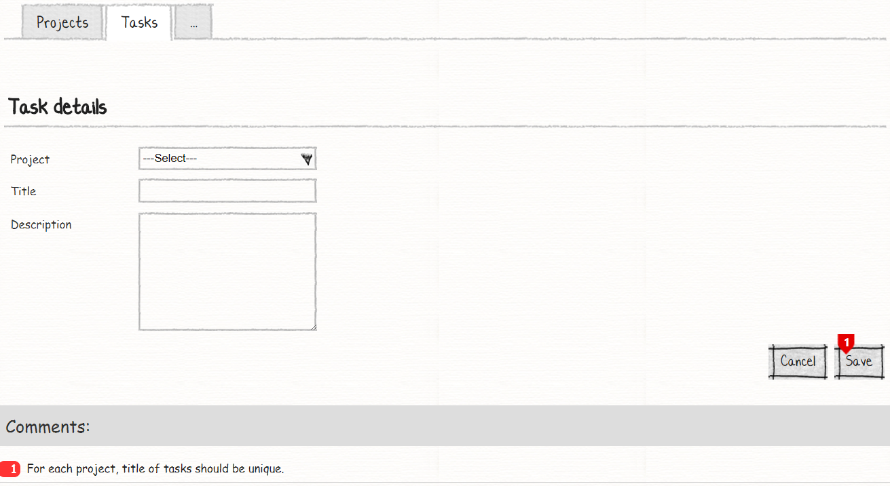
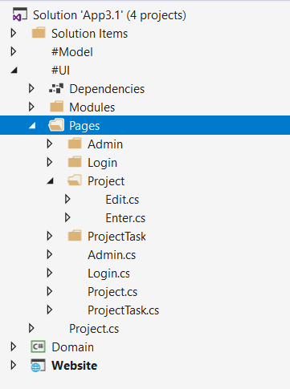

# Your Third M# Application
In this tutorial we continue our learning process with enriching previous topics and learn new topics:

 - Uniqueness rules

## Requirements
As a web developer, we should implement a project management system that lets user manage their projects and related tasks. 
Here are the sketches for list and model.

### Projects:


### Tasks:





As you can see, Edit and Add page of project and task module differ and for the task we have a view page.

## Implementation
From requirements, we can identify two entities, "Project" and "Task" that these entities has One-to-Many relationships since any project can have many tasks and each task has one project, We should also notice that each project name and each project task name should be unique.  
After understanding requirements and identifying its related entities and their relationships, it's time to create them. Now let's create the corresponding classes in the *#Model* project.

## Creating M# Entity Types
We start our work by creating *Project* class in *#Model* project:

```C#
using MSharp;

namespace Domain
{
    public class Project : EntityType
    {
        public Project()
        {
            DatabaseMode(DatabaseOption.Managed);

            Name("Project");

            String("Name");

            UniqueCombination(new[] { "Name" });
        }
    }
}
```
As you can see, We have used some new M# fluent API here, **DatabaseModel** method tells the M# framework how to treat this entity. We have three options here:

- **DatabaseOption.Managed**: By default, this option is selected and it saves data to created table based on M# default conventions
- **DatabaseOption.Existing**: It doesn't create table by M# conventions and let you choose with table to be used
- **DatabaseOption.Transient**: Nothing will be saved to the database and every saved entities life depend on the current application running process
- **DatabaseOption.Custom**: You should define for the M# framework how to save entity

**Name** method used to change the name of the object to our custom name that in this case we have set its name to *Project*. As our requirements told us, we should make sure that the project name is unique, to achieve this goal M# has a method with the name of **UniqueCombinarion**. In this method you should write your custom property name here.
In a similar way add another entity type called *Task* but this time with a set of properties shown in the snippet below:

```C#
using MSharp;

namespace Domain
{
    public class ProjectTask : EntityType
    {
        public ProjectTask()
        {
            DatabaseMode(DatabaseOption.Managed);

            Name("Project Task");

            Associate<Project>("Project");

            String("Title");

            String("Description", 500);

            Bool("Done").Mandatory().Default("false");

            UniqueCombination(new[] { "Project", "Title" });
        }
    }
}
```

As you can see we have used M# fluent API to add *Task* class properties, we have added One-to-Many relationship with **Associate\<Project>("Project")** property.
Here you should consider these methods:
 - DatabaseMode(): Used to tell M# framework how to persist data
 - Name(): Used for changing the name of the entity
 - String(): Used string property
 - Bool(): Used for boolean property and in this case we have set default false value of it
 - UniqueCombination(): Used for make one or combination of properties unique

As you can see, M# framework gives use excellent power to use it's fluent API continuance to add other methods like *.Default()*.
Now it's time to feed our two entity types to the M# code generator. You invoke it by building the *#Model* project.  
In solution explorer, right click the *#Model* project and select *Build*.
Before moving on to developing the UI, let's build the *Domain* project to make sure everything regarding it is fine.

## Developing UI
According to the requirement, we have these pages:

- Projects list
  - Add project
  - Edit project
- Tasks list
  - Add task
  - Edit task
  - View task

So, we have two root pages that hold our list modules and 5 sub pages that are related to add or edit operation.

### Creating Project Pages
We continue our work by adding *Project Root Page* in #UI project.

```C#
using MSharp;

public class ProjectPage : RootPage
{
    public ProjectPage()
    {
        Add<Modules.ProjectsList>();
    }
}
```

As you can see, we have added **Add\<Modules.ProjectsList>();**, by calling this method we tell M# that it should render *ProjectsList* module to show list of projects.
This page is our main page that is acting like parent for other pages. Now we need to add two more pages, *Add* and *Edit* pages. Add a new folder with the name of **Project** under *Pages* folder in #UI project and then add these two classes:



```C#
using Modules;
using MSharp;

namespace Project
{
    public class EnterPage : SubPage<ProjectPage>
    {
        public EnterPage()
        {
            Layout(Layouts.FrontEndModal);

            Add<ProjectAdd>();
        }
    }
}
```

```C#
using Modules;
using MSharp;

namespace Project
{
    public class EditPage : SubPage<ProjectPage>
    {
        public EditPage()
        {
            Layout(Layouts.FrontEnd);

            Add<ProjectEdit>();
        }
    }
}
```
According to requirements, Adding new project should be opened in modal and editing should be opened in a new page, so we have set **Layout()** methods in each class according to its requirement and then add related module.

#### Creating Project List Module
Add a folder with the name of *Project* under the *Modules* folder of the *#UI* project and add *ProjectList* class as shown bellow:


```C#
using MSharp;
using Project;

namespace Modules
{
    public class ProjectsList : ListModule<Domain.Project>
    {
        public ProjectsList()
        {
            HeaderText("Projects");

            Column(x => x.Name);

            ButtonColumn("Edit").Icon(FA.Edit)
                .OnClick(x => x.Go<EditPage>()
                .Send("item", "item.ID")
                .SendReturnUrl());

            ButtonColumn("Delete")
                .ConfirmQuestion("Are you sure you want to delete this Project?")
                .CssClass("btn-danger")
                .Icon(FA.Remove)
                .OnClick(x =>
                {
                    x.DeleteItem();
                    x.Reload();
                });

            Button("New project").Icon(FA.Plus)
                .OnClick(x => x.PopUp<EnterPage>().SendReturnUrl(false));
        }
    }
}
```
This class properties are ordered as requirements and we have inherited from **ListModule** generic class that is a M# framework class and by adding *Domain. Project*  class we tell M# framework, it's a list module class and its responsibility is to list projects.

#### Creating Project Form Module
Now it is time to add a form page that is responsible for adding and editing operations. 
We continue our work by creating a *ProjectAdd.cs* and *ProjectEdit.cs* class in a *Project* folder under the *Modules* folder in *#UI* project:

```C#
using MSharp;

namespace Modules
{
    public class ProjectAdd : FormModule<Domain.Project>
    {
        public ProjectAdd()
        {
            HeaderText("Project Details");

            Field(x => x.Name);

            Button("Cancel").OnClick(x => x.CloseModal());

            Button("Save").IsDefault().Icon(FA.Check)
                .OnClick(x =>
                {
                    x.SaveInDatabase();
                    x.GentleMessage("Saved successfully.");
                    x.CloseModal(Refresh.Full);
                });
        }
    }
}
```

```C#
using MSharp;

namespace Modules
{
    public class ProjectEdit : FormModule<Domain.Project>
    {
        public ProjectEdit()
        {
            HeaderText("Project Details");

            Field(x => x.Name);

            Button("Cancel").OnClick(x => x.ReturnToPreviousPage());

            Button("Save").IsDefault().Icon(FA.Check)
                .OnClick(x =>
                {
                    x.SaveInDatabase();
                    x.GentleMessage("Saved successfully.");
                    x.ReturnToPreviousPage();
                });
        }
    }
}
```

These classes inherits from **FormModule** class that tell the M# framework to deal with this class as a form module. This special class tells M# that it should generate a form page and a user can add or edit entity.
According to our requirement, we should have two separate classes for adding and editing modules that one of them is modal and the other one is a web page, the main difference here is about **Cancel** and **Save** button, as you can see, in Add module we have closed modal and refresh the page but in edit one we have turned back to previous page.

#### Creating Task Pages
For task page, like *Project* pages we have these pages :

- Task root page: This page hold task list module
- Task add page: This page hold task add module
- Task edit page: This page hold task edit module
- Task view page: This page hold task view module

Create *ProjectTask.cs* class under *Pages* folder in #UI project like below:

```C#
using MSharp;

public class ProjectTaskPage : RootPage
{
    public ProjectTaskPage()
    {
        Add<Modules.ProjectTaskList>();
    }
}
```

Add a folder with the name of *ProjectTaskFolder* under *Pages* folder and add these classes:


```C#
using Modules;
using MSharp;

namespace ProjectTask
{
    public class EnterPage : SubPage<ProjectTaskPage>
    {
        public EnterPage()
        {
            Layout(Layouts.FrontEnd);

            Add<ProjectTaskAdd>();
        }
    }
}
```

```C#
using MSharp;

namespace ProjectTask
{
    public class EditPage : SubPage<ProjectTaskPage>
    {
        public EditPage()
        {
            Layout(Layouts.FrontEndModal);

            Add<Modules.ProjectTaskEdit>();
        }
    }
}
```

```C#
using Modules;
using MSharp;

namespace ProjectTask
{
    public class ViewPage : SubPage<ProjectTaskPage>
    {
        public ViewPage()
        {
            Layout(Layouts.FrontEnd);

            Add<ProjectTaskView>();
        }
    }
}
```

As you can see, we have added three pages, *EnterPage* has responsibility for adding new task and it will be open in new page, *EditPage* has responsibility for editing task and it will be open in a modal, *ViewPage* has responsibility for just showing task detail.

#### Creating Task List Module
Add a folder with the name of *ProjectTask* under the *Modules* folder of *#UI* project and then add these classes:

```C#
using MSharp;

namespace Modules
{
    public class ProjectTaskAdd : FormModule<Domain.ProjectTask>
    {
        public ProjectTaskAdd()
        {
            HeaderText("Task Details");

            Field(x => x.Project).Control(ControlType.DropdownList);

            Field(x => x.Title).Mandatory();

            Field(x => x.Description).Control(ControlType.Textbox).NumberOfLines(5);

            Button("Cancel").OnClick(x => x.ReturnToPreviousPage());

            Button("Save").IsDefault().Icon(FA.Check)
                .OnClick(x =>
                {
                    x.SaveInDatabase();
                    x.GentleMessage("Saved successfully.");
                    x.ReturnToPreviousPage();
                });
        }
    }
}
```

**ProjectTaskAdd** class inherits from *FormModule* class, according to requirement, we have added *HeaderText("Task Details")* method and change the control type of project, we have also set the number of lines of *Description* property and return back to previous page.

```C#
using MSharp;

namespace Modules
{
    public class ProjectTaskEdit : FormModule<Domain.ProjectTask>
    {
        public ProjectTaskEdit()
        {
            HeaderText("Task Details");

            Field(x => x.Done).Control(ControlType.CheckBox).Label("Done?");

            Field(x => x.Title).Mandatory();

            Field(x => x.Description).Control(ControlType.Textbox).NumberOfLines(5);

            Button("Cancel").OnClick(x => x.CloseModal());

            Button("Save").IsDefault().Icon(FA.Check)
                .OnClick(x =>
                {
                    x.SaveInDatabase();
                    x.GentleMessage("Saved successfully.");
                    x.CloseModal(Refresh.Ajax);
                });
        }
    }
}
```

**ProjectTaskEdit** is like *ProjectTaskAdd* class, but it differs from property and cancel and save action, in this class we didn't change project property and just add *Done* property and change its control type to *CheckBox*.

```C#
using MSharp;
using ProjectTask;

namespace Modules
{
    public class ProjectTaskList : ListModule<Domain.ProjectTask>
    {
        public ProjectTaskList()
        {
            ShowFooterRow()
                .ShowHeaderRow()
                .UseDatabasePaging(false)
                .HeaderText("Tasks")
                .PageSize(10);

            LinkColumn("View").HeaderText("View")
                .OnClick(x => x.Go<ViewPage>()
                .Send("item", "item.ID")
                .SendReturnUrl());

            Column(x => x.Project);

            Column(x => x.Title);

            Column(x => x.Description);

            Column(x => x.Done).LabelText("Is done?");

            ButtonColumn("Edit").Icon(FA.Edit)
                .HeaderText("Edit")
                .OnClick(x => x.PopUp<EditPage>()
                .Send("item", "item.ID")
                .SendReturnUrl(false));

            ButtonColumn("Delete")
                .HeaderText("Delete")
                .ConfirmQuestion("Are you sure you want to delete this Task?")
                .CssClass("btn-danger")
                .Icon(FA.Remove)
                .OnClick(x =>
                {
                    x.DeleteItem();
                    x.Reload();
                });

            Button("Add task").Icon(FA.Plus)
                .OnClick(x => x.Go<EnterPage>().SendReturnUrl());
        }
    }
}
```
**ProjectTaskList** class shows a list of tasks and let users to add or edit tasks, it also lets users to see task detail by clicking on the *View* link button.

>**Note:** You should consider using *.SendReturnUrl()* when you want to go to another page and let user to come back, And don't use it for modal.

>**Note:** You should consider using *.Go<>()* where you want to go to another page and use *.PopUp<>()* when you want an open modal.

```C#
using MSharp;

namespace Modules
{
    public class ProjectTaskView : ViewModule<Domain.ProjectTask>
    {
        public ProjectTaskView()
        {
            HeaderText("Tasks");

            Field(x => x.Project);

            Field(x => x.Title);

            Field(x => x.Description);

            Field(x => x.Done).LabelText("Is done?");

        }
    }
}
```

**ProjectTaskView** class inherits from *ViewModule* generic class. It's a M# framework class that tells M# that this is view page and let M# know how to generate related code for it.
We have set its property according to requirements and for *done* property, we have used *LabelText()* method to add our custom text.

#### Adding Pages to Menu
Our last step is to add a *Project* and a *Task* root page to the main menu:

```C#
using MSharp;

namespace Modules
{
    public class MainMenu : MenuModule
    {
        public MainMenu()
        {
            AjaxRedirect().IsViewComponent().UlCssClass("nav navbar-nav dropped-submenu");

            Item("Login").Icon(FA.UnlockAlt).VisibleIf(AppRole.Anonymous)
                .OnClick(x => x.Go<LoginPage>());

            Item("Settings").Icon(FA.Cog).VisibleIf(AppRole.Administrator)
                .OnClick(x => x.Go<Admin.SettingsPage>());

            Item("Projects").Icon(FA.Cog)
                .OnClick(x => x.Go<ProjectPage>());

            Item("ProjectTasks").Icon(FA.Cog)
                .OnClick(x => x.Go<ProjectTaskPage>());
        }
    }
}
```

### Final Step
Build **#UI** project, set the **WebSite** project as your default *StartUp* project and configure your *connection string* in **appsetting.json** file and hit F5. Your project is ready to use.
