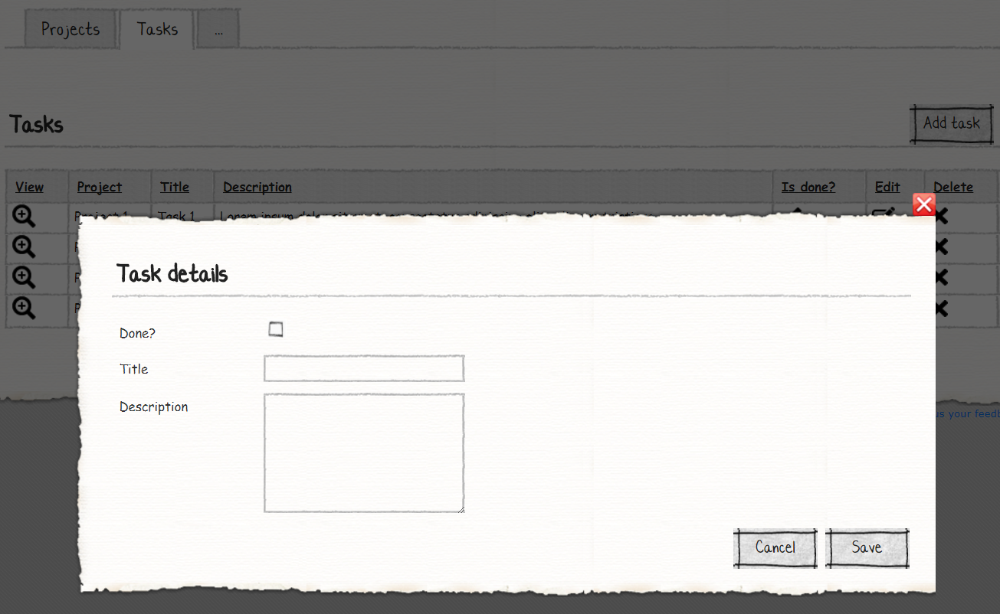

# Your Third M# Application
In this tutorial we continue our learning process with enriching previous topics and learn new topics:

 - Uniqueness rules

## Requirements
As a web developer, we should implement a project management system that lets user manage their projects and related tasks. 
Here are the sketches for list and model.

### Projects:


### Tasks:




As you can see, Edit and Add page of project and task module differ and for the task we have a view page.

## Implementation
From requirements, we can identify two entities, "Project" and "Task" that these entities has One-to-Many relationships since any project can have many tasks and each task has one project, We should also notice that each project name and each project task name should be unique.  
After understanding requirements and identifying its related entities and their relationships, it's time to create them. Now let's create the corresponding classes in the *#Model* project.

## Creating M# Entity Types
We start our work be creating *Project* Class in *#Model* project:

```C#
using MSharp;

namespace Domain
{
    public class Project : EntityType
    {
        public Project()
        {
            DatabaseMode(DatabaseOption.Managed);

            Name("Project");

            String("Name");

            UniqueCombination(new[] { "Name" });
        }
    }
}
```
As you can see, We have used some new M# fluent API here, **DatabaseModel** method tells the M# framework how to treat this entity. We have three options here:

- **DatabaseOption.Managed**: By default, this option is selected and it saves data to created table based on M# default conventions
- **DatabaseOption.Existing**: It doesn't create table by M# conventions and let you choose with table to be used
- **DatabaseOption.Transient**: Nothing will be saved to the database and every saved entities life depend on the current application running process
- **DatabaseOption.Custom**: You should define for the M# framework how to save entity

**Name** method used to change the name of the object to our custom name that in this case we have set its name to *Project*. As our requirements told us, we should make sure that the project name is unique, to achieve this goal M# has a method with the name of **UniqueCombinarion**. In this method you should write your custom property name here.
In a similar way add another entity type called *Task* but this time with a set of properties shown in the snippet below:

```C#
using MSharp;

namespace Domain
{
    public class ProjectTask : EntityType
    {
        public ProjectTask()
        {
            DatabaseMode(DatabaseOption.Managed);

            Name("Project Task");

            Associate<Project>("Project");

            String("Title");

            String("Description", 500);

            Bool("Done").Mandatory().Default("false");

            UniqueCombination(new[] { "Project", "Title" });
        }
    }
}
```

As you can see we have used M# fluent API to add *Task* class properties, we have added One-to-Many relationship with **Associate\<Project>("Project")** property.
Here you should consider these methods:
 - DatabaseMode(): Used to tell M# framework how to persist data
 - Name(): Used for changing the name of the entity
 - String(): Used string property
 - Bool(): Used for boolean property and in this case we have set default false value of it
 - UniqueCombination(): Used for make one or combination of properties unique

As you can see, M# framework gives use excellent power to use it's fluent API continuance to add other methods like *.Default()*.
Now it's time to feed our two entity types to the M# code generator. You invoke it by building the *#Model* project.  
In solution explorer, right click the *#Model* project and select *Build*.
Before moving on to developing the UI, let's build the *Domain* project to make sure everything regarding it is fine.

## Developing UI
Comming Soon...