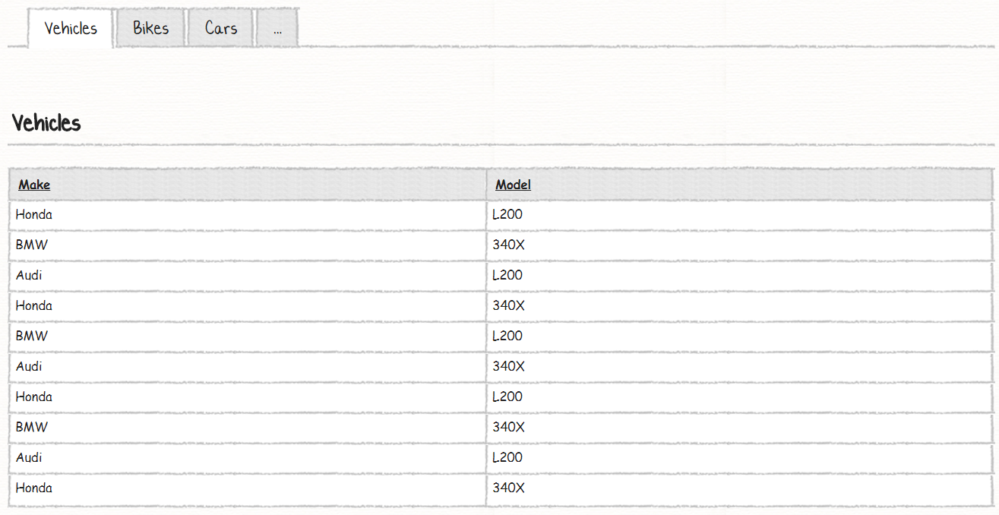
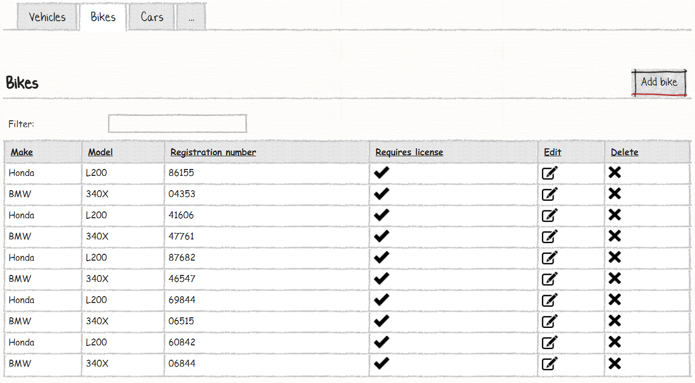
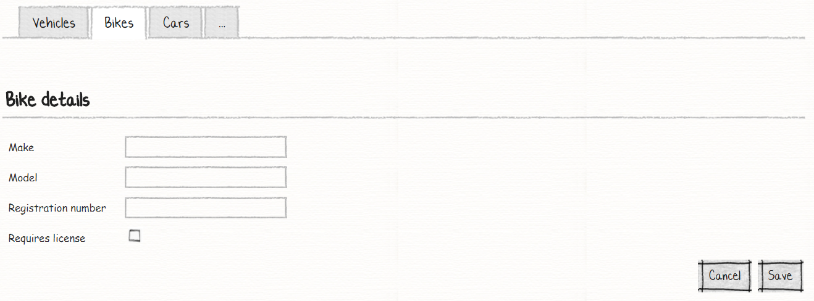

# Your Fifth M# Application
In this tutorial you will learn:

- Inheritence
- Export to excel
- Client-side filter
- Index column

## Requirements
In this tutorial we are going to implement a system that lets users add a car or a bike and see them in related tab, we also let user to see all vehicles that are parent of all cars or bikes in a vehicle tab.
Here are the sketches for list and model.

### Vehicle:


In vehicle entity, we just have a list of them and they are read only.

### Bike:




In bike entity, we have CRUD (Create, Read, Update, Delete) operation and client side filter. This class inherits from the vehicle.

### Car:


In the car list we have an export to Excel button, and in add or editing mode, for *Number of doors* property we have custom view and limited to 3 numbers.

## Implementation
We can identify three entities, "Vehicle", "Bike" and "Car". Bike and Car entity inherit from *Vehicle*.
After understanding requirements and identifying its related properties and their relationships, it's time to create them. Now let's create the corresponding classes in the *#Model* project.

## Creating M# Entity Types
We start our work by creating related classes in a *#Model* project under *Domain* folder:

```C#
using MSharp;

namespace Domain
{
    public class Vehicle : EntityType
    {
        public Vehicle()
        {
            String("Make").Mandatory();

            String("Model").Mandatory();

            Int("Registration number").Mandatory();
        }
    }
}
```
Vehicle class is our root class for Bike and Car class, it has shared properties and act as a parent.

```C#
using MSharp;

namespace Domain
{
    public class Bike : SubType<Vehicle>
    {
        public Bike()
        {
            Bool("Requires license").Mandatory();
        }
    }
}
```
In Bike class, we have used new M# generic class. It's **SubType<>**, this class tell the M# framework that this class inherit from *Vehicle* class.

```C#
using MSharp;

namespace Domain
{
    public class Car : SubType<Vehicle>
    {
        public Car()
        {
            Int("Number of doors").Min(3).Max(5).Mandatory();
        }
    }
}
```
Car class, like bike class inherits from *Vehicle* class and according to our requirement, *Number of doors* property should have numbers between 3 to 5 and it should be radio buttons, so in this class we just set its min and max value that could have and soon you will see how we tell the M# render this values in radio buttons.
By using the M# fluent API, **.Min()** and **Max()** we set its minimum and maximum acceptable value.
Now it's time to feed our two entity types to the M# code generator. In solution explorer, right click the *#Model* project and select *Build* and then build the *Domain* project to make sure everything regarding it is fine.

## Developing UI
According to the requirement, we have these pages:

- Vehicle List
- Bikes List
  - Add / Edit Bike (with client side filter)
- Cars List (with export to excel)
  - Add / Edit car

So, we have three root pages that hold our list modules and 2 sub pages that are related to add or edit operation.

### Creating Vehicle Pages
Use M# context menu to add *Vehicle* root page:


```C#
using MSharp;

public class VehiclePage : RootPage
{
    public VehiclePage()
    {
        Add<Modules.VehiclesList>();
    }
}
```
In this class we have added "VehiclesList" module that is responsible for listing all vehicles.
We continue our work by adding "VehiclesList" module.

#### Creating Vehicle List Module
Add a folder with the name of *Vehicle* under the *Modules* folder of the *#UI* project and add *VehiclesList* by using the M# context menu like bellow:


```C#
using MSharp;

namespace Modules
{
    public class VehiclesList : ListModule<Domain.Vehicle>
    {
        public VehiclesList()
        {
            HeaderText("Vehicles");

            ShowHeaderRow();

            Column(x => x.Make);

            Column(x => x.Model);
        }
    }
}
```
This class is read only and is used just for showing purposes.

#### Creating Bike Pages
Use M# context menu to add a *Bike* root page:

```C#
using MSharp;

public class BikePage : RootPage
{
    public BikePage()
    {
        Add<Modules.BikesList>();
    }
}
```
In this class we add *BikesList* module that is responsible for showing all bikes, we continue our work by creating a *Enter* class that is responsible for adding and editing a bike, create new folder with the name of *Bikes* under the *Pages* folder in *#UI* project and add a *Enter* class like bellow:

```C#
using MSharp;

namespace Bikes
{
    class Enter : SubPage<BikePage>
    {
        public Enter()
        {
            Add<Modules.BikeForm>();
        }
    }
}
```
In this class we add our *BikeForm* module.

#### Creating Bike Modules
Now it's time to create other modules, we need two modules for bike entity, they are **BikesList** and **BikeForm**. Create a new folder with the name of *Bike* under the *Modules* folder of *#UI* project and then add these classes using M# context menu:

```C#
using MSharp;

namespace Modules
{
    public class BikeForm : FormModule<Domain.Bike>
    {
        public BikeForm()
        {
            HeaderText("Bike details");

            Field(x => x.Make);

            Field(x => x.Model);

            Field(x => x.RegistrationNumber);

            Field(x => x.RequiresLicense).Control(ControlType.CheckBox);

            Button("Cancel").OnClick(x => x.ReturnToPreviousPage());

            Button("Save").IsDefault().Icon(FA.Check)
            .OnClick(x =>
            {
                x.SaveInDatabase();
                x.GentleMessage("Saved successfully.");
                x.ReturnToPreviousPage();
            });
        }
    }
}
```

```C#
using MSharp;

namespace Modules
{
    public class BikesList : ListModule<Domain.Bike>
    {
        public BikesList()
        {
            HeaderText("Bikes");

            ShowHeaderRow();

            Search(GeneralSearch.ClientSideFilter).Label("Filter:");

            Column(x => x.Make);

            Column(x => x.Model);

            Column(x => x.RegistrationNumber);

            Column(x => x.RequiresLicense);

            ButtonColumn("Edit").Icon(FA.Edit)
                .OnClick(x => x.Go<Bikes.Enter>()
                .Send("item", "item.ID")
                .SendReturnUrl());

            ButtonColumn("Delete").Icon(FA.Remove)
                .OnClick(x =>
                {
                    x.DeleteItem();
                    x.RefreshPage();
                });

            Button("Add bike").Icon(FA.Plus)
                .OnClick(x =>
                x.Go<Bikes.Enter>()
                .SendReturnUrl());
        }
    }
}
```
In this class we have used ***Search(GeneralSearch.ClientSideFilter)** method that let users have client side search.

#### Creating Car Pages
Our last step is to create related pages for *Car* entity. Use M# context menu to add a *Car* root page:

```C#
using MSharp;

public class CarPage : RootPage
{
    public CarPage()
    {
        Add<Modules.CarsList>();
    }
}
```
In this class we add *CarsList* module that is responsible for showing all assets, we continue our work by creating a *Enter* class that is responsible for adding and editing a car, create new folder with the name of *Cars* under the *Pages* folder of *#UI* project and add a *Enter* class like bellow:

```C#
using MSharp;

namespace Cars
{
    class Enter : SubPage<CarPage>
    {
        public Enter()
        {
            Add<Modules.CarForm>();
        }
    }
}
```
In this class we have added *CarForm* module that tells M# framework how to generate related form code for this class.

#### Creating Car Modules
We continue our work by creating related *Modules*, we need two modules for car entity, they are **CarForm** and **CarsList**. Create a new folder with the name of *Car* under the *Modules* folder of *#UI* project and then add these classes using M# context menu:

```C#
using MSharp;

namespace Modules
{
    public class CarForm : FormModule<Domain.Car>
    {
        public CarForm()
        {
            HeaderText("Car details");

            Field(x => x.Make);

            Field(x => x.Model);

            Field(x => x.RegistrationNumber);

            Field(x => x.NumberOfDoors).Control(ControlType.HorizontalRadioButtons);

            Button("Cancel").OnClick(x => x.ReturnToPreviousPage());

            Button("Save").IsDefault().Icon(FA.Check)
            .OnClick(x =>
            {
                x.SaveInDatabase();
                x.GentleMessage("Saved successfully.");
                x.ReturnToPreviousPage();
            });
        }
    }
}
```
In this class, we have used **.Control(ControlType.HorizontalRadioButtons)** method for *Number of doors* property, this method generate horizontal radio button and let user select just one value from 3 to 5.

```C#
using MSharp;

namespace Modules
{
    public class CarsList : ListModule<Domain.Car>
    {
        public CarsList()
        {
            HeaderText("Cars");

            ShowHeaderRow();

            IndexColumn();

            Column(x => x.Make);

            Column(x => x.Model);

            Column(x => x.RegistrationNumber);

            Column(x => x.NumberOfDoors);

            ButtonColumn("Edit").Icon(FA.Edit)
                .OnClick(x => x.Go<Cars.Enter>()
                .Send("item", "item.ID")
                .SendReturnUrl());

            ButtonColumn("Delete").Icon(FA.Remove)
                .OnClick(x =>
                {
                    x.DeleteItem();
                    x.RefreshPage();
                });

            Button("Export").Icon(FA.FileExcelO)
                .OnClick(x => x.Export(ExportFormat.Excel));

            Button("Add car").Icon(FA.Plus)
                .OnClick(x => x.Go<Cars.Enter>()
                .SendReturnUrl());
        }
    }
}
```
In this class we have used **Button("Export")** M# method, this method generates a button and by using *Export(ExportFormat.Excel)* M# generate related code for generating excel and when user click on "Export" button, excel file will be downloaded.

#### Adding Pages to Menu
Our last step is to add a root page to the main menu:

```C#
using MSharp;

namespace Modules
{
    public class MainMenu : MenuModule
    {
        public MainMenu()
        {
            AjaxRedirect().IsViewComponent().UlCssClass("nav navbar-nav dropped-submenu");

            Item("Login")
                .Icon(FA.UnlockAlt)
                .VisibleIf(AppRole.Anonymous)
                .OnClick(x => x.Go<LoginPage>());

            Item("Settings")
                .VisibleIf(AppRole.Administrator)
                .Icon(FA.Cog)
                .OnClick(x => x.Go<Admin.SettingsPage>());

            Item("Vehicles")
                .Icon(FA.Navicon)
                .OnClick(x => x.Go<VehiclePage>());

            Item("Bikes")
                .Icon(FA.Navicon)
                .OnClick(x => x.Go<BikePage>());

            Item("Cars")
                .Icon(FA.Navicon)
                .OnClick(x => x.Go<CarPage>());
        }
    }
}
```

### Final Step
Build **#UI** project, set the **WebSite** project as your default *StartUp* project and configure your *connection string* in **appsetting.json** file and hit F5. Your project is ready to use.
