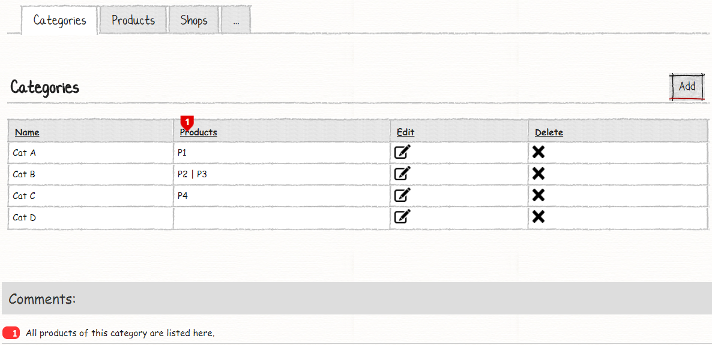
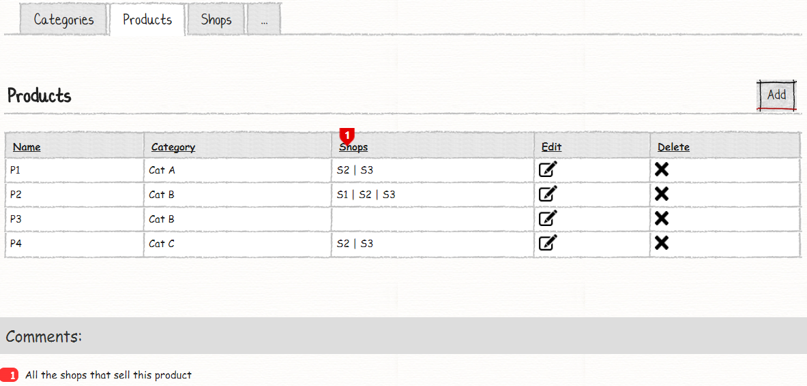
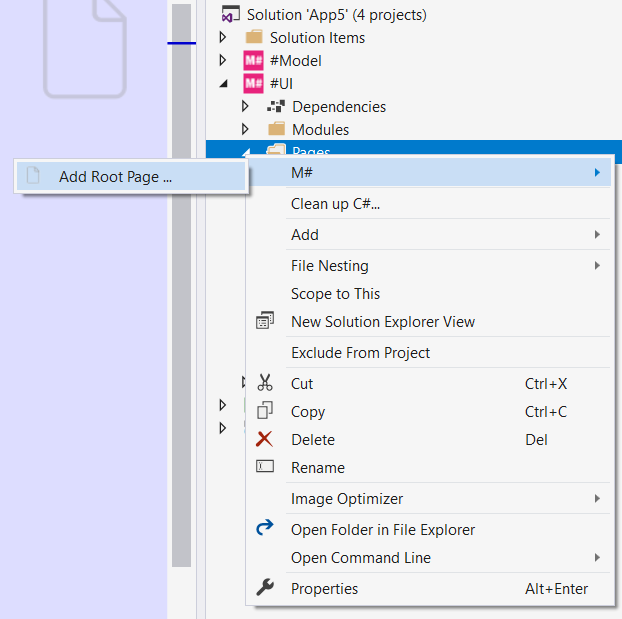

# M# Tutorial - Episode 6: Advanced Associations

In this tutorial you will learn:

- One to Many (inverse) associations
- Many to Many associations

## Requirements

In this tutorial we are going to develop a website that has three tabs:

- Categories
- Products
- Shops

In these pages, use can see related information and add/edit or delete them. Bellow is explanation of each tab.

### Categories




On the category page, user can see a list of all categories and their related products that are separated by "|". User can do CRUD operations. You should notice that in this page we have **inverse assosiation** for product property, this association come from parent to child and it means we should list all related products for each category.

### Products




On the product page, user can see a list of all products and their related shops that are separated by "|". User can do the CRUD operations. You should notice that in this page we have a **assosiation** to category and **inverse assosiation** to shop.

### Shops


In shops page, user can see a list of all shops and their related products that are sold in the shop and separated by "|". User can do the CRUD operations. On this page we have **many to many** relation to products and shops, it means that each shop can sell many products and any products can be sold in any shops.

## Implementation: Entities

Let's start with creating three entities, "Category", "product" and "Shop". There is a one to many relation with *Category* and *Product* also a many to many relation with *Product* and *Shop* entities. Now let's create the corresponding classes in the *#Model* project.

Navigate to the **#Model** project and create a **Domain** folder, *right click > Add > M#* and then add these classes:

```C#
using MSharp;

namespace Domain
{
    public class Category : EntityType
    {
        public Category()
        {
            String("Name").Mandatory();

            InverseAssociate<Product>("Products", "Category");
        }
    }
}
```

Category class has a new M# method with the name of `InverseAssociate<>()`. **InverseAssociate** method tells M# framework that we have a flow from parent to child. First parameter is the name of the property and the second one is the name of property in child entity.

```C#
using MSharp;

namespace Domain
{
    public class Product : EntityType
    {
        public Product()
        {
            String("Name");

            Associate<Category>("Category");

            InverseManyToMany<Shop>("Shops", "Products");
        }
    }
}
```

In product class there is a *one to many assosication* and also a *many to many association*. Every product can have only one category and every product can be sold in many shops. With `Associate<Category>("Category")` generic method we set one to many relation with category entity and with `InverseManyToMany<Shop>("Shops", "Products")` we set inverse association with shops entities that show a flow from parent to child and show all shops that has been sold this product.

```C#
using MSharp;

namespace Domain
{
    public class Shop : EntityType
    {
        public Shop()
        {
            String("Name");

            String("Address").Max(2000).Lines(5);

            AssociateManyToMany<Product>("Products");
        }
    }
}
```

Shop class has three properties, `String("Name")` method add a string property with the name of "Name". `String("Address").Max(2000).Lines(5)` add an "Address" property with a length of 2000 and `.Lines(5)` tell M# framework that it would generate a "TextArea" for UI. `AssociateManyToMany<Product>("Products")` create many to many relation to product entity, it tells M# that every product can have many shops and vise versa.

## Implementation: UI

According to the requirement, we have these pages to develop:

- Categories List
  - Add / Edit Category
- Products List
  - Add / Edit Product (with selected category by default)
- Shops List
  - Add / Edit Shop

So, there's three root pages that hold our list modules and three sub pages that are related to add or edit operations.

### Creating Category Pages

Go to **Pages** folder of **#UI**, *right click > Add > M#*  then create **Category** rootpage:



```C#
using MSharp;

public class CategoryPage : RootPage
{
    public CategoryPage()
    {
        Add<Modules.CategoriesList>();
    }
}
```

In this class we have added "CategoriesList" module that is responsible for listing all categories.
Now let's do the same thing and add *Product* and *Shop* root pages with codes below:

```C#
using MSharp;

public class ProductPage : RootPage
{
    public ProductPage()
    {
        Add<Modules.ProductsList>();
    }
}
```

```C#
using MSharp;

public class ShopPage : RootPage
{
    public ShopPage()
    {
        Add<Modules.ShopsList>();
    }
}
```

Now create three folders named *Shops*, *Catrgories* and *Products*. Then create a class with the name of *EnterPage* in *Shops* folder, then place this code inside of it:

```C#
using MSharp;

namespace Shops
{
    class EnterPage : SubPage<ShopPage>
    {
        public EnterPage()
        {
            Add<Modules.ShopForm>();
        }
    }
}
```

In this class what happens is that we ask M# to render a ShopForm module (which will be implemented later).
Now create a class with the name of *EnterPage* in *Categories* folder, then place this code inside of it:

```C#
using MSharp;

namespace Categories
{
    class EnterPage : SubPage<CategoryPage>
    {
        public EnterPage()
        {
            Add<Modules.CategoryForm>();
        }
    }
}
```

Now do the same thing with the *Products*:

```C#
using MSharp;

namespace Products
{
    class EnterPage : SubPage<ProductPage>
    {
        public EnterPage()
        {
            Add<Modules.ProductForm>();
        }
    }
}
```

### Creating required module of Category Pages

Navigate to **Modules** folder of **#UI** project and create folder named **Category**. Then add a *List module* named **CategoriesList** using M# context menu:


```C#
using MSharp;

namespace Modules
{
    public class CategoriesList : ListModule<Domain.Category>
    {
        public CategoriesList()
        {
            HeaderText("Categories");

            ShowHeaderRow();

            Column(x => x.Name);
            Column(x => x.Products);

            ButtonColumn("Edit").Icon(FA.Edit)
                .OnClick(x => x.Go<Categories.EnterPage>()
                .Send("item", "item.ID")
                .SendReturnUrl());

            ButtonColumn("Delete").Icon(FA.Remove)
                .OnClick(x =>
                {
                    x.DeleteItem();
                    x.RefreshPage();
                });

            Button("Add").Icon(FA.Plus)
                .OnClick(x => x.Go<Categories.EnterPage>()
                .SendReturnUrl());
        }
    }
}
```

This class lists all categories and related products. By using `Column(x => x.Products)` M# is smart enough to understand how to show products. M# shows the names of each related product seprated by a pipe line character **" | "** by default.

Like above use M# context menu to add form module named *CategoryForm* and copy the code below into that file:

Navigate to **Modules** folder of **#UI** project and under **Category** folder add a *Form module* named **CategoryForm** using M# context menu:

```C#
using MSharp;

namespace Modules
{
    public class CategoryForm : FormModule<Domain.Category>
    {
        public CategoryForm()
        {
            HeaderText("Category details");

            Field(x => x.Name);

            Button("Cancel").OnClick(x => x.ReturnToPreviousPage());

            Button("Save").IsDefault().Icon(FA.Check)
            .OnClick(x =>
            {
                x.SaveInDatabase();
                x.GentleMessage("Saved successfully.");
                x.ReturnToPreviousPage();
            });
        }
    }
}
```

### Creating required module of Product Pages

Navigate to **Modules** folder of **#UI** project and create folder named **Product**. Then add a *List module* named **ProductsList** using M# context menu:


```C#
using MSharp;

namespace Modules
{
    public class ProductsList : ListModule<Domain.Product>
    {
        public ProductsList()
        {
            HeaderText("Products");

            ShowHeaderRow();

            Column(x => x.Name);
            Column(x => x.Category);
            Column(x => x.Shops);

            ButtonColumn("Edit").Icon(FA.Edit)
                .OnClick(x => x.Go<Products.EnterPage>()
                .Send("item", "item.ID")
                .SendReturnUrl());

            ButtonColumn("Delete").Icon(FA.Remove)
               .OnClick(x =>
               {
                   x.DeleteItem();
                   x.RefreshPage();
               });

            Button("Add").Icon(FA.Plus)
                .OnClick(x => x.Go<Products.EnterPage>()
                .SendReturnUrl());
        }
    }
}
```

Now add "ProductForm" with the same way that you did earlier:

```C#
using MSharp;

namespace Modules
{
    public class ProductForm : FormModule<Domain.Product>
    {
        public ProductForm()
        {
            HeaderText("Product details");

            Field(x => x.Name);
            Field(x => x.Category).Control(ControlType.DropdownList);

            Button("Cancel").OnClick(x => x.ReturnToPreviousPage());

            Button("Save").IsDefault().Icon(FA.Check)
            .OnClick(x =>
            {
                x.SaveInDatabase();
                x.GentleMessage("Saved successfully.");
                x.ReturnToPreviousPage();
            });
        }
    }
}
```

### Creating required module of Shop Pages

Navigate to **Modules** folder of **#UI** project and create folder named **Shop**. Then add a *List module* named **ShopsList** using M# context menu:


```C#
using MSharp;

namespace Modules
{
    public class ShopsList : ListModule<Domain.Shop>
    {
        public ShopsList()
        {
            HeaderText("Shops");

            ShowHeaderRow();

            Column(x => x.Name);
            Column(x => x.Address);
            Column(x => x.Products);

            ButtonColumn("Edit").Icon(FA.Edit)
                .OnClick(x => x.Go<Shops.EnterPage>()
                .Send("item", "item.ID")
                .SendReturnUrl());

            ButtonColumn("Delete").Icon(FA.Remove)
               .OnClick(x =>
               {
                   x.DeleteItem();
                   x.RefreshPage();
               });

            Button("Add").Icon(FA.Plus)
                .OnClick(x => x.Go<Shops.EnterPage>()
                .SendReturnUrl());
        }
    }
}
```

Let's continue with adding *Form module* named **ShopForm** like below:

```C#
using MSharp;

namespace Modules
{
    public class ShopForm : FormModule<Domain.Shop>
    {
        public ShopForm()
        {
            HeaderText("Shop details");

            Field(x => x.Name);
            Field(x => x.Address);
            Field(x => x.ProductsLinks).Control(ControlType.VerticalCheckBoxes);

            Button("Cancel").OnClick(x => x.ReturnToPreviousPage());

            Button("Save").IsDefault().Icon(FA.Check)
            .OnClick(x =>
            {
                x.SaveInDatabase();
                x.GentleMessage("Saved successfully.");
                x.ReturnToPreviousPage();
            });
        }
    }
}
```

### Adding Pages to the Menu

After you ended up with the pages, you need to add them to the main menu:

```C#
using MSharp;
using Domain;

namespace Modules
{
    public class MainMenu : MenuModule
    {
        public MainMenu()
        {
            AjaxRedirect().IsViewComponent().UlCssClass("nav navbar-nav dropped-submenu");

            Item("Login")
                .Icon(FA.UnlockAlt)
                .VisibleIf(AppRole.Anonymous)
                .OnClick(x => x.Go<LoginPage>());

            Item("Settings")
                .VisibleIf(AppRole.Admin)
                .Icon(FA.Cog)
                .OnClick(x => x.Go<Admin.SettingsPage>());

            Item("Categories")
              .Icon(FA.Navicon)
              .OnClick(x => x.Go<CategoryPage>());

            Item("Products")
               .Icon(FA.Navicon)
               .OnClick(x => x.Go<ProductPage>());

            Item("Shops")
               .Icon(FA.Navicon)
               .OnClick(x => x.Go<ShopPage>());
        }
    }
}
```

### Final Step

Build **#UI** project, set the **WebSite** project as your default *StartUp* project and configure your *connection string* in **appsetting.json** file and hit F5. Your project is ready to use.
