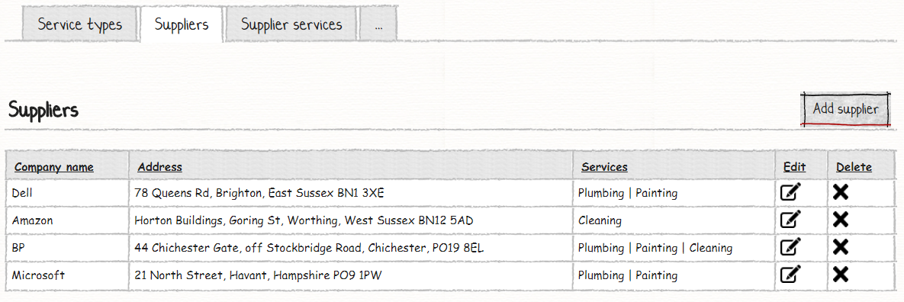
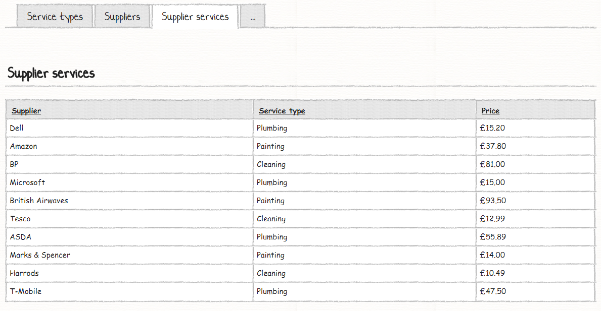

# M# Tutorial - Episode 9: Master-detail

In this tutorial you will learn:

- Master-detail forms

## Requirements

In this tutorial we are going to develop a website that lists Service types, suppliers and supplier services. On service types page user can see all service types and add or edit them. On suppliers page user can see all suppliers with their related services and on the supplier service page user can just see a list of all suppliers and service types with their price.

### Service Types


The service type page is simple, It just shows a list of all service types and let users do CRUD operations.

### Suppliers




On the supplier page, user can see a list of all suppliers and their related services, in the list page all supplier addresses are connected to each other. In the add or edit pages, user can insert supplier information with their related service types as a master detail page.

## Supplier Services



This page is just a list of all suppliers and their related services.

## Implementation: Entities

Let's start with creating **Service Type**, **Supplier** and **Supplier Service** classes in a *#Model* project under *Domain* folder:

```csharp
using MSharp;

namespace Domain
{
    public class ServiceType : EntityType
    {
        public ServiceType()
        {
            String("Name");
        }
    }
}
```

**ServiceType** class just have **Name** property.

```csharp
using MSharp;

namespace Domain
{
    public class Supplier : EntityType
    {
        public Supplier()
        {
            String("Company name");

            String("Address line 1");

            String("Address line 2");

            String("Town");

            String("Postcode");

            String("Address").Calculated().Getter("new[] { AddressLine1, AddressLine2, Town, Postcode }.ToString(\", \")");

            InverseAssociate<SupplierService>("Services", "Supplier");
        }
    }
}
```

**Supplier** class has a computed column named **Address**. We have used array to join all address properties into one column because these properties can be null and this way is best practice to join null-able string properties. This class has an inverse association with **SupplierService** property and other properties are just simple sting property.

```csharp
using MSharp;

namespace Domain
{
    public class SupplierService : EntityType
    {
        public SupplierService()
        {
            Associate<Supplier>("Supplier");

            Associate<ServiceType>("Service type");

            Money("Price");

            ToStringExpression("ServiceType.Name");
        }
    }
}
```

**SupplierService** class has two associations with **Supplier** and **ServiceType** class and a money property.
In solution explorer, right click the *#Model* project and select *Build* and then build the *Domain* project to make sure everything is just fine.

## Implementation: UI

According to the requirements, there are these pages to develop:

- Service Types List
  - Add / Edit Service Type
- Suppliers List
  - Add / Edit Supplier
- Supplier Services List

### Creating Service Type Pages

Use the M# context menu to add a root page to the **Pages** folder of **#UI** project:

```csharp
using MSharp;

public class ServiceTypePage : RootPage
{
    public ServiceTypePage()
    {
        Add<Modules.ServiceTypesList>();
    }
}
```

Create a folder named **ServiceType** under **Pages** folder and add this sub page class:

```csharp
using MSharp;

namespace ServiceType
{
    class EnterPage : SubPage<ServiceTypePage>
    {
        public EnterPage()
        {
            Layout(Layouts.FrontEnd);

            Add<Modules.ServiceTypeForm>();
        }
    }
}
```

### Creating required module of Service Type Pages

Navigate to **Modules** folder of **#UI** project and create folder named **ServiceType**. Then add a *List module* named **ServiceTypesList** using M# context menu:

```csharp
using MSharp;

namespace Modules
{
    public class ServiceTypesList : ListModule<Domain.ServiceType>
    {
        public ServiceTypesList()
        {
            HeaderText("Service types")
                .ShowHeaderRow()
                .ShowFooterRow();

            Column(x => x.Name);

            ButtonColumn("Edit").Icon(FA.Edit)
                .OnClick(x => x.Go<ServiceType.EnterPage>()
                .SendReturnUrl()
                .Send("item", "item.ID"));

            Button("New Service type").Icon(FA.Plus)
                .OnClick(x => x.Go<ServiceType.EnterPage>()
                .SendReturnUrl());
        }
    }
}
```

**ServiceTypesList** class just lists service types items in a grid and lets users do CRUD operations.

Let's continue with adding *Form module* named **ServiceTypeForm** like below:

```csharp
using MSharp;

namespace Modules
{
    public class ServiceTypeForm : FormModule<Domain.ServiceType>
    {
        public ServiceTypeForm()
        {
            HeaderText("Add/Edit Service type");

            Field(x => x.Name);

            Button("Cancel").OnClick(x => x.ReturnToPreviousPage());

            Button("Save").IsDefault().Icon(FA.Check)
            .OnClick(x =>
            {
                x.SaveInDatabase();
                x.GentleMessage("Saved successfully.");
                x.ReturnToPreviousPage();
            });
        }
    }
}
```

### Creating Supplier Pages

Use M# context menu to add **Supplier** root page to the **Pages** folder of **#UI** project:

```csharp
using MSharp;

public class SupplierPage : RootPage
{
    public SupplierPage()
    {
        Add<Modules.SuppliersList>();
    }
}
```

Create a folder named **Supplier** under **Pages** folder and add an *Enter* sub page:

```csharp
using MSharp;

namespace Supplier
{
    class EnterPage : SubPage<SupplierPage>
    {
        public EnterPage()
        {
            Layout(Layouts.FrontEnd);

            Add<Modules.SupplierForm>();
        }
    }
}
```

### Creating required module of Supplier Pages

Navigate to **Modules** folder of **#UI** project and create folder named **Supplier**. Then add a *List module* named **SuppliersList** using M# context menu:

```csharp
using MSharp;

namespace Modules
{
    public class SuppliersList : ListModule<Domain.Supplier>
    {
        public SuppliersList()
        {
            HeaderText("Suppliers")
                .ShowHeaderRow()
                .ShowFooterRow();

            Column(x => x.CompanyName);

            Column(x => x.Address);

            Column(x => x.Services);

            ButtonColumn("Edit").Icon(FA.Edit)
                .OnClick(x => x.Go<Supplier.EnterPage>()
                .SendReturnUrl()
                .Send("item", "item.ID"));

            Button("New Supplier").Icon(FA.Plus)
                .OnClick(x => x.Go<Supplier.EnterPage>()
                .SendReturnUrl());
        }
    }
}
```

For **SuppliersList** class we have used **Address** property and **Services** as requested by requirements.

Let's continue with adding *Form module* named **SupplierForm** like below:

```csharp
using MSharp;

namespace Modules
{
    public class SupplierForm : FormModule<Domain.Supplier>
    {
        public SupplierForm()
        {
            HeaderText("Supplier details");

            Field(x => x.CompanyName);

            Field(x => x.AddressLine1);

            Field(x => x.AddressLine2);

            Field(x => x.Town);

            Field(x => x.Postcode);

            MasterDetail(x => x.Services, s =>
            {
                s.HeaderText("Supplier service details");

                s.Field(x => x.ServiceType).Control(ControlType.DropdownList);

                s.Field(x => x.Price);

                s.Button("Add service").OnClick(x => x.AddMasterDetailRow());
            });

            Button("Cancel").OnClick(x => x.ReturnToPreviousPage());

            Button("Save").IsDefault().Icon(FA.Check)
            .OnClick(x =>
            {
                x.SaveInDatabase();
                x.GentleMessage("Saved successfully.");
                x.ReturnToPreviousPage();
            });
        }
    }
}
```

The **SupplierForm** has got a new generic method named `MasterDetail\<SupplierServiceForm\>(x => x.Services)`. This method tells M# that this page has a nested form and act like a master detail page. **SupplierServiceForm** class is detail form that inherits from *FormModule* and is like other usual M# form pages, but it has a special method for saving its content and this method is `AddMasterDetailRow()`. By calling `MinCardinality()` method we have initialized this detail page with three preselected values and user can't inset less that 3 values. If you need to put a restriction on maximum recodes, you can call `MaxCardinality()` function.

### Creating Supplier Service Pages

Use M# context menu to add *SupplierService* root page to the "Pages" folder:

```csharp
using MSharp;

public class SupplierServicePage : RootPage
{
    public SupplierServicePage()
    {
        Add<Modules.SupplierServicesList>();
    }
}
```

### Creating required module of Supplier Servic Pages

Navigate to **Modules** folder of **#UI** project and create folder named **SupplierService**. Then add a *List module* named **TimeLogsList** using M# context menu:

```csharp
using MSharp;

namespace Modules
{
    public class SupplierServicesList : ListModule<Domain.SupplierService>
    {
        public SupplierServicesList()
        {
            HeaderText("Supplier services")
                .ShowHeaderRow()
                .ShowFooterRow();

            Column(x => x.Supplier);

            Column(x => x.ServiceType);

            Column(x => x.Price);
        }
    }
}
```

### Adding Pages to the Menu

The last step is to add a root page to the main menu:

```csharp
using MSharp;

namespace Modules
{
    public class MainMenu : MenuModule
    {
        public MainMenu()
        {
            AjaxRedirect().IsViewComponent().UlCssClass("nav navbar-nav dropped-submenu");

            Item("Login")
                .Icon(FA.UnlockAlt)
                .VisibleIf(AppRole.Anonymous)
                .OnClick(x => x.Go<LoginPage>());

            Item("Settings")
                .VisibleIf(AppRole.Admin)
                .Icon(FA.Cog)
                .OnClick(x => x.Go<Admin.SettingsPage>());

            Item("Service type")
               .Icon(FA.Cog)
               .OnClick(x => x.Go<ServiceTypePage>());

            Item("Supplier")
               .Icon(FA.Cog)
               .OnClick(x => x.Go<SupplierPage>());

            Item("Supplier services")
               .Icon(FA.Cog)
               .OnClick(x => x.Go<SupplierServicePage>());
        }
    }
}
```

### Final Step

Build **#UI** project, set the **WebSite** project as your default *StartUp* project and configure your *connection string* in **appsetting.json** file and hit F5. Your project is ready to use.
