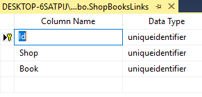

# Many to many relationship

## Problem

There are situations where multiple instances of an entity can be in relation with multiple instances of another entity.
These are called many to many relationships.

A usual example is a relation between a shops and books.
Each book can be sold in multiple shops and each shop can sell multiple books.

## Implementation

We use the `AssociateManyToMany<T>()` and `InverseManyToMany<T>()` to implement many to many relationship for two entities. 
The entity which needs to modify the relationship, and add/remote instances of the other entity should call `AssociateManyToMany<T>() and the other one should call the `InverseManyToMany<T>()` mentioning the property in the other entity (similar to the way one to many and many to one relationship works).

Let's continue our books example and define a `Shop` entity and set a many to many relationship between it and our books.

#### Example

The `Shop` entity can be defined like this

```csharp
using MSharp;

namespace Model
{
    public class Shop : EntityType
    {
        public Shop()
        {
            String("Name").Mandatory();
            String("Address").Mandatory();
            AssociateManyToMany<Book>("Books");
        }
    }
}

```

The book should contain the inverse association as well so it should be modified

```csharp
using MSharp;

namespace Model
{
    public class Book : EntityType
    {
        public Book()
        {
            String("Name").Mandatory();
            String("Author").Mandatory();
            Associate<Category>("book Category").Mandatory();
            InverseManyToMany<Shop>("Shops", "Books");
        }
    }
}

```

The way to understand which entity should contain the actual association and which one should contain the inverse one is to find out which entity will actually contain the other entity or is the parent of it.
For example in a schools management system, between teachers and schools, school should have the main association and the teacher the inverse one.
However if the system is for managing super stars and movies, then the  main relation shiuld be in the `SuperStar` entity and the movie should contain the inverse association since we usually add and remove movies from the list of works of an actor/actress but the system should be able to tell us who played in a movie if needed.
The part that needs to be modified is the main association and the one which is only used for reading is the inverse one.

#### Generated Code

The generated code will make it more clear

**Shop**

```csharp
     public partial class Shop : GuidEntity
    {
        internal List<ShopBooksLink> cachedBooksLinks;
        
        /* -------------------------- Constructor -----------------------*/
        
        /// <summary>Initializes a new instance of the Shop class.</summary>
        public Shop() => Deleting.Handle(Cascade_Deleting);
        
        /* -------------------------- Properties -------------------------*/
        
        /// <summary>Gets or sets the value of Address on this Shop instance.</summary>
        public string Address { get; set; }
        
        /// <summary>Gets or sets the value of Name on this Shop instance.</summary>
        public string Name { get; set; }
        
        /// <summary>Gets the Books of this Shop.</summary>
        [Calculated]
        [Newtonsoft.Json.JsonIgnore]
        public Task<IEnumerable<Book>> Books
        {
            get => BooksLinks.GetList().Select(x => x.Book);
        }
        
        /// <summary>Gets the Books of this Shop.</summary>
        [Calculated]
        [XmlIgnore, Newtonsoft.Json.JsonIgnore]
        [System.ComponentModel.DisplayName("Books")]
        public IDatabaseQuery<ShopBooksLink> BooksLinks
        {
            get => Database.Of<ShopBooksLink>().Where(s => s.ShopId == ID);
        }
}
```

**Book**

```csharp
    public partial class Book : GuidEntity
    {
        CachedReference<Category> cachedBookCategory = new CachedReference<Category>();
        Guid? previousBookCategoryId;
        
        internal List<ShopBooksLink> cachedShopsLinks;
        
       /// <summary>Initializes a new instance of the Book class.</summary>
        public Book()
        {
            Deleting.Handle(Cascade_Deleting);
            Loaded.Handle(() => previousBookCategoryId = BookCategoryId);
        }
        
       /// <summary>Gets or sets the value of Author on this Book instance.</summary>
        public string Author { get; set; }
        
        /// <summary>Gets or sets the value of Name on this Book instance.</summary>
        public string Name { get; set; }
        
        /// <summary>Gets or sets the ID of the associated book Category.</summary>
        public Guid? BookCategoryId { get; set; }
        
        /// <summary>Gets or sets the value of book Category on this Book instance.</summary>
        [System.ComponentModel.DisplayName("book Category")]
        public Category BookCategory
        {
            get => cachedBookCategory.Get(BookCategoryId);
            set => BookCategoryId = value?.ID;
        }
        
        /// <summary>Gets the Shops of this Book.</summary>
        [Calculated]
        [Newtonsoft.Json.JsonIgnore]
        public Task<IEnumerable<Shop>> Shops
        {
            get => ShopsLinks.GetList().Select(x => x.Shop);
        }
        
        /// <summary>Gets the Shops of this Book.</summary>
        [Calculated]
        [XmlIgnore, Newtonsoft.Json.JsonIgnore]
        [System.ComponentModel.DisplayName("Shops")]
        public IDatabaseQuery<ShopBooksLink> ShopsLinks
        {
            get => Database.Of<ShopBooksLink>().Where(s => s.BookId == ID);
        }
}
```

## Database schema

A new table is created for many to many relationships which stores the relations by storing IDs of the related touples together.
The schema for the previous example can is this one

