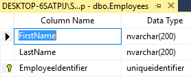

# Custom primary key

## Problem

By default M# generates a `Guid` field named ID and uses it as the primary key of the entity.
Sometimes your entity by default has a property which is unique per touple and can be used as primary key.
M# allows you to choose a `Guid`, `int`, `long` or a `string` as the primary key.

## Implementation

You should call the `IsPrimaryKey()` method on a property to set it as the primary key of your entity.
If you want to change the type of the primary key from Guid to another type, you should call the `PrimaryKeyType()` method in the entity's definition.
Valid arguments are:

- `"string"` for `string` keys
- `"int"` for `int` keys
- `"long"` for `long` keys
- `"Guid"` for `Guid` keys which is the default type and you don't need to call it.

#### Example

Each employee in our company has a unique employee ID used for identifying him.
We can use this ID as the primary key of the employee in the database.
In order to do that, we define our employee like the code below:

```csharp
using MSharp;

namespace Model
{
    public class Employee : EntityType
    {
        public Employee()
        {
            String("first Name").Mandatory();
            String("Last Name").Mandatory();
            Guid("EmployeeIdentifier").Mandatory().IsPrimaryKey();
        }
    }
}

```

The employee ID property which we have here is calling `IsPrimaryKey()` in its chain so the M# framework will choose this property as primary key.

#### Database Schema

The database schema will look like this



#### Generated Code

The generated code for the `Employee` entity will accommodate changes so it uses the custom ID.

```csharp
    public partial class Employee : GuidEntity
    {
        /* -------------------------- Properties -------------------------*/
        
        /// <summary>Gets or sets the ID of this Employee instance based on its EmployeeIdentifier property.</summary>
        public override Guid ID
        {
            get
            {
                return EmployeeIdentifier;
            }
            
            set
            {
                EmployeeIdentifier = value;
            }
        }
        
        /// <summary>Gets or sets the value of EmployeeIdentifier on this Employee instance.</summary>
        [PrimaryKey]
        [System.ComponentModel.DisplayName("EmployeeIdentifier")]
        public Guid EmployeeIdentifier { get; set; }
        
        /// <summary>Gets or sets the value of FirstName on this Employee instance.</summary>
        [System.ComponentModel.DisplayName("first Name")]
        public string FirstName { get; set; }
        
        /// <summary>Gets or sets the value of LastName on this Employee instance.</summary>
        [System.ComponentModel.DisplayName("Last Name")]
        public string LastName { get; set; }
    }
```

The `Employee` code overrides the `ID` property so it uses the custom ID property we have, usually entity classes don't need to override this and use the `GuidEntity`'s implementation.

#### Example

Let's say we have a `Student` entity in a university website and each student has a unique `int` number assigned to them as their student ID.
We want to use this ID as their key in the database as well.
We define the entity like this

```csharp
using MSharp;


namespace Model
{
    public class Student : EntityType
    {
        public Student()
        {
            PrimaryKeyType("int");
            Int("Student ID").Mandatory().IsPrimaryKey();
            String("First Name").Mandatory();
            String("Last Name").Mandatory();
        }
    }
}

```

We here set the type of the primary key to `int` and then create an int property which will be used as the primary key called `StudentID` and call `IsPrimaryKey()` method on it.

#### Database Schema

The schema of the table uses an int key named `StudentID` as well.


#### Generated Code

The generated code is a bit different now
Let's take a look

```csharp
public partial class Student : IntEntity
{
        /* -------------------------- Properties -------------------------*/
        
        /// <summary>Gets or sets the ID of this Student instance based on its StudentID property.</summary>
        public override int ID
        {
            get
            {
                return StudentID;
            }
            
            set
            {
                StudentID = value;
            }
        }
        
        /// <summary>Gets or sets the value of FirstName on this Student instance.</summary>
        [System.ComponentModel.DisplayName("First Name")]
        public string FirstName { get; set; }
        
        /// <summary>Gets or sets the value of LastName on this Student instance.</summary>
        [System.ComponentModel.DisplayName("Last Name")]
        public string LastName { get; set; }
        
        /// <summary>Gets or sets the value of StudentID on this Student instance.</summary>
        [PrimaryKey]
        [System.ComponentModel.DisplayName("Student ID")]
        public int StudentID { get; set; }
}
```

There are few things to note here:

- The entity is not inherited from `GuidEntity` and is derived from `IntEntity` instead.
- The `ID` property which is overridden is of type `int` and uses the custom key we defined