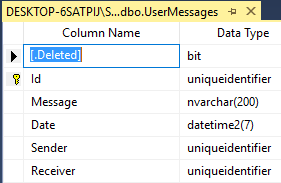

# Soft delete

## Problem

Sometimes you might want to implement your delete operations in a way that the data is not actually deleted from the database and it is just not shown to the user.
There might  be multiple reasons for this:

- some business rules require you to keep the data for future inspection of legal departments.
- The data is needed for other purposes like calculating analytical metrics and is needed by the application to function correctly.
- You want to allow the user to see the data in their trash and restore them.

## Implementation

To mark an entity as one which should not be actually deleted when the user requests to delete it, we should call the `SoftDelete()` method in the entity definition.
M# will add a column of type `bit` for the entity which indicates if it's deleted or not.
When the user requests to delete the data, M# sets this bit to 1 and no longer returns the entity when calling Get/GetList/… operations on the database.

#### Example

Let's say we want to define an entity which  represents messages which users can send to each other in a system.
The entity should include the message, the sender and the receiver and the date and time the message was sent.
Also we want to keep all messages for archiving purposes.
This means when a user deletes a message, we want to do a soft delete and keep the data for auditing.
We will define our `UserMessage`  Entity like this:

```csharp
using MSharp;

namespace Domain
{
    public class UserMessage : EntityType
    {
        public UserMessage()
        {
            SoftDelete();
            String("Message").Mandatory();
            DateTime("Date").Mandatory();
            Associate<User>("Sender").Mandatory();
            Associate<User>("Receiver").Mandatory();
        }
    }
}
```

The only special thing about the entity is the fact that we are calling `SoftDelete()` in its definition so when messages are deleted, only a soft delete operation happens and the data will remain in the database for future retrieval. 

#### Generated code

```csharp
    [SoftDelete]
    public partial class UserMessage : GuidEntity
    {
        ...
    {
```

The generated class will have a `[]SoftDelete]` attribute which tells M# to execute an update query for soft deleting instead of executing the actual delete query when the user wants to delete the entity.
    
#### Database Schema
    
The database schema of the `UserMessage` entity has an additional column for storing if the entity is soft deleted or not.
    

    
## Remarks

- When writing custom queries, you should take care of soft deleted entities yourself to not return them when not appropriate.
- Soft deleting entities in the system means that they'll remain in the database, be careful of storage consequences of it if your application will deal with a huge amount of data which will be soft deleted. You might want to erase the data after some time using a scheduled task or some other mechanism (if relevant).
- We are not providing legal advice and are not licensed to do that but before deciding to keep any data, make sure you are following the law of your jurisdiction and are having the correct terms in your privacy terms and other relevant documents.