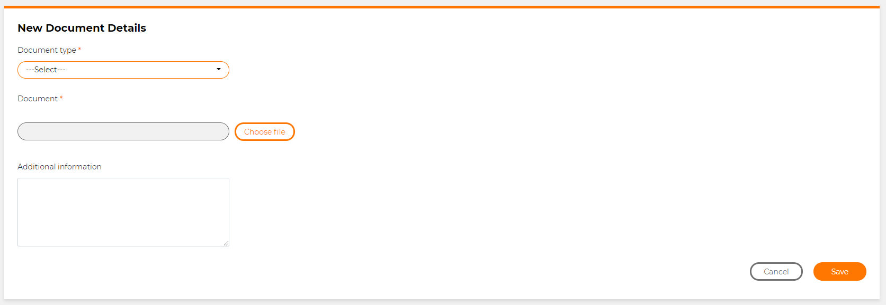

# Adding a file upload field

## Problem

Sometimes you will want your user to be able to upload a file to be saved on the server where the application is running.  A good example of this is if they want to be able to change their logo in the application.

## Implementation

This is very easy to do in M# as long as you have set up the property correctly within the model.  When creating the property in the model, use `SecureFile()`

### Example

In this example we have the `SecureFile("Document")`

```csharp
using MSharp;

namespace Domain
{
    public class IDDocumentation : EntityType
    {
        public IDDocumentation()
        {
            Associate<IDDocumentType>("Type").Mandatory();
            SecureFile("Document").Mandatory();
            BigString("Additional information");
            DateTime("Added on").Mandatory();
        }
    }
}
```

This can then be used when writing the UI.

```csharp
using MSharp;

namespace Modules
{
    public class ApplicantIDDocumentationForm : FormModule<Domain.ApplicantIDDocumentation>
    {
        public ApplicantIDDocumentationForm()
        {
            HeaderText("New Document Details");

            AutoSet(x => x.Application).Value("CurrentApplication");
            Field(x => x.Type).Label("Document type").Mandatory();
            Field(x => x.Document).Mandatory();
            Field(x => x.AdditionalInformation);

            Button("Cancel").CssClass("pull-left").OnClick(x => x.ReturnToPreviousPage());

            Button("Save").IsDefault()
            .OnClick(x =>
            {
                x.SaveInDatabase();
                x.GentleMessage("Saved successfully.");
                x.Go<Applicant.Documentation.IDDocumentationPage>();
            });
        }
    }
}
```

The `Field(x => x.Document)` will show as a field with an upload button called "Choose File" where they can select a file and add it to the application. This file is then saved in a folder on the server and a reference to the file is stored in the database as a `blob` file.



The location of the blob files can be changed by setting `Blob:RootPath` key in `appsettings.json`.

```json
"Blob": {
    "RootPath": "Blob", // Relative path to the application root path
    "BaseUrl": "/file?",

    "WebTest": {
        "SuppressPersistence": false,
        "Origin": "..\\Test\\ReferenceFiles"
    }
}
```