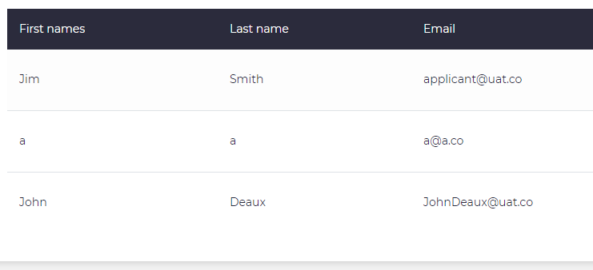

# Merging columns

## Problem

Sometimes in your application, you will want to show a column in a list that has more than one data source.

## Implemenation

There is a method that allows you to merge to data sources into a single column called `NeedsMerging()`.  This is implemented on the second list column and will merge this into the first list column.  This step can be repeated on the third column as well and the data would be added to the first column.

## Example

Below is an example of the `NeedsMerging()` method in use.

```csharp
            Column(x => x.FirstNames).LabelText("Name");
            Column(x => x.LastName).NeedsMerging();
            Column(x => x.Email);
```

Along with the rest of the code this would show like this in the list.


if we remove the `NeedsMerging()` method and change the code to this...

```csharp
            Column(x => x.FirstNames);
            Column(x => x.LastName);
            Column(x => x.Email);
```

 We would see this in the list.

