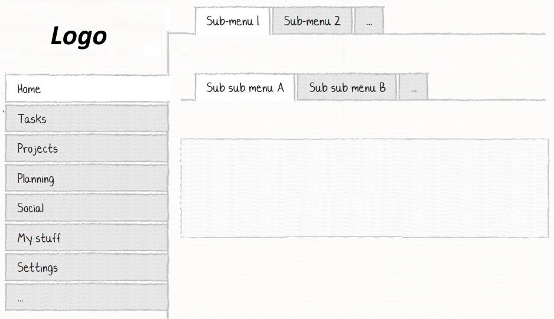

# Sub-navigation menu/tabs

## Problem

When applications get expanded and more functionalities are added, we need to have multiple menus organized into the main menu and sub-menus. 

## Design Considerations

When creating a menu structure you should consider the following options:

- **Number** - how many menus in terms of view components are needed. We need a menu module class for each component.

- **Nesting** - Whether you want to have flat items or hierarchical items in the form of parent-child within the menu.

- **Placement** - Where each of the menu components is positioned in the page, like left, top, etc.

- **Template** - Should they be added to the master page default template or already exist.

- **Source** - Whether menu items are known at the compile-time and whether they are static or dynamic.

## Example

Consider the following scenario for the menu structure. In this example, we have a 1st level menu on the left. Some menu items in the first level like **Home** in this example have 2nd and 3rd level menu items.



The steps for creating this menu structure are as follows:

### Creating menu module classes
As shown in the wireframe, we have at least 3 menu module classes. First, we define the main menu at the left:

```csharp
public class MainMenu : MenuModule
{
    public MainMenu()
    {
        AjaxRedirect().WrapInForm(false);
        Using("Olive.Security");
        IsViewComponent().UlCssClass("nav flex-column");
        RootCssClass("sidebar-menu");

        Item("Contacts")
                .OnClick(x => x.Go<ContactPage>());

            Item("Home")
                .OnClick(x => x.Go<HomePage>());

            Item("Task")
                .OnClick(x => x.Go<TaskPage>());

            Item("Project")
                .OnClick(x => x.Go<ProjectPage>());
            //...
    }
}
```
And then 2nd level menu at the top:
```csharp
public class SubMenu : MenuModule
{
    public SubMenu()
    {
        WrapInForm(false);
        AjaxRedirect();
        IsViewComponent();
        RootCssClass("sidebar-menu");
        UlCssClass("nav flex-row");
        Using("Olive.Security");

        Item("Sub-menu 1")
            .OnClick(x => x.Go<SubPage1>());

        Item("Sub-menu 2")
            .OnClick(x => x.Go<SubPage2>());
    }
}
```
This class uses `flex-row` css class instead of `flex-column` that was used in the left menu because in the top menu items are placed horizontally.

A similar class could be created for `SubSubMenu`.

You can also send data from each menu module class to the destination page to know the entire navigation history.

### Placement and Template
Different layouts and settings are defined n **Project.cs** file in **#Model** project. We should define 3 page settings for 3 menu positions in this example:
```csharp
public Project()
{
    //...
    Layout("Admin default").AjaxRedirect().Default().VirtualPath("~/Views/Layouts/AdminDefault.cshtml");

    PageSetting("LeftMenu");
    PageSetting("SubMenu");
    PageSetting("TopMenu");
}
```
Having these page settings defined, then the next step would be checking the placeholder for each of them in the template cshtml file. This file can be found in the **Website** project in **Views/Layouts/[TEMPLATE].cshtml** path.
```html
<!-- AdminDefault.cshtml -->
@{ var leftMenu = ViewData["LeftMenu"].ToStringOrEmpty(); }
@{ var topMenu = ViewData["TopMenu"].ToStringOrEmpty(); }
@{ var subMenu = ViewData["SubMenu"].ToStringOrEmpty(); }
<main>
  <header> @await Component.InvokeAsync(typeof(Header)) </header>
  <div class="page">
    <div class="left-panel">
      @if (leftMenu.HasValue())
      {<div class="sidebar-wrapper">@await Component.InvokeAsync(ViewData["LeftMenu"].ToString())</div>}
    </div>
    <div class="right-panel">
      <div class="content-wrapper">
        @if (topMenu.HasValue())
        {<div class="top-menu">@await Component.InvokeAsync(ViewData["TopMenu"].ToString())</div>}
        @if (subMenu.HasValue())
        {<div class="sub-menu">@await Component.InvokeAsync(ViewData["SubMenu"].ToString())</div>}
        <div class="content">@RenderBody()</div>
  <!-- ... -->
</main>
```
Similarly, we can add other placeholders in the page settings and template file.

### Adding modules to a page
The final step is using menu module classes and page settings in the page class.
```csharp
public HomePage()
{
    Layout(Layouts.AdminDefault);

    Set(PageSettings.LeftMenu, "MainMenu");
    Set(PageSettings.TopMenu, "SubMenu");
    Set(PageSettings.SubMenu, "SubSubMenu");

    //...
}
```

