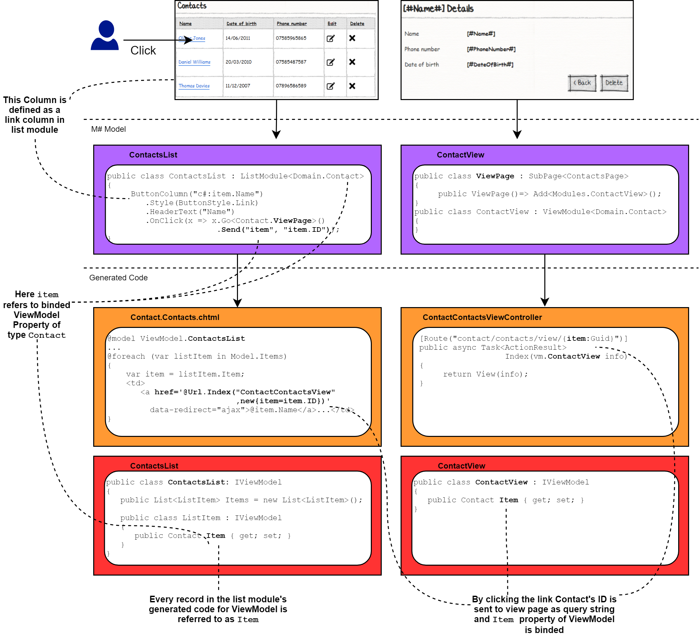

# Passing and using parameters

## Problem

We usually create different views for viewing and editing interrelated records in M#. It is often required to know the selected record from the previous view or its associated entity for being able to show the desired data on the UI module correctly. For this purpose, we should have a proper mechanism to send and receive data parameters in and out of the UI module.

## Sending data in the navigation
When navigating to another view, we can send data along with navigation. We can send parameters by using the `Send` method. We can also send a return URL with the `SendReturnUrl` method to be able to return to where we were after we are done with the view.

### Example
Suppose that we have a list of contact records that each one has an edit column to change the contact data. We want the form to be populated with contact data to be edited by the user.

```csharp
public class ContactsList : ListModule<Domain.Contact>
{
    public ContactsList()
    {
        ButtonColumn("Edit")
            .OnClick(x => x.Go<Contact.EnterPage>()
                           .Send("item", "item.ID")
                           .SendReturnUrl());
    }
}
```
Navigation is done with `Go()` or `PopUp()` methods. By calling `Send("item", "item.ID")` we are sending a query string with the name of the contact and with the value of the contact ID to the desired page. Here we are sending this data to the editing form to prefill its elements with pre-existing data.

By calling `SendReturnUrl()` we are sending the Url of the current page to the navigated page in the query string too. After doing our work on the target page we can return to the current page using this Url.

Note:

> We can use `SendItemId()` instead of `Send("item", "item.ID")` as a shorthand syntax.

## How sending data works
If you want to know what is represented by the input arguments in the `Send` method, you should have a look at the generated code. The schematic below shows different related pieces in the model and generated code for a scenario that the user clicks a link column in the contact list page to navigate to the contact's view page.



## Sending multiple data
We may have multiple data being sent to the navigating page. For this purpose, we may use a `Send` method for every data we want to send and chain them together. This is often needed for associated entities.

### Example
Suppose that we have `person` and `Address` entities that have an association of type one-to-many. Here we want to create an address list page for each person.

```csharp
public class AddressesList : ListModule<Domain.Address>
{
    public AddressesList()
    {
        ButtonColumn("Edit")
            .GridColumnCssClass("actions")
            .Icon(FA.Edit)
            .OnClick(x => x.Go<Address.EnterPage>()
                           .Send("item", "item.ID")
                           .Send("Person", "info.Person.ID")
                           .SendReturnUrl());
    }
}
```

When editing each address, we are sending both the address we want to edit along with the person who owns this address to the form for editing address. Here, `info` represents the bound ViewModel instance.

## Using for the ViewModel property
You can use the parameter sent to the form and store it in a newly created ViewModel property for further processing or showing in other parts of the view.

### Example
Consider the address list page for a given `Person`. The parameter `item` has been sent to this form that contains the person ID.
```csharp
public class AddressesList : ListModule<Domain.Address>
{
    public AddressesList()
    {
        HeaderText("@info.Person.Name 's Addresses")
        //...
        ViewModelProperty("Person", "Person").FromRequestParam("item");
    }
}
```
Here we have used `ViewModelProperty` with the type and name of `Person` that comes from the query string for being used on the header of the form.

## Setting directly from the query string
If both sending and receiving parameters have the same name we can use:
-  the `AutoSet`method in form module
-  the `NotReadOnly`method in list or view module

### Example
In the address form, we have used `AutoSet` for setting the `Person` property from the query string parameter with the same name.

```csharp
public class AddressForm : FormModule<Domain.Address>
{
    public AddressForm()
    {
        //...
        AutoSet(x => x.Person);
    }
}
```

### Example
In the address list, we have used the `NotReadOnly` method for setting the `Person` ViewModel property from the query string parameter with the same name.

```csharp
public class AddressesList : ListModule<Domain.Address>
{
    public AddressesList()
    {
        //...
        ViewModelProperty("Person", "Person").NotReadOnly();
    }
}
```
In this code, using 

`ViewModelProperty("Person", "Person").NotReadOnly()` 

has the same effect as 

`ViewModelProperty("Person", "Person").FromRequestParam("Person")`

M# generates `[ReadOnly(true)]` attribute in the generated code for the ViewModel properties by default to avoid unwanted misuse. Using `NotReadOnly()` means I am aware of what I'm doing and want to set this propert from query string parameter.