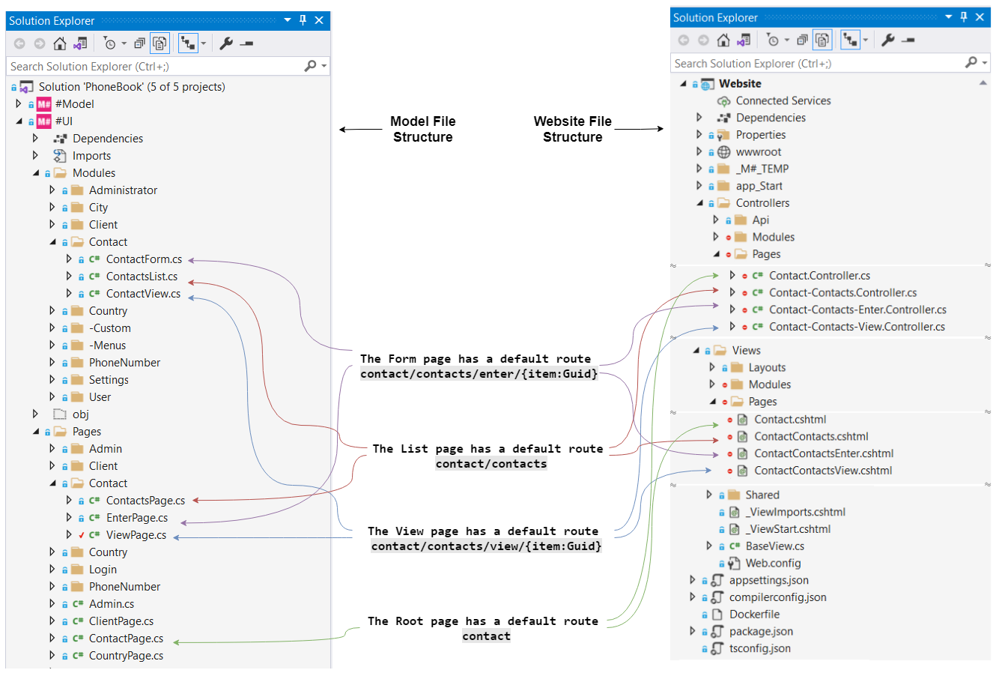

# Custom page URL

## Problem

M# will automatically decide on the route per page that is used to map an incoming request in the form of the page URL to a method that will handle it. You are not happy about the automatic routing for some reasons like readability and customisation and want to manually set the route or page URL or change the mechanism for route generation.

## Default routing

Default routing in M# for a page is based on its location in the page tree and the modules that sit on it and their configuration. An example of typical model classes and their default route is shown in the following diagram.




## Changing the default route
You can set the route explicitly using the `Route` method. This method gets the route template expression as an input argument.

### Example
Suppose that we want to change the route template for the contact's view page.
```csharp
public class ViewPage : SubPage<ContactsPage>
{
    public ViewPage()
    {
        Route("contact/contacts/{item:Guid}/view");

        Layout(Layouts.AdminDefault);

        Set(PageSettings.LeftMenu, "AdminSettingsMenu");

        Add<Modules.ContactView>();
    }
}
```
In this example, we have change the default rout template for the page from `contact/contacts/view/{item:Guid}` to `contact/contacts/{item:Guid}/view`. In other words, the page that opens in this URL by default:

http://www.company.com/contact/contacts/view/c5b91323-4c21-444b-bf68-8305d6dbd3e3

now opens in this URL:

http://www.company.com/contact/contacts/c5b91323-4c21-444b-bf68-8305d6dbd3e3/view

This change is a kind of URL rewriting that other navigation codes and parameter settings don't need to be changed.

## Changing the routing mechanism
You can go beyond simple URL rewriting and change the routing mechanism, however with few more steps. 

### Example
A common scenario for this case is using routes that are not IDs. Normally the main route segment for referring to object IDs are in the form of Guid. There are cases (for example for SEO) in which you may want to use a human-readable route segment instead of ID. For example instead of:

http://www.company.com/contact/contacts/view/c5b91323-4c21-444b-bf68-8305d6dbd3e3

we want to have:

http://www.company.com/contact/contacts/view/alexander-smith

This can be done by following the steps below.

### Registering the Binder
 Olive framework makes it relatively easy to add a binding. We just need to register a binding parser for the type in the application startup logic. We need to provide a type (e.g. `Contact`) and a function that receives the route segment (e.g. "alexander-smith") and returns the entity:

```csharp
public class Startup : Olive.Mvc.Startup
{
    public override void ConfigureServices(IServiceCollection services)
    {
        base.ConfigureServices(services);
        //...
        EntityModelBinder.RegisterCustomParser<Contact>(route => Contact.FindByName(route));
    }
}
```
Here, `EntityModelBinder` is a type defined in `Olive.Mvc` and `FindByName` is a static method added to the entity logic to find the contact by its name in DB:

```csharp
partial class Contact
{
    public static Task<IEntity> FindByName(string route)
    {
        return Database.FirstOrDefault<Contact>(c => c.FullName == route).AsTask<Contact, IEntity>();
    }
}
```

### Updating the links
The links for the view page should now be updated to accommodate this change and send name instead of ID. 

```csharp
public class ContactsList : ListModule<Domain.Contact>
{
    public ContactsList()
    {
        //...
        ButtonColumn("c#:item.FullName")
            .Style(ButtonStyle.Link)
            .HeaderText("Name")
            .OnClick(x => x.Go<Contact.ViewPage>()
                .Send("item", "item.FullName"));
    }
}
```
When you have links to a page with query parameters, M# will look at the destination page route:

- If a route parameter is matched with the same name as the query parameter, then it will include the parameter as part of the URL.
- If the destination page doesn't have a route parameter matching it, then the parameter will be attached as the query string.

### Specifying the route
With binding parser and links in place, we can use the updated routing on the view page:
```csharp
public class ViewPage : SubPage<ContactsPage>
{
    public ViewPage()
    {
        Route("contact/contacts/view/{item}");

        Layout(Layouts.AdminDefault);

        Set(PageSettings.LeftMenu, "AdminSettingsMenu");

        Add<Modules.ContactView>();
    }
}
```