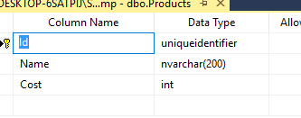

# How to use inheritance

## Problem:

Inheritance is one of the main features of object oriented programming and is heavily used to model software intuitively and reuse common behavior and attributes between object types.

In languages like C# you usually use inheritance when you have objects which have common properties or behaviors.
For example if you have a shopping software, probably all of your product types have common properties like price but some of them have quantity and some of them are sold based on their weight.
you usually create a `Product` base class and derive your `QuantifiableProduct` and `WeightedProduct` from it.
You need to be able to do the same thing in M# as well.

## The M# way

M# supports inheritance, abstract classes and even interfaces which we'll talk about in other chapters.
Inheriting from another entity is as easy as it is in C#

## How to implement

The entity should inherit from `SubType<T>` instead of `EntityType` when you want to use inheritance.
The type `T` is the class which you want to inherit from.

#### Example

Let's say we have a `Product` entity and a `QuantifiableProduct` which we want to inherit from `Product`, We should define the entities like this:

```csharp
using MSharp;

namespace Model
{
    public class Product : EntityType
    {
        public Product()
        {
            String("Name").Mandatory();
            Int("Cost").Mandatory();
        }
    }
}

```

```chsarp
using MSharp;

namespace Model
{
    public class QuantifiableProduct : SubType<Product>
    {
        public QuantifiableProduct()
        {
            Int("Quantity").Mandatory();
        }
    }
}

```
As you can see `Product` is similar to all other ordinary entities and `QuantifiableProduct` only differs in the class that it derives from.
The `QuantifiableProduct` entity inherits `Cost` and `Name` properties from `Product` and add its own property which is `Quantity`.

#### Generated code

The generated code of the classes follows this inheritance hierarchy as well.
Here is the code for `Product`

```csharp
    public partial class Product : GuidEntity
    {
       /// <summary>Gets or sets the value of Cost on this Product instance.</summary>
        public int Cost { get; set; }
        
        /// <summary>Gets or sets the value of Name on this Product instance.</summary>
        public string Name { get; set; }
         ...   
    }
```

As usual `Product` inherits from `GuidEntity`
Now let's look at `QuantifiableProduct`

```csharp
    public partial class QuantifiableProduct : Product
    {
        /// <summary>Gets or sets the value of Quantity on this Quantifiable product instance.</summary>
        public int Quantity { get; set; }

        /// <summary>
        /// Validates the data for the properties of this Quantifiable product and throws a ValidationException if an error is detected.<para/>
        /// </summary>
        protected override async Task ValidateProperties()
        {
            var result = new List<string>();
            
            try
            {
                await base.ValidateProperties();
            }
            catch (ValidationException ex)
            {
                result.Add(ex.Message);
            }
            
            if (Quantity < 0)
                result.Add("The value of Quantity must be 0 or more.");
            
            if (result.Any())
                throw new ValidationException(result.ToLinesString());
        }
    }
```

As expected `QuantifiableProduct` inherits from `Product` instead of `GuidEntity`.
Also it calls the base methods in its implementation of `ValidateProperties()`.

## Database Generation

M# generates database tables for your inheritance hierarchies in a way that the database easy to maintain and normalized.
In the example above it creates a `Products` table and a `QuantifiableProducts` table and each record in the `QuantifiableProducts` table has a foreign key field to a `Product` record in the `Products` table.

|    |    SQL Database Structure    |     |
|:--:|:----------------------------:| :--:|
|  |  |   |
 | Products database table | QuantifiableProducts database table | Products and QuantifiableProducts One-To-One relationship |

## Abstract classes

Sometimes you want to make your parent classes abstract so they act as the base building-block for your other parts of the application.
Abstract classes in C# can have behavior and data (methods and properties) but cannot be instantiated and you need to inherit from them.
The User class in our hello world application which is created by the M# template is a good example of it.
You want to have different types of users and all of them share the properties which the user has, but `User` on its own is not a type of user to be instantiated.
`Administrator` is a class inherited from `User` in the hello world application.

#### Example

For any class to be abstract you simply need to call the `Abstract()` method in its public constructor.
Take a look at the `User` Class.

```csharp
using MSharp;

namespace Domain
{
    public class User : EntityType
    {
        public User()
        {
            Abstract();

            String("First name").Mandatory();
            String("Last name").Mandatory();
            ...
        }
    }
}
```

As you can see the class has multiple properties and calls the `Abstract()` method. 
the generated code reflects this

```csharp
public abstract partial class User : GuidEntity
{
        
        /// <summary>Gets or sets the value of FirstName on this User instance.</summary>
        public string FirstName { get; set; }
        
        ...
        
        /// <summary>Gets or sets the value of LastName on this User instance.</summary>
        public string LastName { get; set; }

        ...
}
```

In this way you can make sure `User` is not instantiatable on its own but other classes like `Administrator`, `Moderator`, `BasicUser` and … can inherit from it and use the defined behavior and data in `User`.

## Remarks

- Use inheritance with care, deep levels of inheritance can make programs hard to understand and databases hard to maintain. Try to keep it below 5-7 levels best is below 3
- transient entities can be inherited as well but no database table is created for them
- Transient entities can derive from none-transient ones but not vice versa